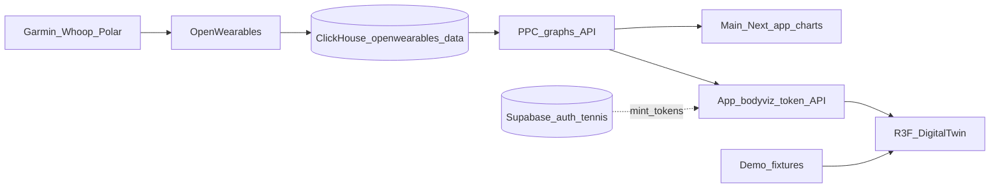

# BodyViz Digital Twin Plan

## What we found (ground truth)

### Product home
- [`PeakPerformanceDataMarketing/ThreeJS`](PeakPerformanceDataMarketing/ThreeJS) exists and is **empty** — correct home for this work.
- Mirror conventions from [`PeakPerformanceDataMarketing/courtviz`](PeakPerformanceDataMarketing/courtviz): pnpm 9 + turbo, `packages/*` + `apps/*`, Vitest, **Ladle** gallery + Vite demo, CI at **monorepo root** path-filtered like [`.github/workflows/courtviz.yml`](.github/workflows/courtviz.yml) (nested courtviz CI is inert unless that submodule is its own repo).
- CourtViz already has a working R3F stack in [`@courtviz/three`](PeakPerformanceDataMarketing/courtviz/packages/three) (`three@0.173`, `@react-three/fiber@9`, `@react-three/drei@10`) used for cinematic **court** scenes. Reuse its tooling/version choices and camera-rig patterns; do **not** put the anatomical body inside CourtViz.
- Marketing folder is sibling projects (not one workspace); `ThreeJS/` is the correct new sibling home (register as submodule later if desired).
- Deploy demo on **Vercel** (AcademiesPresentation precedent); Render is backends only; no Cloudflare Pages for demos.

### Brand
- Canonical dark PPD palette lives in [`courtviz/packages/tokens/src/colors.ts`](PeakPerformanceDataMarketing/courtviz/packages/tokens/src/colors.ts) + `BRAND.md`: canvas `#0F172A`, primary `#3B82F6`/`#2563EB`, marketing `#0047FF`, accent emerald `#10B981`, fonts **Barlow Condensed** (display) + **Inter** (body). Avoid purple-forward AI aesthetics; violet only as a tertiary chart accent.
- Prefer consuming/re-exporting `@ppd/tokens` (or `courtviz/integration/brand.json`) over inventing a second palette.

### Data reality (critical)
Wearable biomarkers are **not** primarily in Supabase today.

| Store | Role | BodyViz relevance |
|------|------|-------------------|
| Supabase `PeakPerformanceDataV2` | Auth, profiles, tennis (`tennis_match_*` rich), org/coach graph | Tennis later; auth identity |
| Supabase `garmin_connect_*` metric tables | Referenced by [`body-data/route.ts`](PeakPerformanceData/peak_performance_data/src/app/api/dashboard/player/body-data/route.ts) and `calculate_athlete_readiness` RPC | **Tables missing** (only `garmin_connect_accounts` exists) — do not build BodyViz on this path |
| PPC API `https://api.wearablesync.app/ppc` | Live graph API used by charts/readiness | **Primary product interface** for v1 live mode |
| Hetzner `ds-wearables-extract` (not `ppd-wearables`) ClickHouse `openwearables_data` | Warehouse with real rows | Source of truth for deep metrics / admin exports |
| Hetzner OpenWearables Postgres | 577k series points, sleep_details | Upstream of CH sync |
| ClickHouse `wearables_data` (legacy Garmin schema) | Full table schemas for sleep/HRV/battery/stress | **Empty (0 rows)** — keep as schema reference only |

Confirmed live CH metrics in `openwearables_data.ow_timeseries` include: `heart_rate`, `garmin_body_battery`, `garmin_stress_level`, `resting_heart_rate`, `recovery_score`, `heart_rate_variability_rmssd`, plus rich `ow_sleep_summaries` / `ow_sleep_sessions` (mostly Whoop) and `ow_workouts.training_load`.

PPC already exposes the exact v1 biomarkers as graph types: `sleep_duration`, `sleep_efficiency`, `sleep_stages`, `recovery_score`, `hrv_trends`, `resting_heart_rate`, `training_load`, `stress_levels`, `body_battery`.

**Provider capability matrix (tour stops must degrade, never invent):**

| Metric | Garmin | Whoop | Polar |
|--------|--------|-------|-------|
| Sleep duration / stages | Yes | Yes | Duration yes; **no stages** |
| Recovery score | — | **Whoop-only** | — |
| HRV / RHR | Yes | Yes | Yes |
| Training load | Yes | via workouts | Yes |
| Stress / Body Battery | **Garmin-only** | N/A | N/A |

**Do not use as live data plane:** `/api/dashboard/player/body-data` and SQL `calculate_athlete_readiness` still reference removed Supabase `garmin_connect_*` metric tables. Charts/readiness already fall back to PPC graphs — BodyViz should too.



### SSH note
Use host alias **`ds-wearables-extract`** (and `ds-wearables-process` for processing). There is no `ppd-wearables` alias in `~/.ssh/config`.

---

## Product definition (locked)

- **Surface**: Marketing/demo in `ThreeJS/`; path into main app later via reusable packages.
- **Audience**: Athlete digital twin first; coach secondary later.
- **v1**: Interactive web only (no Remotion/export).
- **Separate from CourtViz**; optional “performance day” link later.
- **Look**: Premium stylized anatomical body (Qbio-inspired), PPD navy/blue/green, not medical-photoreal.
- **UX**: One persistent body + guided spotlight tour; Today + 7-day scrubber; desktop-first, simplified mobile; WebGL fallback.
- **Privacy**: Public demo = fake athlete fixtures; real athlete = private/authenticated.
- **i18n**: EN copy first; structure strings for later hooks.

---

## Creative v1 experience (best use of our data)

One full-viewport composition: stylized translucent body on atmospheric navy gradient, not a dashboard of cards.

**Guided systems tour (6 stops)**

1. **Sleep** — cranial/rest glow; stages as soft layered pulses (deep/REM/light from `ow_sleep_*` / `sleep_stages`).
2. **Recovery / readiness** — whole-body vitality wash: Whoop `recovery_score` and/or PPC-derived readiness composite (sleep/HRV/load fallback in [`readiness-snapshot.ts`](PeakPerformanceData/peak_performance_data/src/lib/dashboard/readiness-snapshot.ts)); never invent ~50 defaults.
3. **HRV** — autonomic signal (nightly ms; charts use SDNN primary / RMSSD fallback; healthy band ~20–80 ms).
4. **RHR** — cardiac pulse (`resting_heart_rate` bpm; healthy ~50–70).
5. **Strain / load** — musculature heat from `training_load` / workout volume (**no Whoop “strain” metric in codebase** — use training load as strain proxy).
6. **Stress / Body Battery** — Garmin-only nervous-system / energy sheath; skip or mark unavailable for Whoop/Polar athletes.

**Scrubber**: fixed 7-day window ending today + day playhead (patterns from `PlayerBodyDashboard` Today/Week tabs + `MomentumChart` pinned scrubber panel). Prefer day-index scrubbing over charts’ 1M–AllTime dual-thumb slider. Keep all 7 day slots (including nulls).

**UX chrome (minimal)**: brand mark, athlete first name, active system title + one sentence, metric value + 7-day spark, tour prev/next. No card grid in the hero.

**Fallback**: if WebGL weak / `prefers-reduced-motion`, render a 2D silhouette + same tour/scrubber using CSS/SVG (reuse metric mapping).

---

## Repo architecture to build

Scaffold inside [`PeakPerformanceDataMarketing/ThreeJS`](PeakPerformanceDataMarketing/ThreeJS):

```text
ThreeJS/
  package.json, pnpm-workspace.yaml, turbo.json, tsconfig.json
  packages/
    tokens/     # re-export/copy PPD navy-blue-green tokens + body-system semantic colors
    core/       # DailySnapshot types, normalize(), readiness helper, tour state machine
    data/       # Zod schemas, demo fixtures, PPC batch client, athlete resolver
    react/      # <BodyTwin>, <SystemSpotlight>, <DayScrubber>, <TourControls>, WebGL gate
    shaders/    # body shell, organ glow, pulse (GLSL via R3F)
  apps/
    demo/       # Vite interactive marketing demo (primary deliverable)
    gallery/    # Ladle stories (not Storybook) + Playwright visual snaps
  assets/models/  # licensed GLB + SOURCES.md (AcademiesPresentation asset pattern)
```

Package names: `@bodyviz/core`, `@bodyviz/data`, `@bodyviz/react`, `@bodyviz/tokens`, `@bodyviz/three` (R3F stage), optional `@bodyviz/shaders`.

Reuse CourtViz lessons: framework-agnostic `core`, thin Ladle stories, tokens-first theming, `frameloop="demand"` + `preserveDrawingBuffer` from `@courtviz/three` CourtStage when capturing, CI build/typecheck/test + optional visual job.

---

## Canonical data model (consume this, not raw tables)

```ts
type DailySnapshot = {
  date: string; // YYYY-MM-DD
  provider: 'garmin' | 'whoop' | 'polar' | 'mixed' | 'demo';
  sleep: { score: number | null; durationHours: number | null; deepPct: number | null; remPct: number | null; efficiency: number | null };
  recovery: { score: number | null; readiness: number | null };
  hrv: { rmssdMs: number | null; status: 'balanced' | 'low' | 'high' | 'unknown' };
  rhr: { bpm: number | null };
  load: { trainingLoad: number | null; strainProxy: number | null };
  stress: { avg: number | null };          // Garmin-first
  bodyBattery: { high: number | null; low: number | null; current: number | null }; // Garmin-first
};
```

Normalization rules:
- Prefer PPC graph series for app-parity with charts.
- Fill gaps from CH `openwearables_data` rollups/summaries when building fixtures or a server BFF.
- Missing Garmin-only fields on Whoop athletes → hide that tour stop or show “unavailable on this wearable,” never invent numbers (matches readiness-snapshot philosophy).

---

## Data access for the demo (concrete)

**Default public mode**: CourtViz/Boluda-style fixtures — `data/raw` → generate → Zod validate → `@bodyviz/data/fixtures`, fake athlete id `demo-user`, clearly labeled “Demo / sample data”. Never accept a real `athleteId` in demo mode.

**Private live mode** (real athlete) — mirror tennis `/watch/{token}` capability links, **not** marketing-site Supabase cookies and **not** public athlete UUIDs against PPC (ppc-proxy today lacks hard assignment ACL):
1. Main app mints `bodyviz_demo_links` (crypto token, athlete_id, created_by, TTL ≤7d, revocable; no anon RLS).
2. Guest/demo client calls app-owned `GET /api/bodyviz/[token]` (service-role validate → scoped 7-day `DailySnapshot[]` via server-side PPC batch).
3. Response: `Cache-Control: private, no-store`; no emails, Garmin account ids, or full history dumps; exclude women’s-health metrics by default.
4. Browser never talks to ClickHouse; CH used only for one-shot fixture export over SSH.
5. Mint ACL: athlete self / assigned coach / linked parent / admin (same as match share).

Do **not** wire BodyViz to `/api/dashboard/player/body-data` (legacy, unwired UI, queries missing tables).

---

## 3D / art direction

1. **Source a licensed stylized anatomical GLB** (commercial use): translucent shell + separable regions (head/brain, heart, torso energy, limbs). Prefer CC0/CC-BY or paid RF with clear video/marketing rights; document in `assets/models/SOURCES.md` + fetch script (AcademiesPresentation pattern). Prefer low/med poly with navy mesh + blue/emerald accents over hyper-real medical scans; avoid CC BY-SA for closed commercial packaging.
2. Region → metric mapping via named nodes / bone attachments.
3. Custom shaders: fresnel shell, soft subsurface accent in brand blue/green, pulse driven by RHR, heat for load, cool calm for high recovery.
4. Camera: OrbitControls desktop; fixed framed angle + tap-to-advance on mobile; `DominanceCameraRig`-style constrained rig from `@courtviz/three` as reference.
5. Motion: 2–3 intentional motions only — idle breath, tour camera ease, scrubber metric morph. Respect `prefers-reduced-motion`.

---

## 2-week delivery plan

### Days 1–2 — Scaffold + brand
- Init pnpm/turbo monorepo under `ThreeJS/` (root name `bodyviz`).
- Port/adapt `@ppd/tokens` into `@bodyviz/tokens` (body-system semantic roles + anatomy mesh neutrals).
- Vite `apps/demo` blank stage with navy aurora atmosphere (Barlow Condensed + Inter).
- Root CI: `.github/workflows/bodyviz.yml` path-filter `PeakPerformanceDataMarketing/ThreeJS/**` → install/build/typecheck/test.

### Days 3–5 — Body + tour shell
- Procure/import GLB; set up R3F `BodyCanvas` + lighting + fallback silhouette.
- Implement tour state machine in `@bodyviz/core` (6 stops).
- Wire spotlight camera + system highlight materials with fixture data.
- Gallery stories for each stop.

### Days 6–8 — Metrics + scrubber
- Finalize `DailySnapshot` + fixture generator from CH samples (SSH one-shot export).
- Day scrubber UI; animate uniforms from selected day.
- Metric readouts + 7-day spark (lightweight, not a chart dashboard).
- Provider capability matrix (Whoop vs Garmin field availability).

### Days 9–11 — Live data + privacy
- App API: `bodyviz_demo_links` + `GET /api/bodyviz/[token]` → PPC batch → `DailySnapshot[]`.
- Public marketing URL stays fixtures-only; live requires opaque token.
- Empty/partial/provider-gated states (no fake 50 defaults).
- Probe WebGL + `prefers-reduced-motion` **before** dynamic import; mobile simplified scene.

### Days 12–14 — Polish + handoff path
- Visual polish, performance pass, Vercel project for `apps/demo`.
- README: run demo, fixture regen, token live mode, SOURCES.md for models.
- Document main-app embed: vendor/`file:` deps + `transpilePackages` + `dynamic(..., { ssr: false })` (CourtViz precedent); i18n hooks under `playerDashboard.body` / `home.readiness` later.
- Explicit non-goals for v1: Remotion/MP4 export, tennis overlays, coach roster matrix, public real-athlete gallery.

---

## Main-app path later (out of v1 build, in design)

Product layering once embedded:
1. **Keep** `/player` `HeroRingTrio` as daily decide surface.
2. **BodyViz** as mid-depth “feel the story” (absorb unused `PlayerBodyDashboard` role).
3. **Keep** `/charts` for long-range exploration + connect/sync.

Coach secondary later: athlete switcher + attention drill-through into one twin (not multi-body grid in v1).

Fix schema drift separately: rewrite readiness RPC/`body-data` to PPC/CH (BodyViz is not blocked if token API uses PPC).

---

## Risks and mitigations

- **Schema drift** (app code vs Supabase): BodyViz uses PPC/fixtures, not broken tables.
- **Garmin-only stress/battery; Whoop-only recovery_score**: tour stops degrade by provider.
- **ppc-proxy ACL gap**: never call it with raw athlete UUIDs from marketing; use capability tokens on app API.
- **CH MCP timeout**: fixture export via SSH `ds-wearables-extract`; live via PPC.
- **Model licensing**: SOURCES.md + commercial-safe licenses only.
- **WebGL CI flakiness**: unit-test math without GL; visual snaps with fixed camera/DPR; optional separate visual job.

---

## Success criteria (end of 2 weeks)

- Public demo at `ThreeJS/apps/demo` (Vercel) with fake athlete, 6-stop tour, 7-day scrubber, PPD look.
- Live mode loads real 7-day snapshots via opaque token → PPC (private by default).
- Smooth on recent desktop; usable mobile simplified + non-WebGL / reduced-motion fallback.
- Packages structured so main app can vendor `@bodyviz/react` later without rewrite.
