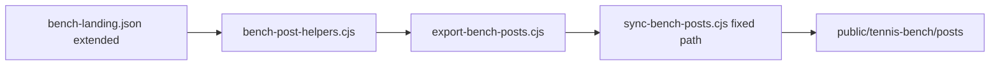

# Bench Social Posts v2 (Court-Plot Carousel)

## Locked decisions (from your answers)

- Stay at **10** slides, **4:5 / 1080×1350**, EN-only, same platforms.
- **Posts only** — do not change live Tennis Bench UI (`AggregateTicker`, `BenchRecordsStrip`, etc.).
- Same match (Quevedo–Boluda); **extend frozen fixture**, not live DB at render.
- Kill: with-video, video coverage, n=1 derived ratios, break conv, `BENCH RECORD`, histograms.
- Viz mix: **ServeLayer** / **DotLayer(stroke)** / **HexbinLayer**; denser editorial look (no full-bleed invent).
- Keep **03**; clean **08**; enlarge **09**; rewrite **01, 02, 04–07, 10**.

## New 10-slide storyboard

| # | New id | Intent |
|---|---|---|
| 01 | `cover` | Stronger brand hierarchy + 4 cards: Matches · Shots · Points · Avg speed (surface as accent only) |
| 02 | `scale` | Slim aggregates (no video / no shots-per-match / no video%) + stroke mix + **small court inset** from pooled/featured shots |
| 03 | `live-bench` | Keep pooled host hexbin + ribbon (Published · Surface · Shots mapped · Avg speed) |
| 04 | `serve-map` | **ServeLayer** court (1st/2nd markers) + short serve KPI line (avg serve speed / serves tracked) — no histogram |
| 05 | `stroke-dots` | Full-court **DotLayer `colorBy: "stroke"`** + stroke legend |
| 06 | `host-hexbin` | Host-only **HexbinLayer** density |
| 07 | `guest-hexbin` | Guest-only **HexbinLayer** density |
| 08 | `featured-match` | Editorial story + score + **4 KPIs** (Points won · 1st serve in · Shot accuracy · Avg shot speed — **no Break conv.**) + large stroke-dot court |
| 09 | `featured-insight` | Court-first host hexbin density + same KPI ribbon language; court sized like live-bench (unified minHeights / grow) |
| 10 | `cta` | Drop chips; **large featured court thumbnail** + 3 benefits + stronger URL + Request invitation button |

## Root causes to fix while rewriting

From swarm findings ([Whitespace layout](e3307391-72bd-4e6c-9d12-f872508e4a74), [Court sizing](db974c65-1faa-4dd6-8b1d-cf80c19595d2), [PNG sync](5687acab-ad57-4ba0-b677-d621a049b8e6)):

1. **Empty lower half** — grow bands with fixed-height chart bodies; CTA `button` grow; Cover/Record/CTA phantom title/footer (`0 || undefined` → defaults 100/56) in `FigureFrame`.
2. **Courts look small** — full `contentW` letterboxing (~37% width used). Size Court box to tennis aspect (center) so painted court reads larger; unify court `minHeight` / grow recipe across 03/06/07/08/09.
3. **`sync-bench-posts.cjs` dest is wrong** (resolves under Marketing, not app `public/`). Fix relative path to `PeakPerformanceData/peak_performance_data/public/tennis-bench/posts/`.

## Implementation steps

### 1) Extend frozen fixture

Files:
- [`generate-bench-fixture.cjs`](PeakPerformanceDataMarketing/courtviz/scripts/generate-bench-fixture.cjs)
- [`bench-landing.json`](PeakPerformanceDataMarketing/courtviz/packages/data/src/fixtures/bench-landing.json)
- [`DATA-NOTES.md`](PeakPerformanceDataMarketing/courtviz/packages/data/src/fixtures/DATA-NOTES.md)

Changes:
- Raise shot preview / pooled sample enough for serve + host/guest hexbins (prefer full Boluda enriched shots for court slides, or raise preview cap well above 120 if memory allows — target: all In-bounce shots with coords for host and guest separately).
- Add derived fields used by posts (computed at freeze time): `avgShotSpeed`, `shotAccuracyPct`, `avgServeSpeed`, `serveCount`, stroke mix already available via shots.
- Update featured `heroStats` for posts to: `points_won_pct`, `first_serve_pct`, **shot accuracy**, **avg shot speed** (drop `break_points_converted_pct` from post hero pills). Keep computing break stats in fixture only if unused — prefer omit from post-facing hero list.
- Document that social posts no longer consume `records` / video aggregates (records can remain in JSON for parity with `BenchListResponse` shape, but slides ignore them).

### 2) Rewrite slide registry + renderers

Files:
- [`bench-posts-slides.cjs`](PeakPerformanceDataMarketing/courtviz/scripts/bench-posts-slides.cjs) — new ids/titles/subtitles for 04–07; drop “Bench record” subtitles.
- [`bench-post-helpers.cjs`](PeakPerformanceDataMarketing/courtviz/scripts/bench-post-helpers.cjs) — main work.

Concrete renderer work:
- **Delete** `renderRecordSlide` path + histogram/duel helpers only used by records (`histogram`, `serveSpeedHistogram`, `rallyLengthHistogram`, `duelBar`).
- **Add** `renderServeMap`, `renderStrokeDots`, `renderHostHexbin`, `renderGuestHexbin` reusing `@courtviz/react` layers already proven in coach deck / featured slides (`ServeLayer`, `DotLayer`, `HexbinLayer`). Port thin patterns from [`export-slide-helpers.cjs`](PeakPerformanceDataMarketing/courtviz/scripts/export-slide-helpers.cjs) `renderServeSlide` / placement — reflow for portrait + `ppdEditorial`.
- **Cover:** denser brand stack; 4 cards without video; fill grow band (court watermark or larger ticker + brand mark).
- **Scale:** remove video cell + derived video%/per-match ratios; keep meaningful totals + stroke mix; add small court inset (DotLayer or hexbin mini).
- **Featured (08):** swap Break conv. pill → Shot accuracy; Tracked shots → Avg shot speed (or keep shots as secondary line under court — ribbon is the four KPIs above). Large stroke-dot court matching insight sizing approach.
- **Insight (09):** same court band recipe as live-bench (minHeight ≥ 300, grow fills); hexbin host density; KPI ribbon = Points won · 1st serve · Shot accuracy · Avg speed.
- **CTA:** remove chips; court thumbnail from `featured.shotPreview`; tighten bands so button/URL aren’t stranded in empty grow space; keep Request invitation + URL.

Shared layout helper (inside helpers file): one `renderCourtSlideShell({ title, subtitle, courtNode, legend, stats })` so 03/04/05/06/07/09 share spacing and court sizing.

### 3) Fix export → app sync + carousel filenames

- Fix [`sync-bench-posts.cjs`](PeakPerformanceDataMarketing/courtviz/scripts/sync-bench-posts.cjs) destination path.
- Update [`BenchSocialCarousel.tsx`](PeakPerformanceData/peak_performance_data/src/components/tennis-bench/BenchSocialCarousel.tsx) hardcoded `SLIDE_FILES` to new `04-serve-map.png` … `07-guest-hexbin.png` (and any renamed titles). Prefer reading `manifest.json` later — out of scope unless cheap; hardcoded list is fine if kept in sync.
- Regenerate: from `courtviz/` run `pnpm export:bench-fixture` → `pnpm export:bench-posts` → `pnpm sync:bench-posts`.
- Commit refreshed PNGs + manifest under [`public/tennis-bench/posts/`](PeakPerformanceData/peak_performance_data/public/tennis-bench/posts/).

### 4) Tests / docs

- [`export.integration.test.ts`](PeakPerformanceDataMarketing/courtviz/scripts/__tests__/export.integration.test.ts) already asserts `BENCH_POSTS_SLIDE_IDS` PNG count — will follow new ids.
- Update [`bench_social_posts_06eb7285.plan.md`](PeakPerformanceDataMarketing/_plans/bench_social_posts_06eb7285.plan.md) storyboard section to v2 (or leave and rely on this plan — prefer short note in DATA-NOTES that social arc is court-plot v2).
- Optional: assert sync dest exists in sync script (fail loud if path wrong).

## Explicit non-goals

- No live Bench UI changes (video ticker / records strip stay).
- No Remotion / 9:16 coach deck changes (reuse helpers only).
- No live Supabase fetch at PNG render time.
- No i18n for slide copy; no ZIP download fix unless trivial.

## Success criteria

- 10 PNGs at 1080×1350 with court plots on **03–09** (and inset on 02 + thumbnail on 10).
- No video / break-conv / BENCH RECORD / histogram slides.
- Cover + CTA denser; no large empty grow bands under charts.
- Courts visually large and consistent across hexbin/dot/serve slides.
- `pnpm sync:bench-posts` writes into the real app `public/` path.
- Carousel on `/tennis-bench` shows the new set.