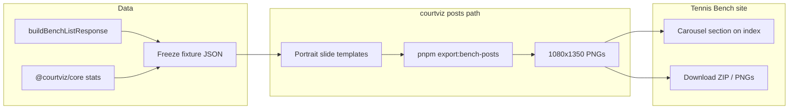

# Tennis Bench Social Posts (10-slide 4:5 carousel)

## What we learned (context)

- Tennis Bench UI lives in the main app at [`/[locale]/tennis-bench`](PeakPerformanceData/peak_performance_data/src/app/[locale]/tennis-bench/page.tsx), not under Marketing.
- Courtviz already has a **match coach deck** (`pnpm export:deck`) at **9:16** with a different arc (serve/density/patterns…). Leave that alone.
- Preferred static path: `@courtviz/react` + `@courtviz/render` (SVG→PNG via sharp). Remotion/video stays frozen/unused for this work.
- Portrait **4:5 / 1080×1350** already exists as `socialFormats.portrait` in [`packages/tokens/src/social.ts`](PeakPerformanceDataMarketing/courtviz/packages/tokens/src/social.ts).
- Live Bench numbers come from Supabase via [`buildBenchListResponse`](PeakPerformanceData/peak_performance_data/src/lib/tennis-bench/loader.ts) + [`computeBenchRecords`](PeakPerformanceData/peak_performance_data/src/lib/tennis-bench/compute-landing-stats.ts); card KPIs use `@courtviz/core` rates.
- Published featured stories today: Quevedo–Boluda (rank 1), Lazaro Garcia (rank 2), Akli (rank 3).

**Style north star (Opta Analyst / Untold Arena–like):** one big claim per slide, oversized number, short supporting line, court graphic or compact chart, brand mark + slide index. No video, no clutter. Visual language matches Bench: marketing blue `#0047FF`, navy, Barlow Condensed display + Inter body, surface-colored courts.

## Locked product decisions (from your answers)

| Decision | Choice |
|---|---|
| Deliverable | 10 static PNGs (plus SVG intermediates for debug) |
| Format | Single: **portrait 4:5 (1080×1350)** |
| Structure | One sequential narrative carousel |
| Platforms | IG / TikTok / X / LinkedIn (same assets) |
| Video | Leave code; no further investment |
| Data | Bench path → freeze verified fixture |
| Arc | hero → live bench → records → featured → CTA |
| Names | Respect each feature’s anonymize/publish settings |
| Locale | EN only v1 |
| CTA | Same as Bench (`Request invitation` → existing dialog / destination) |
| Audience | coaches, clubs, players, investors |

## 10-slide storyboard

Reuse Bench copy/stats; one job per slide.

1. **Cover** — Brand + “The tennis analytics bench” + one-line hook (swipe).
2. **Scale** — Ticker: matches / shots / points / matches with video (exact Bench aggregates).
3. **Live bench** — Pooled hexmap + avg serve speed + dominant surface + published count.
4. **Record: Fastest serve** — Value + player/context (same as `BenchRecordsStrip`).
5. **Record: Longest rally** — Value + set/game context.
6. **Record: Best break conversion** — Value + player · setScore.
7. **Record: Top points won** — Value + player · setScore.
8. **Featured match** — Featured headline, surface tags, score line, 4 hero KPI pills, court thumbnail dots.
9. **Featured insight** — One CourtViz figure from featured match (host hexbin or serve placement—whichever the story already leads with) + 1–2 frozen metrics.
10. **CTA** — “Want your matches on the bench?” + Request invitation / `peakperformancedata.app/tennis-bench`.

## Architecture (keep simple)

**Do not** route through Remotion. **Do not** expand the existing 9:16 coach deck. New path only.

## Implementation steps

### 1) Freeze a verified Bench fixture

- Add a small snapshot script (courtviz or app) that dumps the fields needed for the 10 slides from the same logic as `buildBenchListResponse` / `computeBenchRecords` / featured `heroStats` + shot preview.
- Commit frozen JSON under courtviz, e.g. [`courtviz/packages/data/src/fixtures/bench-landing.json`](PeakPerformanceDataMarketing/courtviz/packages/data/src/fixtures/) (or `data/frozen/`).
- Manual verification checklist: each number on slides 2–8 equals live `/en/tennis-bench` for the same snapshot date.
- Add short `DATA-NOTES.md` documenting known gaps (SV vs scorekeeper: rally length from max `shot_number`; first-serve/BP prefer official stats when present; Bench records use vendored rates with `total > 0`; serve speeds filtered 40–215 km/h; ticker counts are **platform-wide**, records/featured are **published features only**).

### 2) Reusable portrait slide templates (courtviz)

- New thin helpers under courtviz (prefer TS/React SVG over growing the 2.9k-line CJS coach helpers):
  - `SlideShell` — 1080×1350, brand footer, slide `i/10`, baseline rule (tokens/`FigureFrame` portrait).
  - `BigStatSlide`, `RecordSlide`, `CourtFigureSlide`, `CtaSlide`.
- Theme: Bench-adjacent light editorial or `ppdDeck` adjusted for light/social readability; surface colors from tokens; **do not** force brand hard-court when the Bench slide is showing clay featured data.
- Wire export CLI: `pnpm export:bench-posts` → `apps/demo/public/exports/bench-posts/` (PNG + `manifest.json` with slide ids, dimensions, fixture hash, generatedAt).

### 3) Concrete deck renderer

- Map the 10 storyboard slides to templates + frozen fixture fields.
- Court graphics: reuse `@courtviz/react` (`Court`/`CourtSurface` + `HexbinLayer` / `DotLayer` / `ServeLayer`) at `revealProgress=1` / full opacity.
- Captions (optional v1 stretch): generate EN caption pack for IG/TikTok/X/LinkedIn from same fixture (`export:captions` pattern already exists—extend or sibling `bench-captions`).

### 4) Show + export on Tennis Bench (minimal UI)

On [`TennisBenchIndex`](PeakPerformanceData/peak_performance_data/src/components/tennis-bench/TennisBenchIndex.tsx):

- New section **“Share the bench”** (after records / before or after featured):
  - Horizontal swipe or simple 1–10 pager of the 10 PNGs (static `` from `public/tennis-bench/posts/`).
  - Buttons: **Download all (ZIP)** and/or per-slide download.
- Ship PNGs into the app as static assets (copy from courtviz export into [`public/tennis-bench/posts/`](PeakPerformanceData/peak_performance_data/public/) during a documented `pnpm` sync step—or check in the 10 PNGs for v1 simplicity).
- No new CMS, no per-user generation, no Remotion. Admin keeps curating matches; posts regenerate from freeze when you choose to re-snapshot.

### 5) CI / QA (light)

- Assert export produces exactly 10 PNGs at 1080×1350 + manifest.
- Optional: one Playwright snapshot of slide 1 + slide 8 later; not blocking v1.
- Do **not** add spike/video CI work.

### 6) Explicit non-goals

- No deleting Remotion/video/spike code.
- No changing the existing 9:16 match coach deck.
- No multi-format export in v1.
- No i18n for slides.
- No live DB fetch at render time in production (frozen fixture only after verification).

## Key files to touch

| Area | Files |
|---|---|
| Export | New `scripts/export-bench-posts.ts` (+ helpers); root `package.json` script |
| Templates | New small modules under `packages/react` or `scripts/bench-posts/` |
| Fixture | New frozen bench landing JSON + DATA-NOTES |
| App UI | `TennisBenchIndex.tsx`, optional tiny `BenchSocialCarousel.tsx`, `public/tennis-bench/posts/*` |
| i18n | EN keys only under `tennisBench.socialPosts.*` for section chrome |

## Success criteria

- 10 PNGs at **1080×1350**, coherent swipe story matching Bench arc.
- Numbers on slides match Bench UI for the frozen snapshot.
- Visible on `/tennis-bench` with one-click download.
- Video pipelines untouched; coach 9:16 deck untouched.
- Opta-like readability: big number, short claim, court/stat graphic, brand.