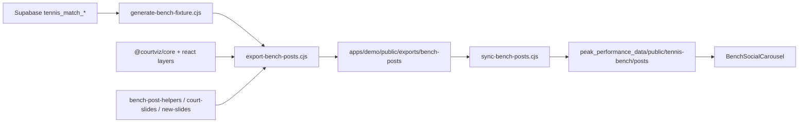

# Tennis Bench Match-Report Deck — Complete Improvement Plan

## Swarm + research status

- Launched **80** Grok 4.5 explore/research subagents; all completed.
- Validated Boluda–Quevedo match in Supabase (`tennis_matches` / `tennis_match_shots`): **909 shots**, all with bounce+hit coords; **15** Y outliers beyond court, **6** wide X — plotting is largely correct; outliers need clip/filter policy.
- ClickHouse Catapult MCP was unreachable; tennis deck data path is **Supabase SwingVision**, not ClickHouse.
- Competitor north star confirmed in code comments and web research: Opta Analyst / Infosys CourtVision — one claim per slide, strong brand mark, readable trajectories, story-led CTAs.

## Architecture (source of truth)



**Primary work lives in** [`PeakPerformanceDataMarketing/courtviz/`](PeakPerformanceDataMarketing/courtviz/), not the thin app wrappers.

| Role | Path |
|---|---|
| Slide registry (50 ids) | [`scripts/bench-posts-slides.cjs`](PeakPerformanceDataMarketing/courtviz/scripts/bench-posts-slides.cjs) |
| Shell / cover / CTA / featured | [`scripts/bench-post-helpers.cjs`](PeakPerformanceDataMarketing/courtviz/scripts/bench-post-helpers.cjs) |
| Court charts / coach / depth / flows | [`scripts/bench-post-court-slides.cjs`](PeakPerformanceDataMarketing/courtviz/scripts/bench-post-court-slides.cjs) |
| Export + sync | `pnpm export:bench-posts` → `pnpm sync:bench-posts` |
| Layers | [`packages/react/src/ray-layer.tsx`](PeakPerformanceDataMarketing/courtviz/packages/react/src/ray-layer.tsx), `hexbin-layer.tsx`, `dot-layer`, `insight-panel.tsx`, `brand-mark.tsx` |
| Logo tokens | [`packages/tokens/src/logo.ts`](PeakPerformanceDataMarketing/courtviz/packages/tokens/src/logo.ts) |
| App carousel | [`src/components/tennis-bench/BenchSocialCarousel.tsx`](PeakPerformanceData/peak_performance_data/src/components/tennis-bench/BenchSocialCarousel.tsx) |

**Default logo decision:** wire `benchBranding()` → `logoHref: getLogoDataUri()` from existing [`packages/brand/assets/ppd-logo.png`](PeakPerformanceDataMarketing/courtviz/packages/brand/assets/ppd-logo.png) (same as app `Logo-512.png`) at **40–48px**. Cover + CTA get a **lockup**. Today footers omit `logoHref` (“no PEAK PNG at 32×32”), so `BrandMark` falls back to the blue “A” monogram.

---

## Phase 0 — Data correctness audit (before visual polish)

**Fixture match:** Quevedo vs Ángela Boluda, clay, `2025-04-09`, id `f6cd7d61-fc69-4dfc-8336-2c90a4ced93a` (909 shots).

**Confirmed plot bugs (swarm):**
1. **`serve-zones-heat`:** Hexbin on near half **without** `useHalfCourtNormalization` → guest density can vanish while KPIs use normalized `computeServeZones`.
2. **Serve+1:** host-first-serve only plotted; KPI win% can include all serve+1 → mismatch.
3. **BP conversion** on break-points slide is shot-derived; clutch prefers official — unify labeling or source.
4. **Fastest serve:** fixture filters 40–215 km/h; slide re-maxes without filter; fault outline not legended.
5. Winners = last-In endings ≠ Official W/UE (by design) — keep labels clear, not a plot bug.
6. Clip/mute ~15 Y / ~6 X outliers; note ~71% out-of-range `hitY` clamp risk in DATA-NOTES.

**Actions:**
1. Re-run [`scripts/generate-bench-fixture.cjs`](PeakPerformanceDataMarketing/courtviz/scripts/generate-bench-fixture.cjs) and diff KPIs vs live `/tennis-bench` + official `tennis_match_stats`.
2. Fix serve-zones-heat normalization; align serve+1 / BP sources with labels.
3. Plot QA asserts: Serve-only maps; flow rays `result === "In"`; depth via `classifyDepthFromNet`; short threshold **5.485 vs product 6.4** documented or aligned.
4. Document SV vs scorekeeper gaps in [`DATA-NOTES.md`](PeakPerformanceDataMarketing/courtviz/packages/data/src/fixtures/DATA-NOTES.md).

---

## Phase 1 — Bug fixes (coach truncation + overlaps)

**Exact sites** ([Coach insights generation](1cff6637-8c40-4ecc-9fac-8f99046c4224)):
- Focus truncate: [`bench-post-court-slides.cjs`](PeakPerformanceDataMarketing/courtviz/scripts/bench-post-court-slides.cjs) **~1807–1815** — `maxWidth: 220` + measure Inter 28 while `statCard` paints Barlow Condensed ~26.88 on ~494px cells → exports 44–46 cut to `Reinforce cen…` / `Mix serve loc…` / `Push for serv…`.
- Takeaway vs court: same file **~1737–1800** — `InsightPanel` carved from court box with fixed `insightH = 76`; 2-line panel is **82px** → collision at court `y = 88`.
- Internal banner crowding: [`insight-panel.tsx`](PeakPerformanceDataMarketing/courtviz/packages/react/src/insight-panel.tsx) **LABEL_GAP = 8** → label/body baselines at y=24/32.

**Fixes:**
1. Focus: measure with Barlow Condensed; `maxWidth` from actual `statW` (or truncate values inside `statCard`); allow wrap to 2 lines.
2. Give `InsightPanel` its own band above the court; `insightH = panelHeight(headline) + gap` (never hardcode 76).
3. Increase label→body separation in `InsightPanel` (baseline gap ≥ body size + padding).
4. Drop redundant subtitle when takeaway carries the same headline; keep short category eyebrow only.
5. Do not shorten generator copy as the primary fix — layout must fit real `action` strings from [`generate-coach-insights.ts`](PeakPerformanceDataMarketing/courtviz/packages/brand/src/insights/generate-coach-insights.ts).

**Related social-export bugs** ([Coach slide CJS helpers](73c05061-de5e-4dc5-82ec-c430e691856d)) — same coach copy path, not the bench PNG shell:
6. [`export-slide-helpers.cjs`](PeakPerformanceDataMarketing/courtviz/scripts/export-slide-helpers.cjs) `wrapSvgText` (~94–103): when overflow exists but last kept line fits width, **no `…`** and rest is dropped — align with core `fitSvgText` wrap (join remainder then `truncateText`).
7. `renderCompactCoachCard` (~1168–1179): passes `maxLines` to `wrapText`, which **ignores** it → card grows past requested `cardH` → stacked cards/CTA overlap. Enforce `fitSvgText`/`wrapSvgText` with maxLines; position by measured card height.
8. Subtitle `shortSub` measures Inter 16 / 920px while `FigureFrame` paints subtitle at fs 14 / ~1000px — drop duplicate or match measure to render.

---

## Phase 2 — Global frame: kill nested white/blue + bottom dead space

**Root cause:** `FigureFrame` solid `background: BENCH_BG_MID` + full-bleed `benchBackground` gradient + `courtBox` letterboxing + large `BENCH_STATS_ROW_H` (92) + footer 64 leave a vacant strip under KPIs. Viewer chrome (white card on grey) amplifies the “two rectangles” read. CTA also splits court (blue) vs copy (white-feeling).

**Fixes in** [`bench-post-helpers.cjs`](PeakPerformanceDataMarketing/courtviz/scripts/bench-post-helpers.cjs) + [`figure-frame.tsx`](PeakPerformanceDataMarketing/courtviz/packages/react/src/figure-frame.tsx):
1. Single continuous canvas: one gradient as the only page fill; remove competing flat fill / nested panel fills (`CARD_FILL` islands only where interaction needs a chip).
2. Tighten rhythm: `BENCH_GAP` 20→14, `BENCH_STATS_ROW_H` 92→72, reduce footer breathing room; keep `court` as the `grow` band so leftover space **enlarges the court**, not empty padding.
3. Court stage: soft vignette only (no second rounded “blue card” behind court).
4. Cover + CTA: same unified surface — no hard mid-slide white/blue split; CTA button sits on the same atmospheric gradient.

---

## Phase 3 — Logo + typography

**Logo**
- Wire `benchBranding()` to set `logoHref` to official PNG (copy asset into `courtviz/packages/brand/assets/`).
- Footer mark height 40–48; cover/CTA use `BrandMark variant="lockup"` or PNG + wordmark.
- Keep slide index next to mark; mute handle/source slightly for contrast.

**Fonts** (already Barlow Condensed + Inter in tokens)
- Bump deck title weight/tracking for Opta-like editorial punch (`fontSizeRampDeck` / benchTheme).
- Ensure SVG→PNG export embeds/registers Barlow + Inter (sharp/text measurement already assumes them); fall back stack must stay Condensed→Arial Narrow.
- Stat values: condensed bold; labels: Inter medium; never truncate titles — wrap or scale.

---

## Phase 4 — Trajectories (keep dots; upgrade rays)

**Keep** `BENCH_DOT_STROKE` / hex settings (user likes current balls + hex size/color).

**Problem:** depth-angle uses `RayLayer` `alpha: 0.3`, default `strokeWidth: 0.8` on clay — rays wash out.

**Changes in** [`ray-layer.tsx`](PeakPerformanceDataMarketing/courtviz/packages/react/src/ray-layer.tsx) + court slide call sites:
1. Prefer **flowMode** with width ∝ √count (already) for CC / DTL / IO / depth-angle / serve+1.
2. Add soft underlay stroke (wider, lower opacity) + main stroke (higher opacity) for readability on clay.
3. Bench defaults: raise flow `alpha` **0.4→0.65**, depth-angle **0.3→0.55**; `flowMaxWidth` 8–10; `curvature` 0.14–0.18.
4. Replace pale mid win-rate `#CBD5E1` (washes on clay); treat `winRate == null` as muted/omitted — **never** paint as `winRate ?? 0` (false “loss” color).
5. Legend swatches match stroke colors; cap raw rays when not in flowMode.

---

## Phase 5 — Depth bands (better color on clay)

Current [`depthBandRects`](PeakPerformanceDataMarketing/courtviz/scripts/bench-post-court-slides.cjs): cream `#FFF1B8` / teal `#14B8A6` / navy `#1E3A8A` at ~0.36–0.48 opacity — fights clay and can read as muddy purple/grey in PNG.

**New band system:**
- Clay-harmonized translucent tints: short = warm sand wash, mid = soft slate-blue, deep = brand navy with **gradient fade** to transparent at band edges (not hard rects).
- Optional dashed depth guides instead of heavy fills on dense-dot slides.
- Depth-angle: deep wash only + stronger IO/II flows (Phase 4).
- Align or document short-depth threshold: courtviz **5.485** vs product/fixture **6.4**.
- Legend: Short / Mid / Deep with the new swatches.

---

## Phase 6 — Slide-by-slide design polish (priority order)

1. **Cover (`renderCover`)** — Hero composition: brand lockup, one scoreline, one court field, 4 KPIs as thin rules (not heavy cards), single CTA line. No nested stage card.
2. **Featured story** — Editorial magazine layout: oversized score, one narrative sentence, 4 hero metrics; drive true H2H/`duelStats` (not remixed match-snapshot); fix guest orange ≈ FH HC orange collision; use `surfaceColor`.
3. **CTA + cta-court** — Wire `brandDefaults` URL (no hardcoded string); squarer button; `cta-court` must earn a CTA UI (today hex-only); lockup footer; less bottom void.
4. **Zone win rate** — Labels outside bands or white halo text; avoid line collisions; clay-safe sequential scale (not purple-on-orange).
5. **Coach ×3** — After Phase 1 layout fix.
6. **Match DNA / H2H** — Keep hex quality; tighten mini-court gutters; shared color scale labeled once.
7. **Flow slides (18–20, 22)** — Trajectory upgrades from Phase 4.

Preserve hex density look: `BENCH_HEX_DENSITY` (`gridsize: 9`, `sizeRange: [0.35, 0.8]`, `alpha: 0.85`) unchanged unless contrast tweak on clay.

---

## Phase 7 — New high-value graphs (add 5 slides → 55)

Reuse **already-built** primitives (inventory found unused in bench registry); register in [`bench-posts-slides.cjs`](PeakPerformanceDataMarketing/courtviz/scripts/bench-posts-slides.cjs):

| New slide | Viz | Why |
|---|---|---|
| `momentum-race` | `MomentumChart` (true temporal swing — `momentum-court` is dots only) | Broadcast race story |
| `serve-diamond` | W·B·T matrix + `ServeAnnotations` | Opta-style serve diamond |
| `hex-efficiency` | Hexbin win-rate / efficiency mode | Frequency vs payoff |
| `zone-bars` | `ZoneBarChart` | Readable zone summary without court letterbox |
| `error-profile` | long/wide/net summary + court | Cleaner than separate out/net only |

Insert after Outcomes / before Close; renumber via `benchPostFileName`; script PDF stitch of 01–55 → `00-match-report-deck.pdf` (today ad-hoc Pillow).

---

## Phase 8 — Competitor-informed design rules (apply globally)

From Opta Analyst / Opta Graphics / Infosys CourtVision research:
- One big claim + one visual + ≤4 KPIs.
- Brand mark always legible (never 32px ambiguous monogram).
- Trajectories: aggregated flows > raw spaghetti.
- Heat/hex: frequency first; efficiency as secondary encoding.
- Story slides: score as hero typography; insight as caption, not overlay sticker.
- CTA: single action, high contrast, product URL once.

---

## Phase 9 — Export, sync, QA

```bash
cd PeakPerformanceDataMarketing/courtviz
pnpm export:bench-fixture   # if data refresh needed
pnpm export:bench-posts
pnpm sync:bench-posts
```

QA checklist:
- [ ] Logo PNG readable on all 55 footers; lockup on cover/CTA
- [ ] No truncated Focus/action text on coach slides
- [ ] No takeaway overlapping court
- [ ] No nested white-on-blue card; bottom void gone
- [ ] Depth-angle / CC / DTL rays clearly visible on clay
- [ ] Hex slides unchanged in quality
- [ ] KPI counts match fixture/DB audit
- [ ] Carousel + PDF updated in app `public/tennis-bench/posts`

---

## Implementation order (execution)

1. Data plot bugs (`serve-zones-heat` normalize, serve+1/BP labels, outliers) + DATA-NOTES  
2. Logo + branding plumbing (`getLogoDataUri`)  
3. Coach Focus + InsightPanel layout  
4. Frame spacing / single canvas  
5. RayLayer + depth band visual system  
6. Cover / featured story / CTA redesign  
7. Five new slides + registry  
8. Full export → sync → prune stale PNGs → PDF → visual QA
