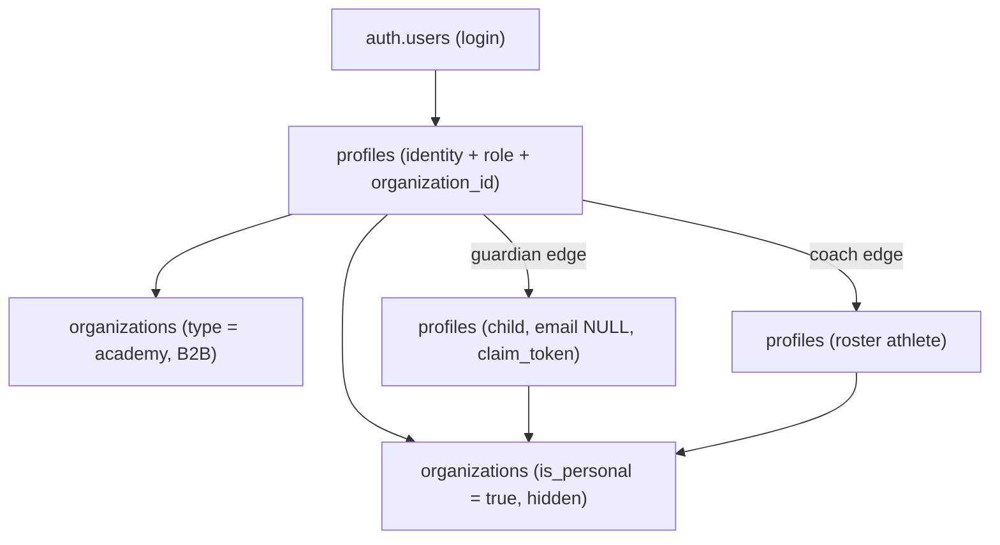

`

---
name: B2C consumer transformation
overview: Turn the academy-oriented Peak Performance Data app into a self-serve, mobile-first B2C product for individual athletes, parents, and independent coaches — using an auto-created hidden personal organization so existing org-scoped RLS keeps working, while the B2B academy experience stays fully intact. Sequenced in 13 phases, front-loaded with security work that a public consumer launch makes unavoidable.
todos:
  - id: phase0-security
    content: "Phase 0 (blocking): purge and rotate committed secrets (.env.production, firebase-debug.log); move admin authz off user_metadata to profiles.role/app_metadata + Auth Hook; add auth and rate limiting to ppd_backend; fix ppp_ai_agent IDOR and force athleteId=userId for players; auth-gate transcribe/ppc-proxy/vision-proxy; remove CORS wildcard from vercel.json; close RLS holes (global coach reads, WITH CHECK (true) writes, ungated SECURITY DEFINER RPCs); add CSP/HSTS/Referrer/Permissions headers"
    status: pending
  - id: phase1-foundation
    content: "Phase 1: regenerate Supabase types + CI drift check; add typecheck to CI and stop ignoring build errors; add pgTAP RLS tests via supabase test db; repair stale signup/middleware test mocks; delete ghost protected paths and ~20 verified zero-importer components; pick ONE design direction and mark the other two docs superseded; mark the prior b2c memory-bank plans superseded"
    status: pending
  - id: phase2-personal-org
    content: "Phase 2: add organizations.is_personal migration; filter personal orgs out of /api/organizations/public and all admin lists and counts; derive accountMode in user-context-lite, middleware headers, layout, and UserContextProvider; unblock the org-required 400s in personal-trainings, personal-tournaments, parent children create, player training and tournaments; auto-approve coach_requests in personal mode"
    status: pending
  - id: phase3-signup
    content: "Phase 3: rewrite signup without the org picker (move to react-hook-form + zod); add Google and Apple OAuth with linkIdentity for Apple private relay; provision personal org in the auth callback; enforce a server-side 16+ age gate with under-16 via parent; add an append-only consent event table for Art. 9 data; add Turnstile on signup; fix locale-less reset and confirm links"
    status: pending
  - id: phase4-onboarding
    content: "Phase 4: build the onboarding wizard on Sheet + Progress (one question, three value paths, scorekeeper primary); add profiles.onboarding_completed and a home setup checklist; request permissions at the hook with priming screens; implement is_sample tagged per-user sample data with a badge, one-click delete, and exclusion from aggregates"
    status: pending
  - id: phase5-ia
    content: "Phase 5: unify sidebar and bottom nav into one mode-aware source; ship the 5-tab consumer IA (Today, Matches, Log+, Progress, You); fix the BottomNav user-agent mount bug and padding; gate /management, /club-admin, /admin by mode in middleware without deleting shared components; fix coach deep-links into /management; build feature-gating seams on BrandConfig.features"
    status: pending
  - id: phase6-scorekeeper
    content: "Phase 6: make the scorekeeper the activation hook - rehydrate live state from the unused GET endpoint, auto-finalize on natural match end, offline-first match creation, Screen Wake Lock, default Quick mode with thumb-zone actions, and surface it as the center Log tab"
    status: pending
  - id: phase7-home
    content: "Phase 7: consumer home with at most 3 scores plus an explicit calibration window; standardize empty states by variant and wire ErrorStates with retry; fix the dead /wearables and /settings/wearables CTAs and TennisHighlightCard infinite skeleton; replace fake wearable sync progress with real job state and honest Garmin expectations; write to the unused insights store on a schedule; rework the AI persona for solo consumers with durable rate limits; reseed achievements for solo users with weekly streaks and no leaderboards; hide messaging, genetics, and labs in personal mode"
    status: pending
  - id: phase8-copy
    content: "Phase 8: implement the sparse consumer i18n overlay merged in messages-cache and the client providers when the user has no academy; rewrite the ~40 must-fix strings and make ~165 conditional; close the 78-key es/ca/zh gap and fix the hardcoded path in sync-translations.js"
    status: pending
  - id: phase9-lifecycle
    content: "Phase 9: add self-serve email change, avatar upload, DOB/phone/units, and athlete self-edit of player_details; make account deletion cascade to ClickHouse, R2, and non-cascading FKs; add a data export endpoint; rewrite the privacy policy, add Terms of Service and a consent banner; design the consumer-joins-academy migration path"
    status: pending
  - id: phase10-growth
    content: "Phase 10: add native share, revoke UI, longer TTL, and a match-highlight OG image to share links, and strip video keys from the guest payload; rewrite the landing page around individual signup with screenshots and an FAQ; convert the Tennis Bench CTA to signup and fix its OG images and mobile carousel; add hreflang for all four locales and fix robots.ts blocking OG images"
    status: pending
  - id: phase11-analytics
    content: "Phase 11: add PostHog Cloud EU and Sentry; capture activation and payment events server-side; capture and persist first-touch and last-touch UTMs plus signup_source; instrument the minimum funnel event set; add a consent banner with equal-prominence Accept and Reject"
    status: pending
  - id: phase12-polish
    content: "Phase 12: execute the chosen design direction across shell, cards, and charts; fix mobile overflow, the player activity table, MessageInput text-sm and tap targets, and fixed-width court SVGs; consolidate service workers, add navigateFallback, CDN-free offline page, manifest screenshots and shortcuts, and a post-install push prompt; fix bottom-nav contrast, skip link on public routes, aria-current, h1s, reduced motion, and enable jsx-a11y; finish the outstanding performance-audit items"
    status: pending
  - id: phase13-video-launch
    content: "Phase 13: gate and queue video with per-user quotas, real pipeline_jobs status in the app, an honest 24-72h SLA, and auto-import of finished jobs; then run the launch checklist - credentials rotated, RLS tests green, typecheck gating, consent and deletion verified end to end, analytics firing, and a real-phone smoke test of consumer signup in all four locales"
    status: pending
isProject: false
---
# B2C Consumer Transformation

100 subagents on Grok 4.5 audited the monorepo (75 agents) and researched the consumer sports market and comparable products (25 agents). This plan consolidates those findings.

## What the research changed about the plan

Four findings reshape the approach and you should read these before the phases.

**The personal-org decision is validated.** Supabase practitioners ship exactly this pattern (Makerkit's `accounts.is_personal_account`, auto-created at signup, personal `id = auth.uid()` so policies stay uniform). It keeps your ~80 org-scoped tables and their RLS untouched. But `organizations` has **no `CREATE TABLE` in any of the 47 migrations** — it predates the migration folder — so we work from the live schema, not the repo.

**The B2C work is blocked by pre-existing security holes.** These were tolerable when every tenant was a trusted academy. They are not tolerable on the open internet:

- `.env.production` and `firebase-debug.log` are **committed to git**, containing `SUPABASE_SERVICE_ROLE_KEY`, a GitHub PAT, and R2/Garmin/Strava secrets.
- Admin authorization reads `user.user_metadata.role`, which the browser client can write via `updateUser({ data })` — your own `EditProfileDialog.tsx:50` does exactly that for names. This is a likely path to full admin.
- `ppd_backend` graphs/wearables endpoints have **no auth and no rate limiting**, are publicly reachable at `api.wearablesync.app/ppc`, and accept a client-supplied `user_id`. The `x-internal-service` header the app sends is never validated there.
- `ppp_ai_agent` trusts the shared secret and does not verify athlete access — confirmed IDOR.
- RLS has global `role='coach'` read policies and `WITH CHECK (true)` write policies on `ai_memories`, genetics, labs, and insights.

**You already have two unimplemented B2C plans in the repo.** `_memory_bank/features/b2c-consumer-app-implementation-plan.md` and `b2c-individual-athlete-implementation.md` propose `is_individual` plus a **nullable** `organization_id` plus Stripe. Nothing shipped. Their nullable-org direction conflicts with today's personal-org decision. This plan supersedes them; they should be marked superseded rather than left to mislead the next agent.

**More already works than expected.** `tennis_matches` is already `user_id`-owned with no `organization_id` — ideal for B2C. Personal trainings and personal tournaments already exist as self-logging paths. The scorekeeper is a real product. Share links already have crypto tokens, OG cards, and a signup gate. The blocker in each case is the same: a hard `400` or a "No Organization" card when the user has no academy.

## Target account model

Every consumer signup creates one hidden personal organization. Role stays one of the existing five (`player`, `parent`, `coach`, `club_admin`, `admin`); a new orthogonal **account mode** (`personal` vs `academy`) derived from `organizations.is_personal` decides what the user sees. Do not invent new roles — 169 files branch on role today and that surface should not grow.

## Recommended consumer IA

Research across Strava, Whoop, Oura, Garmin Connect, Nike Run Club, Apple Fitness, Peloton, and MyFitnessPal converges on 3–5 equal tabs with a Today-style landing, never a social feed, and settings under a profile tab. Proposed, identical for all three personas with content adapting:

- **Today** — readiness, next session, one insight
- **Matches** — history, highlights, share
- **Log (+)** — center action: score a match live, upload, quick note
- **Progress** — trends over time
- **You** — profile, athlete/child switcher, coach mode, settings, devices

Today's coach role sees 11 sidebar items, parent 9, player 8, and the bottom bar is a hardcoded 4-item subset. `/management`, `/club-admin`, and `/admin` get hidden by mode, not deleted.

---

# Stage 1 — Make it safe to have strangers

## Phase 0: Security remediation (blocking, do not defer)

Nothing else ships until this is done.

- Purge `.env.production` and `firebase-debug.log` from git history; add both to `.gitignore`; **rotate every leaked credential** (Supabase service role, GitHub PAT, R2, Garmin, Strava, Resend, AI keys).
- Move admin authorization off `user_metadata`. Every check like `user.user_metadata.role === 'admin'` (in `src/app/api/admin/*`, `src/middleware/authorization.ts:18`) must read `profiles.role` or `app_metadata`. Add a Supabase Auth Hook to block client writes to role fields.
- Add auth + per-IP/per-user rate limiting to `PeakPerformanceData/ppd_backend/api/main.py`, mirroring the middleware that already exists at `ppp_ai_agent/api/middleware/auth.py:35`. Reject client-supplied `user_id` unless it matches the verified session. Disable public `/docs`.
- Fix the `ppp_ai_agent` IDOR: bind caller identity per request; in `src/lib/ai/tools/specialistTools.ts` force `athleteId = userId` for player personas rather than letting the LLM choose it.
- Auth-gate `src/app/api/transcribe/route.ts`, `ppc-proxy`, and `vision-proxy`; require `CRON_SECRET` unconditionally.
- Remove `Access-Control-Allow-Origin: *` from `vercel.json:21`; it overrides the allowlist in `src/middleware/cors.ts`.
- Close RLS holes: replace global `role='coach'` SELECT policies, drop `WITH CHECK (true)` writes on `ai_memories`/genetics/labs/insights, gate `SECURITY DEFINER` RPCs (`get_player_dashboard_init`, `match_ai_memories`) on caller identity, and add athlete self-access on `injuries` and `tennis_specific_tests`.
- Add security headers (CSP, HSTS, Referrer-Policy, Permissions-Policy) in `next.config.js`; today only three headers are set.
- Verify membership on `/api/upload/logo`; require a session on `/api/auth/create-coach-request` and `create-member-request`, which currently accept a body `userId` with the service role.

## Phase 1: Foundation and safety net

- **Make types authoritative.** `src/lib/supabase/database.types.ts` is missing 15 tables (courts, tennis participants/pauses, bench, labs, genetics, insights) and the scorekeeper columns. Add a `gen:types` npm script and fail CI on drift.
- **Add a typecheck gate.** `npm run typecheck` exists but runs nowhere, and `next.config.js:425` sets `ignoreBuildErrors: true` — type errors currently ship. Add typecheck to `.github/workflows/ci.yml` and plan to flip the ignore off.
- **Add RLS tests.** Adopt pgTAP with `supabase test db` in CI. Assert both allow and deny, cross-tenant especially. There are zero RLS tests today.
- **Repair the stale test suite.** `tests/auth/signup-comprehensive.test.ts:50` mocks `auth.signUp` while `src/lib/auth/auth.ts:149` calls `auth.admin.createUser`; `tests/middleware.test.ts:26` mocks `@supabase/auth-helpers-nextjs` while the code uses `@supabase/ssr`.
- **Delete dead surface area.** Remove ghost protected paths `/exploration`, `/stats`, `/chat`, `/admin-test` from `src/middleware.ts:80` and `src/middleware/auth.ts:14` (no routes exist); delete the `/history` stub; delete verified zero-importer components (`CoachStats`, `AthletesList`, both `OfflineBanner` duplicates, `ReadinessCard`, `QuickActionsPanel`, `ErrorStates`, `PlayerGoalsTracker`, and ~15 others).
- **Resolve the design-direction conflict** before any UI work. Three competing systems exist: `docs/design-system.md` (light, Inter), `docs/premium-design-overhaul-v2.md` (neutral dark, Geist), and `_plans/broadcast_console_redesign` (navy, Barlow, `@ppd/tokens`). Pick one — `@ppd/tokens` is recommended since Tennis Bench already aligns to it — and mark the others superseded.
- Mark the two prior B2C memory-bank plans superseded.

---

# Stage 2 — Let a stranger sign up and get value

## Phase 2: Personal org and account mode

- Migration: add `organizations.is_personal boolean default false` (or extend `type` with `'personal'`); backfill nothing; index it.
- Filter `is_personal = true` out of `/api/organizations/public` (currently **unauthenticated and returns every org**), `/api/organizations`, admin org lists, `get_full_user_context`'s org count, and brand domain lookup.
- Derive `accountMode` once and thread it exactly where role and org already travel: `src/app/api/auth/user-context-lite/route.ts`, `setMiddlewareUserHeaders` in `src/middleware/auth.ts:120`, `src/app/[locale]/layout.tsx:168`, and `UserContextProvider.tsx:33`.
- Follow the research: use membership/DB lookups for authorization, not JWT claims, to avoid staleness. Wrap `auth.uid()` in `(select auth.uid())` in any new policy — the documented benchmark is 179ms to 9ms.
- Unblock the paths that hard-fail without an academy: `POST /api/personal-trainings` (400 at `route.ts:46`), `POST /api/personal-tournaments` (400 at `route.ts:44`), the "No Organization" early return in `PlayerTournamentsClient.tsx:169`, the org gate in `player/training/page.tsx:60`, and the org requirement in `parent/children/create/route.ts:91`.
- Auto-approve `coach_requests` for personal-mode coaches so an independent coach isn't stuck behind a club-admin approval gate (`coach/page.tsx:102`).

## Phase 3: Consumer signup, OAuth, age gate, consent

- Rewrite `src/app/[locale]/signup/page.tsx`: remove the organization picker for the platform brand, keep it for branded academy domains. Note this form is raw `useState`; move it to the react-hook-form + zod pattern exemplified by `InjuryForm.tsx`.
- Add Google and Apple OAuth via `signInWithOAuth`. **Apple gotcha:** Hide My Email issues a `@privaterelay.appleid.com` address, Supabase auto-links by email, so relay addresses create duplicate accounts. Use `linkIdentity()` and treat Apple `sub` as the stable identity.
- Harden `src/app/[locale]/auth/callback/route.ts` to provision a personal org and persona on first OAuth login; today it falls through to `/overview` which then redirects players away.
- **Age gate at 16+.** GDPR Art. 8 defaults to 16 and Germany/Netherlands/Ireland keep it there, so a single 16+ rule is the safe EU-wide default. Under-16 must be created under a parent account. Make `date_of_birth` server-validated, not just UI-required.
- **Add a consent event table** (append-only): subject, actor and role, action, timestamp, jurisdiction, purpose codes, data categories, Art. 6 basis, Art. 9 condition, policy version, verification method. A boolean column is not sufficient for special-category data.
- Add Turnstile or hCaptcha on signup; there is no bot protection today.
- Fix locale-less reset and confirm links in `src/lib/auth/auth.ts:469` and `:611`.

## Phase 4: Onboarding and first-session value

There is **no onboarding machinery today** — one unused `EmptyStateOnboarding` variant and nothing else. Build it fresh on `Sheet` + `Progress` + `Tabs`; no new dependencies needed.

Recommended first-session flow, grounded in the activation research (good consumer time-to-value is under 2 minutes; 3-step flows complete at ~72% while 7-step flows complete at ~16%):

1. Minimal auth, then **one** skippable question (compete / train / recover) that reorders home cards.
2. Replace the empty dashboard with a three-path chooser whose **primary CTA is Score a match live** — it is the only hook that delivers value in the same session.
3. Secondary: connect Garmin, with honest progress and an explicit "readiness appears after tonight's sleep" promise.
4. Tertiary: upload video, with a queue position and an honest SLA. Never the only day-one path.
5. Request permissions at the hook, not at launch (pre-permission priming raised location opt-in from 45% to 93% in the cited case).
6. Add `profiles.onboarding_completed` and a 3–5 item home checklist.
7. Sample data: seed into the consumer's own `user_id` only, tagged `is_sample`, badged in the UI, one-click deletable, and excluded from aggregates. Do **not** reuse `clone_demo_wearables.py` — it wrote unlabeled rows under real academy UUIDs.

---

# Stage 3 — Make it feel like a consumer app

## Phase 5: IA, navigation, and mode gating

- Unify the two mobile navigation systems: `BottomNav.tsx` is a hardcoded 4-tab subset while `SidebarMobile.tsx` still exposes the full B2B list.
- Implement the 5-tab IA above; drive both sidebar and bottom bar from one source filtered by role **and** mode.
- Fix the mount bug: `BottomNav` mounts only on a mobile user-agent (`layout.tsx:410`) but is styled `md:hidden`, so a narrow desktop window gets no bottom nav while still taking `pb-28` padding.
- Gate `/management`, `/club-admin`, `/admin` by mode in `src/middleware/authorization.ts` — note `/management` is currently **not role-gated at all**. Keep the routes alive for B2B and do not delete `src/components/management/**`, which `/coach` pages import.
- Fix coach deep-links into `/management` (`coach/athlete/[id]/page.tsx:235`, `TrainingReports.tsx:382`).
- Remove `/management/families` from the coach sidebar (`navigationItems.tsx:59`).
- Feature gating: extend the existing unused `BrandConfig.features` hook rather than adding a flag service. Build the seams the pricing research identified (tier, monthly video/AI/sync meters, history depth, athlete seats, advanced metrics, export) even though billing is out of scope.

## Phase 6: Scorekeeper as the activation hook

This is the highest-leverage product work in the plan. Fix, in `src/app/[locale]/tennis-scorekeeper/**`:

- **Rehydrate on load** — `LiveScorekeeperView.tsx:98` always calls `startMatch` with an empty log, and the GET hydrate endpoint at `matches/[id]/route.ts:104` is unused. Refresh or phone-lock loses the match.
- **Auto-finalize** when the reducer reaches `completed` (`rules.ts:291`); today only an explicit Finish tap calls `/finish`, so matches can sit `in_progress` forever.
- **Offline-first create**, not just a point outbox; today `MatchSetupForm.tsx:180` needs network.
- **Screen Wake Lock**, default Quick mode, thumb-zone primary actions. Research says one tap per point as the default with optional post-point enrichment.
- **Put it in the bottom nav** as the center Log action; today it's reachable only via a Tennis Analytics CTA.

## Phase 7: Consumer home, wearables, and insights

- **Home composition.** Follow the Whoop/Oura pattern: at most three scores on the home screen with depth behind a tap, plus an explicit calibration window ("baseline forming, day 4 of 14") instead of empty rings. Wire the `tournaments` and `previousTest` props that `PlayerDashboard.tsx:312` never passes to `PlayerHome`.
- **Empty states as a standard.** Require a `variant` (first-use, cleared, no-results, error, permission) on the existing `src/components/ui/empty-state.tsx`, and wire the already-written-but-unused `ErrorStates.tsx` with retry. Worst current offenders: `TennisHighlightCard.tsx:121` pulses forever on error; `HeroRingTrio.tsx:48` and `ConnectWearableCard.tsx:47` link to `/wearables` and `/settings/wearables`, **neither of which exists**; `TennisAnalyticsContent.tsx:580` shows fetch errors as "no matches".
- **Honest wearable sync.** `sync/[jobId]/progress/route.ts:51` maps "connected" to 100% and `ChartsContent.tsx:422` forces completion at 60s. Persist real job IDs. Promise what Garmin can actually deliver: minutes for recent data after a device sync, ~30 days of backfill, but **~3 weeks of nightly wear** before HRV Status has a baseline.
- **Consumer insights.** `supabase/migrations/20260727_insight_store.sql` created `insights`, `feedback_events`, and `preference_memory` but **nothing writes to them**. Add a scheduled writer (post-match and weekly) reusing the existing `computeProgressFindings` rules. Research is clear that proactive cards, not chat, are the default coach; keep chat for follow-ups.
- **Rework the AI persona.** `src/app/api/ai-agent/route.ts:61` hard-requires an organization; `systemPrompt.ts:28` forbids unsolicited advice; `athleteTools.ts:114` averages org-wide reports with no athlete filter. Add durable rate limits (the current one is an in-memory Map) and batch the card generation on a cheap model.
- **Gamification.** Reuse the existing achievements engine but reseed definitions — current ones need group-training attendance, so a solo user can earn almost nothing. Use **weekly** streaks with a freeze, not daily, for a 2–4×/week sport. **Do not ship leaderboards**: org-scoped means one member, and the Fitbit teen study found peer leaderboards reduced competence and autonomy in young athletes.
- **Do not ship messaging in consumer v1.** Contacts are built from same-org coaches and club admins, so a personal-org user sees an empty list forever. Worse, SafeSport and NSPCC/CPSU guidance prohibit unsupervised adult-to-minor 1:1 messaging, and Apple 1.2 plus Google's UGC and Families policies require moderation, reporting, and blocking. Enabling it is a rebuild (parent-copy enforcement, age gates, audit logs, moderation ops), not a toggle. Hide `/messages` and the unread badge in personal mode.
- **Do not ship genetics or labs to consumers.** Both routes are live but unlinked and un-gated. `lab_panels.consent_org_admin_visible` defaults to `true`, all three tables have open `WITH CHECK (true)` inserts, and there are no parent policies at all. Special-category data needs legal review first.

## Phase 8: Conditional consumer copy

507 English strings across 55 namespaces carry academy framing. Categorized: ~40 must be rewritten, ~300 are correct for genuine coach/admin roles and should stay, ~165 should be conditional.

Recommended mechanism (from the i18n audit): a **sparse runtime overlay** — `messages/overlays/consumer/{en,es,ca,zh}.json` using the same top-level namespaces, deep-merged in `src/i18n/messages-cache.ts` and the client message providers when the user has no academy. This preserves every call site, leaves the B2B JSON untouched, and avoids re-running `scripts/generate-route-namespaces.js`. Suffix keys or ICU `select` both cost more here.

Also fix the existing 78-key gap in es/ca/zh and repair `scripts/sync-translations.js:11`, which hardcodes a path outside this monorepo.

---

# Stage 4 — Make it launchable

## Phase 9: Self-serve lifecycle, GDPR, legal

- Users can currently only self-edit their name, password, and language. Add email change, avatar upload (today `/api/upload/logo` is club-admin only), DOB/phone/units, and let athletes edit their own `player_details` (`/api/athletes/[id]` PUT is coach/admin only).
- **Fix account deletion.** `DELETE /api/user/account:9` calls only `auth.admin.deleteUser`. It must cascade to ClickHouse wearable data, R2 video, and non-cascading Supabase FKs. The privacy policy promises 30-day deletion.
- **Add data export** — no portability endpoint exists.
- Rewrite the privacy policy (it cites a US-style "under 13" standard), add Terms of Service (none exist), and add a consent banner. Separate engineering work from what needs a lawyer; the compliance agent produced a prioritized question list.
- Design the consumer-joins-academy upgrade path now, since it is the natural B2C-to-B2B expansion: keep `user_id`-keyed history portable and re-tag org-scoped rows from personal to academy org.

## Phase 10: Growth loops

- **Share cards.** The share link plumbing is good (192-bit tokens, OG cards, soft gate at 10 min). Add native `navigator.share`, a revoke UI, a longer TTL, a match-highlight OG image instead of a logo, and **strip `cloudflare_video_key` and `swingvision_url` from the guest payload** (`match-detail.ts:380` leaks them). Prompt at the emotional peak — a win or a personal record.
- **Landing page.** The hero already says "See every angle of your tennis" and goes to `/signup`, but the pricing CTA is "Request Invitation" into an org-required B2B lead form. Make signup the single primary CTA, add individual-oriented value props, app screenshots, and an FAQ. Replace hardcoded `#0047FF` with tokens.
- **Tennis Bench** is your best top-of-funnel asset: public, indexable, with dynamic OG images and a sitemap. Add OG images to the index, switch the CTA from "Request invitation" to signup, make the new `BenchSocialCarousel` tap-to-download on mobile, and load the manifest instead of a hardcoded file list.
- **SEO.** Add `alternates.languages` for all four locales (missing everywhere), fix `robots.ts` — it disallows `/api/` which blocks the OG image URLs, and its `/watch/` rule doesn't match locale-prefixed paths so share links are crawlable anyway.

## Phase 11: Analytics and observability

You cannot currently measure signup conversion, activation, retention, or ad ROI. This is a launch blocker in its own right if you are buying traffic.

- **PostHog Cloud EU** (events, funnels, replay, flags in one tool, EU residency at no extra cost) plus **Sentry** for errors.
- Capture activation and payment events **server-side** in Route Handlers so ad-blockers don't erase them.
- Capture UTMs and click IDs on first landing, persist first-touch write-once and last-touch, and store `signup_source` on the profile.
- Minimum event set: `landing_page_viewed`, `signup_started`, `signup_completed`, `email_verified`, `onboarding_completed`, `first_value_reached`, plus `identify` for cohorts.
- Full product analytics with `identify` and replay needs a consent banner in the EU; equal-prominence Accept/Reject (hiding Reject dropped refusal from 17% to 4% in the cited study, and CNIL enforces against it).

## Phase 12: Design, mobile, PWA, accessibility

- Execute the single chosen design direction from Phase 1 across the shell, cards, and charts.
- Mobile fixes: clamp `AppShell.tsx:133` overflow, replace the player activity table with cards under `sm`, fix `MessageInput.tsx:231` `text-sm` (causes iOS zoom) and its 32px tap targets, make the court SVGs fluid (`CourtvizCourtHeatmap` is fixed 440×700, `PointReplayPanel` fixed 400px).
- PWA: delete or merge the unused `public/service-worker.js`, add `navigateFallback`, rewrite `offline.html` without its Tailwind CDN dependency, add `screenshots` and `shortcuts` to the manifest, and add a post-install push prompt (iOS requires home-screen install before push works at all).
- Accessibility (European Accessibility Act applies to consumer services): fix inactive bottom-nav contrast (~1.7:1 at `BottomNav.tsx:84`), mount the skip link on public routes, add `aria-current`, add page-level `h1`s, gate landing Framer Motion on `useReducedMotion`, and enable `jsx-a11y/recommended`.
- Performance: finish the outstanding items from `_plans/app_performance_audit_2d7eb1f9.plan.md` — the HR-zone cold path, the charts sync stampede, and the player init focus-revalidation override.

## Phase 13: Video, and launch readiness

- **Gate and queue video, do not automate it yet.** There is no self-serve tennis video analysis API on the market; the pro vendors sell facility hardware and league feeds. Open-source ball tracking is mature (TrackNetV4/V5, WASB) but productizing amateur phone footage is a multi-quarter ML effort. Your current capacity is ~300 SwingVision-hours per month on one Mac Mini and five iPhones.
  - Surface real `pipeline_jobs.status` in the app; today `video_upload_status: 'ready'` misleadingly means "uploaded", not "analyzed".
  - Enforce a per-user monthly quota before the watcher enqueues.
  - State an honest SLA (24–72 hours, manual review).
  - Close the loop so a finished job auto-imports into `/api/tennis/import` instead of only pasting a URL.
- Launch checklist: rotate credentials verified, RLS test suite green, typecheck in CI, consent and deletion working end to end, analytics funnel firing, and a smoke test of the full consumer signup on a real phone in all four locales.

---

## Open questions the research surfaced

These do not block Phase 0–2, but they should be answered before Stage 3 hardens the IA.

1. **Padel.** In Spain padel has ~6.7M casual players and 109k licences against tennis's ~2.2M and ~96k. If Spain is your launch market, tennis-only may be the smaller opportunity. Worth deciding whether the data model stays tennis-shaped or becomes racket-sport-shaped.
2. **UTR / World Tennis Number integration.** Both have APIs (UTR Engage requires partner approval; WTN has a public GraphQL API). Research is unambiguous that products which move or explain a rating outperform generic insights, and only ~7% of the world's 106M players are association-registered — so ratings are the wedge into the segment that actually pays.
3. **Athlete-versus-user modeling.** Every youth platform studied separates a durable Athlete entity from logins, with multiple guardian edges and roles. Your `profiles` + `claim_token` approach is close but assumes one guardian. Divorced parents and a child with two coaches are the cases that break it.
