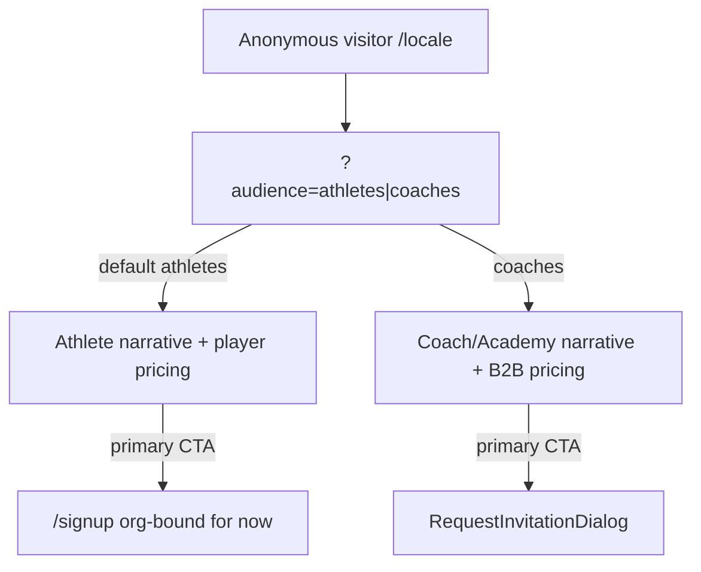

  

---

name: B2C Landing Dual Audience
overview: Restructure PlatformLanding into an athlete-first dual-audience page on the same URL (`?audience=athletes|coaches`), with honest conversion CTAs, a real tiered pricing section, and full i18n—without touching AcademyLanding or redesigning the visual system.
todos:

- id: audience-hook
  content: Add useLandingAudience (?audience=athletes|coaches) + AudienceSwitcher (Tabs/AccentTabs)
  status: pending
- id: platform-restructure
  content: "Refactor PlatformLanding: audience-aware section order, role elevation, CTAs, integrations copy"
  status: pending
- id: pricing-grid
  content: Replace Early Access card with dual-mode tiered pricing + monthly/yearly + honest waitlist/invite CTAs
  status: pending
- id: navbar
  content: Wire switcher into LandingNavBar + Sheet; fix sm-md gap; scroll-margin on anchors
  status: pending
- id: i18n
  content: Add audience/pricing keys to en/es/ca/zh under landing.platform
  status: pending
- id: tests
  content: Vitest audience switcher + CTA/URL tests
  status: pending
- id: seo-legal
  content: Platform OG/meta/hreflang; sitemap locale roots; Terms note for Stripe follow-up
  status: pending
- id: copy-accuracy
  content: Fix overclaims (single tap, equal wearable parity, many more); soft analytics events for switcher/CTAs
  status: pending
  isProject: false

---

# Dual-Audience B2C/B2B Platform Landing

## Current state (swarm findings)

[`PlatformLanding.tsx`](PeakPerformanceData/peak_performance_data/src/components/landing/PlatformLanding.tsx) is one mixed page: athlete-leaning hero/features, coach-elevated `#roles`, coach-only testimonials, and B2B-only Early Access pricing. CTAs fight each other (`/signup` vs Request Invitation).

Critical product truths that must shape landing copy:

- **No org-free B2C signup yet** — [`signUp`](PeakPerformanceData/peak_performance_data/src/lib/auth/auth.ts) requires `organizationId` (or `club_admin` creates an org). “Get Started” today means join an org, not solo consumer signup ([Signup self-serve](3d076a15-ced5-4ff0-a3e3-63c4a04ee2cf)).
- **No Stripe / entitlements in code** — pricing is marketing + lead-gen until billing ships ([Billing search](fa395a7b-12c0-4656-aae4-54de0053cc17), [Entitlements](0c690803-44c3-4cfa-8bc5-9965b77e5c33)).
- **Leave [`AcademyLanding`](PeakPerformanceData/peak_performance_data/src/components/landing/AcademyLanding.tsx) alone** — white-label login portal only ([AcademyLanding audit](5fadede4-72bc-4a19-af19-91c983f16f25)).
- Role label: say **Players** (auth role `player`); “athlete” is fine as sports language ([Player vs athlete](b76ce408-7737-4be2-bbc1-2c54e9988e96)).



## Locked product decisions

| Decision        | Choice                                                              |
| --------------- | ------------------------------------------------------------------- |
| URL             | Same path; deep-link`?audience=athletes\|coaches`                  |
| Default         | `athletes`                                                        |
| Tracks          | Athletes · Coaches & Academies (parents: light copy only)          |
| Visual system   | Keep`#0047FF`, Barlow/DM Sans, `cardBase`, dark navy tokens     |
| Academy domains | Unchanged                                                           |
| B2B CTA         | Keep invitation dialog                                              |
| Athlete CTA     | `/signup` with honest org-join framing until B2C individual ships |

## Recommended pricing (research-backed)

**Market anchors (July 2026 research)**

- SwingVision US: Free · Plus $14.99/$95.99yr · Pro $24.99/$179.99yr · Max $39.99/$299.99yr — phone capture + line-call AI; Teams = contact sales ([SwingVision](4dcd475d-ecc4-430a-b94b-8f534cad2741))
- Broader bands: B2C tennis AI ~$8–40/mo; coach tools ~$50–80/mo; academy software ~$400–2.7k/mo or $2.5–32k/yr tagging packages; CourtReserve ops $159–499/mo ([Tennis apps pricing](be970eac-9d83-4a3c-b939-6fcd4e3c669b), [PlayerData comps](64db0457-6b38-4f6d-b4f8-9fb31e2b77b9))

**Positioning lock:** Do not compete head-on on recording hours. Landing narrative = *film (SwingVision/pipeline) → PPD performance OS* (wearables, longitudinal progress, multi-role coach/parent/academy ops).

**B2C prices (landing display)** — keep memory-bank Freemium ([Memory bank](2046936c-3de4-4472-9730-37f519ebf0cd)), intentionally **under** SwingVision Pro/Max because PPD is not selling capture hours:

| Tier     | Monthly       | Yearly                                             | Position |
| -------- | ------------- | -------------------------------------------------- | -------- |
| Free     | $0 | $0       | Match import + limited wearable history            |          |
| Athlete  | $9.99 | $99   | Core — match insights, wearables, progress, tests |          |
| Athlete+ | $19.99 | $199 | AI companion + priority (AI on this tier only)     |          |

- Garmin/full wearables on Athlete (not Free)
- Athlete+ = Premium rename for clarity
- Alternate research suggestion of Player @$24 is rejected for v1 landing (too close to SwingVision Pro without capture parity)

**B2B prices (indicative on coaches mode)**

| Tier    | Display               | CTA                                                                                     |
| ------- | --------------------- | --------------------------------------------------------------------------------------- |
| Coach   | From $69/mo           | Request Invitation — above Max/Ten-Fifty5 Coach; seats TBD (target ~12 athletes)       |
| Academy | From $449/mo / Custom | Request Invitation — software seats, not labor tagging; optional analyst credits later |

Until Stripe exists: paid athlete CTAs = **“Join waitlist”** via invitation API with new optional fields `audience` + `intent`/`plan` (today API only stores name/email/phone/organization — [Invitation API](65497377-8faf-47ce-aaf6-308cbecaa97c)). Free athlete CTA → `/signup` with org-join framing. Footnote: “Paid individual plans launching soon.”

B2B stays **Request Invitation** (organization required). Athlete waitlist can make organization optional when `audience=athletes`.

---

## Implementation steps

### 1. Audience state + deep-link

Add a small client hook/module (e.g. `src/components/landing/useLandingAudience.ts`):

- Values: `'athletes' | 'coaches'`; default `'athletes'`
- Read/write `?audience=` via `useSearchParams` + `router.replace(..., { scroll: false })` — match Tennis Analytics pattern ([Query patterns](8cd28ddf-2f35-4e6f-9e72-9e5972355dbb)); no `nuqs`
- Allowlist invalid values → default; omit param when default

### 2. Persistent switcher UI

New `AudienceSwitcher.tsx` using existing [`Tabs`](PeakPerformanceData/peak_performance_data/src/components/ui/tabs.tsx) or [`AccentTabs`](PeakPerformanceData/peak_performance_data/src/components/ui/accent-tabs.tsx) (`cols={2}`):

- Labels: “Athletes” / “Coaches & Academies”
- Place in hero (below badge, above H1) **and** mirror in [`LandingNavBar`](PeakPerformanceData/peak_performance_data/src/components/ui/LandingNavBar.tsx) desktop center + mobile Sheet top
- Style with existing hero pill tokens (`border-[#0047FF]/30`, `#5C8DFF` dark) — no new visual language ([Design tokens](d4bc91d7-2300-413e-8178-6d4622326630))
- A11y: tablist name, keyboard, `useReducedMotion` for panel swaps ([A11y](8f43833a-e67c-4e4b-82dd-4c0457981acc), [Reveal](35d65c22-8f10-4941-8eea-d1088bd7a6d5))
- Mobile: do **not** cram switcher into the &lt;sm header row; Sheet + hero only ([Mobile](8e03c197-eaa7-49e7-a12c-813b7266a48d))
- Fix nav gap: expose center links (or at least Pricing) in Sheet for `sm–md`, and add `scroll-margin-top` on `#features` / `#pricing` / `#roles`

Nav copy: rename `landing.nav.forTeams` → audience-aware (“For players” / “For teams”) or neutral “Who it’s for”.

### 3. Refactor PlatformLanding into audience-aware sections

Keep one file split into section components if &gt;300 lines, same shells:

**Athlete order** ([CTA strategy](ad3b9d87-9ea2-46e2-82d6-036b9068cce8)):
Hero → Features → Integrations → Tennis Bench → Roles (Players elevated) → Testimonials → CTA → Pricing

**Coaches order:**
Hero → Roles (Coaches elevated) → Features → Integrations → Testimonials → Pricing → Tennis Bench → CTA

Per-audience swaps (same components, different keys/emphasis):

| Surface               | Athletes                                                                                                                                                    | Coaches & Academies                                                                                                          |
| --------------------- | ----------------------------------------------------------------------------------------------------------------------------------------------------------- | ---------------------------------------------------------------------------------------------------------------------------- |
| Hero                  | “your tennis”; primary`/signup`; secondary `#pricing` or Bench                                                                                        | Multi-athlete intel; primary Request Invitation; secondary`#pricing`                                                       |
| Integrations subtitle | “your wearables”                                                                                                                                          | “devices your players trust”                                                                                               |
| Roles elevation       | Players card                                                                                                                                                | Coaches card (current)                                                                                                       |
| Pricing bullets       | Athlete tier features                                                                                                                                       | Four equal coach pillars: wearables, match analytics, physiology, testing ([Coach B2B](bcdf35f8-fb29-4909-b37c-302c9d2006ad)) |
| Bottom CTA            | Player start                                                                                                                                                | Academy/coach deploy                                                                                                         |
| Testimonials          | Prefer athlete+coach mix; until real athlete quotes, use Tennis Bench as proof and keep 1 coach quote ([Testimonials](a12dffb5-9e0d-4acf-9665-cc51a1df530b)) |                                                                                                                              |

Parents: one line in roles subtitle + optional Players/Academies bullet — no fourth track ([Parents](80568609-8453-41a7-bc14-3dda358933d3)).

**Copy accuracy (integrations):** drop “single tap”; avoid implying equal sleep/recovery across Whoop/Garmin/Polar; change “And many more” → “More coming” (Suunto/Apple Health) ([Integrations audit](763d8d19-9c53-47b0-97e4-5eaa39d7dc04)). Move Tennis Bench earlier in athlete mode — on-court proof lives there, not in the physiology hero video ([Public assets](c5a5892b-99c8-4c22-bdb5-2f2efb81f9e3)).

### 4. Rebuild `#pricing`

Replace single Early Access card with:

1. Audience-synced plan grid (1-col mobile, 3-col `md+` for athletes; 2-col for B2B)
2. Monthly/yearly toggle (athletes)
3. Feature bullets grounded in real product: match analytics + progress, wearables/readiness, physical tests ([Tennis](913bda66-e274-4a94-b070-e3266c6199e1), [Progress](6bc6bf9a-0323-4374-aff6-a6f743e8dc79), [Wearables](9a9fb1d7-794e-40eb-ae0c-fc0e5ad1f6b6)) — do **not** claim `/history`, org-wide match rollups as fully shipped ([Academy ops](e425d4da-6d2a-4485-8255-ff1715aa5921)), or autonomous AI coaching
4. Footnote: “Individual paid plans launching soon” / “Join through your academy today” until Stripe + org-free signup land ([B2C partial](3435c0ab-da6c-4ed9-a630-a0a505e92d95), [Org model](ac473218-8f36-4e85-bbd5-7e3667889606))
5. Parameterize `RequestInvitationDialog` (today props are only `{ open, onOpenChange }` — no source/copy overrides; org always required; API hardcodes `source: 'landing.request_invitation'` even from Tennis Bench) ([Invitation dialog](831ba6e4-c314-4e53-becf-2f0ea7b70a57)):
   - Add props: `source`, `variant` (`b2b` | `athlete`), optional i18n namespace override
   - Athlete waitlist: organization optional; athlete-facing copy; `source` e.g. `landing.athlete_waitlist`
   - B2B: keep org required; `source` e.g. `landing.request_invitation`
   - Also fix `BenchLeadCapture` to pass `source: 'tennis_bench.request_invitation'`
   - API Zod: accept optional `organization` when athlete variant; store `audience` / `plan` / `source` from client (allowlisted)
   - Prefer checking in a local migration for `invitation_requests` if still missing from repo (table exists remotely)

### 5. i18n (all 4 locales)

Extend [`landing.platform`](PeakPerformanceData/peak_performance_data/messages/en.json) with selective overrides (not a full 78-key fork):

```
landing.platform.audiences.athletes|coaches.{hero,cta,pricing,integrations.subtitle,roles.emphasis}
landing.platform.pricing.tiers.{free,athlete,athletePlus,coach,academy}
landing.nav.athletes / coaches (switcher)
```

Parity across `en` / `es` / `ca` / `zh`. Nested keys under `landing` need **no** route-namespace regen ([i18n gen](9e84182f-e367-48d3-bcd0-f54583eab13b)). Align ES/CA/ZH hero tone with shorter EN-style athlete clarity where they currently diverge ([i18n audit](f4164b67-ebea-4731-aba8-ec91cc0c4840)).

### 6. CTA honesty (critical)

| Audience | Primary                                                                                           | Secondary                                      |
| -------- | ------------------------------------------------------------------------------------------------- | ---------------------------------------------- |
| Athletes | `/signup` — label “Join your academy” or “Get started” + helper that org is required today | `#pricing`                                   |
| Coaches  | Open invitation dialog                                                                            | `#pricing` / `/signup` for club_admin path |

When B2C individual signup ships (your parallel work), flip athlete primary to org-free `/signup?role=player` (or new individual role) and wire Athlete/Athlete+ to Stripe Checkout — landing structure stays the same.

### 7. SEO / legal / analytics / polish

- Platform metadata when `brand.type === 'platform'`: athlete-first title/description from hero copy; add OG/Twitter, `alternates.languages` hreflang, canonical ([SEO](44a01c38-d224-44f2-bf5e-661b46e4d45e)).
- [`sitemap.ts`](PeakPerformanceData/peak_performance_data/src/app/sitemap.ts): include `/{locale}` roots (today tennis-bench only).
- [`robots.ts`](PeakPerformanceData/peak_performance_data/src/app/robots.ts): allow locale landings; consider disallowing authenticated app prefixes.
- Footer: Terms stub before public paid checkout; privacy billing when Stripe goes live ([Footer](94360c03-81eb-4a83-bf72-5d29ffa62fb4)).
- Keep single shared hero video; no Remotion re-render this pass ([Hero video](f3760c16-c5ce-47ce-bd47-20f629dd4397)).
- Soft product analytics: no PostHog/gtag today ([Analytics](039170d6-d5c9-4466-bc60-8faa1a6351c2)) — add minimal `data-analytics` / console-safe event helper for `audience_switch`, `cta_signup`, `cta_invite`, `pricing_plan_click` (or wire Vercel Analytics if you prefer a one-dep approach). Do not block the PR on a full PostHog install.
- Deploy note: Vercel+pnpm ships `messages/*.json` as committed; no namespace regen needed for nested `landing.*` keys ([CI/deploy](e691f292-12c6-4280-b4c1-917340ecad84)).
- Authenticated users never see landing — `?audience=` anonymous only ([Middleware](cd24d798-3a42-4c04-8018-4d2031cf161b)).

### 8. Tests

Add Vitest + RTL suite modeled on `TrainingTabs.test.tsx`:

`tests/components/landing/PlatformLanding.audience.test.tsx`

- Default `athletes`; `?audience=coaches` seeds coaches
- Tab switch updates URL + visible hero/pricing
- Keyboard/ARIA tablist
- Invitation dialog still opens in coaches mode

### 9. Explicit non-goals (this landing PR)

- No Stripe SDK / checkout / webhooks
- No `AcademyLanding` changes
- No full brand redesign / new fonts
- No parent as third switcher tab
- No Remotion re-render required
- No dedicated `/pricing` route unless grid outgrows the section (optional later)

---

## File touch list

| File                                                   | Change                                               |
| ------------------------------------------------------ | ---------------------------------------------------- |
| `src/components/landing/PlatformLanding.tsx`         | Audience state, reorder, pricing grid, CTA branching |
| `src/components/landing/AudienceSwitcher.tsx`        | **New**                                        |
| `src/components/landing/useLandingAudience.ts`       | **New**                                        |
| `src/components/landing/RequestInvitationDialog.tsx` | Optional intent field                                |
| `src/components/ui/LandingNavBar.tsx`                | Switcher + nav gap + label                           |
| `messages/{en,es,ca,zh}.json`                        | Audience + pricing keys                              |
| `tests/components/landing/*.test.tsx`                | **New**                                        |
| `[locale]/layout.tsx` metadata                       | Platform description only if low-risk                |

## Success criteria

- Athlete clarity above the fold with persistent equal-strength path to coaches/academies
- `?audience=coaches` deep-links correctly
- Pricing shows researched tiers (not only Early Access card)
- CTAs match what the product can do today (org signup vs invitation)
- All four locales updated; Academy white-label landing untouched
