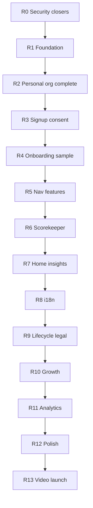

# B2C Remaining Implementation Plan

Audit date: 2026-08-09. Source plan: [`b2c_consumer_transformation_6e7f8585.plan.md`](./b2c_consumer_transformation_6e7f8585.plan.md). Method: **50 parallel Grok 4.5 explore subagents** + **Supabase MCP** on project `PeakPerformanceDataV2` (`bcfwtgqvusjhlrqsztod`).

## Executive verdict

**The plan is not fully implemented.** Roughly Phases 0–6 are 40–70% landed in code/migrations; Phases 8–13 are mostly not started. Live DB has the personal-org / consent / onboarding schema, but **0 personal organizations**, **0 consent_events**, and **0 insights** rows.

| Phase | Verdict | One-line reality |
|------|---------|------------------|
| 0 Security | **PARTIAL** | App admin authz fixed; RLS leftovers, backend IDOR still open |
| 1 Foundation | **PARTIAL** | Typecheck gates CI; no gen:types drift, no pgTAP |
| 2 Personal org | **PARTIAL** | Column + RPC + signup/callback wired; public/admin filters and org 400s incomplete; 0 live personal orgs |
| 3 Signup | **PARTIAL** | Platform org picker gone, OAuth + Turnstile exist; RHF/zod, Apple linkIdentity, consent writes, hard age gate missing |
| 4 Onboarding | **PARTIAL** | Wizard/checklist exist; sample-data product behavior and context wiring incomplete |
| 5 IA | **PARTIAL** | 5-tab BottomNav + mode gates done; dual nav sources; BrandConfig.features unused |
| 6 Scorekeeper | **PARTIAL** | Wake lock, auto-finalize, Quick mode done; hydrate does not apply state; offline create partial |
| 7 Home/insights | **PARTIAL** | 3-score hero + calibration partial; dead wearables links; no scheduled insight writers |
| 8 Copy | **NOT_DONE** | No consumer overlays; ~115-key locale gap |
| 9 Lifecycle/legal | **PARTIAL** | `GET /api/user/export` exists (untracked); delete RPC wrong-keyed/aborts; no ToS/banner/self-serve profile/CH/R2 |
| 10 Growth | **PARTIAL** | Landing → signup; share keys still leak; Tennis Bench still “Request invitation” |
| 11 Analytics | **NOT_DONE** | No PostHog/Sentry/UTMs |
| 12 Polish | **PARTIAL** | A few mobile fixes; design/PWA/a11y mostly open |
| 13 Video/launch | **NOT_DONE** | No per-user quotas, no pipeline status UI, no launch checklist green |

### Live Supabase facts (MCP)

- `organizations.is_personal` exists; **all 11 orgs are `false`**
- `profiles.onboarding_completed` exists
- `consent_events` table matches the plan schema (append-only policies present)
- `create_personal_organization`, `cleanup_user_data` RPCs exist (SECURITY DEFINER)
- `match_ai_memories` / `get_player_dashboard_init` still **unguarded** on `auth.uid()`
- `ai_memories` / `insights` still have **`WITH CHECK (true)`** inserts
- `injuries` (and many others) still reference **`auth.jwt() → user_metadata.role`**
- `public.rate_limits` has **RLS disabled** (critical advisor)
- Security advisors: **161** notices, including many `rls_references_user_metadata`
- No pgTAP / no `is_sample` column visible on `tennis_matches` in live schema (repo migration may be unapplied or named differently — verify)

**Critical advisory to fix first:** enable RLS on `rate_limits` with service-role-only policies before any public consumer traffic.

---

## What already shipped (do not redo)

Use these as building blocks; only close gaps below.

1. **Admin API authz** — all `src/app/api/admin/**` routes use `profiles.role` (0 remaining `user_metadata.role` gates).
2. **Security headers** — CSP, HSTS, Referrer-Policy, Permissions-Policy in `next.config.js`; `ignoreBuildErrors: false`; `typecheck` job gates build in CI.
3. **`vercel.json` CORS `*` removed** (proxies still set `*` on some responses — see R0).
4. **Auth-gated** `transcribe`, `ppc-proxy`, `vision-proxy` via `withAuth`.
5. **Personal org RPC** called from `src/lib/auth/auth.ts` and `auth/callback/route.ts`.
6. **Mode gating** — personal mode blocked from `/management`, `/club-admin`, `/admin`; BottomNav 5-tab IA (Today / Matches / Log / Progress / You).
7. **Scorekeeper** — Screen Wake Lock, auto-finalize on `completed`, Quick mode default, offline pending-match sketch.
8. **Onboarding scaffold** — `OnboardingWizard` (Sheet+Progress), `SetupChecklist`, `PermissionPriming`, migrations for onboarding columns.
9. **Turnstile** widget + server verify path; Google/Apple `signInWithOAuth` buttons on platform signup.
10. **Test mocks** aligned (`admin.createUser`, `@supabase/ssr`).
11. **Prior B2C memory-bank plans** marked superseded (Phase 1 doc item).
12. **`GET /api/user/export`** exists and is wired from settings UI (file currently **untracked** — commit it).
13. **Auth hook SQL** `20260803_auth_hook_strip_role_metadata.sql` exists and is applied in prod as an UPDATE-only strip trigger (also **untracked**). Signup/admin still write `role` into `user_metadata` on INSERT; confirm the hook is attached in the Supabase dashboard.

### Late-audit corrections (fold into R0–R9)

- **Export is not missing** — treat as “commit + verify completeness,” not greenfield.
- **`cleanup_user_data` is worse than “incomplete keys”** — the live RPC loops `DELETE … WHERE user_id` and only catches `undefined_table`. The first table without `user_id` (e.g. `auth_tokens`) **aborts and rolls back**, so profile cleanup often never runs while `auth.admin.deleteUser` still proceeds.
- **B2C migrations are on disk + applied but untracked** (`20260803_*`, `20260808_*`, genetics/labs/insight store). Commit them in S1/S2 so CI and teammates match prod.
- **`rate_limits` is wired** via `check_and_increment_rate_limit` from `/api/ai-agent`; still enable RLS (or keep revoke-all + document) before launch.
- **Insights writers** exist in `ppp_ai_agent` Python only; Next has none; live tables are **0 rows** — schedule the nightly batch, do not assume “no writers at all.”

---

# Remaining work — sequenced

Do **R0 before anything else**. Then R1–R2 so strangers can sign up safely. Then product (R3–R7), launch surfaces (R8–R11), polish (R12–R13).

---

## R0 — Security closers (blocking)

### Step 0.1 — Auth hook + commit B2C migrations

1. Commit untracked B2C migrations (including `20260803_auth_hook_strip_role_metadata.sql`, personal-org, consent, rate limits, GDPR cleanup).
2. Verify the strip trigger/hook is **enabled in the Supabase dashboard**.
3. Stop writing `role` into `user_metadata` on signup/switch-role/admin updates (hook is UPDATE-only today — INSERTs still land with role).

### Step 0.2 — Finish RLS remediation

1. Migration: drop every policy that reads `auth.jwt() → user_metadata.role` (advisors list injuries, courts, training_plans, player_groups, tennis_bench_features, etc.). Replace with `get_current_user_role()` / assignment-scoped checks.
2. Replace global `role='coach'` SELECTs with assignment-scoped coach policies.
3. Drop `WITH CHECK (true)` on `ai_memories`, `insights` (and genetics/labs if any remain); restrict inserts to service role or `auth.uid() = athlete_id/user_id`.
4. Gate RPCs:
   - `match_ai_memories`: require `(select auth.uid()) = match_user_id` (or service_role).
   - `get_player_dashboard_init`: require caller is the player, assigned coach, or approved parent.
5. `ALTER TABLE public.rate_limits ENABLE ROW LEVEL SECURITY;` + deny-all for `anon`/`authenticated`; service role only.
6. Re-run Supabase MCP `get_advisors` type `security` until `rls_references_user_metadata` and `rate_limits` RLS-off are gone.

### Step 0.3 — Backend IDOR / auth gaps

1. **`ppp_ai_agent`:** bind caller identity on every route that accepts `athlete_id`; reject mismatches. Do not trust shared-secret-only internal calls without an athlete ACL when the caller is a user session.
2. **`specialistTools.ts` / `toolRouter.ts`:** force `athleteId = userId` for player persona at the router (keep LLM from choosing another athlete).
3. **`ppd_backend`:** reject client `user_id` unless it equals verified session `user_id`; disable public `/docs` in production.
4. **Proxies:** remove `Access-Control-Allow-Origin: *` from `ppc-proxy` and `vision-proxy` responses; rely on `cors.ts` allowlist.
5. **Cron:** require `CRON_SECRET` in all environments (no non-prod fallthrough).
6. **`upload/logo`:** membership check; **`create-coach-request` / `create-member-request`:** session only (no body `userId` + service role).

**Exit criteria:** advisors clean of user_metadata RLS; rate_limits RLS on; IDOR smoke test fails for cross-athlete access.

---

## R1 — Foundation and safety net

1. Add `gen:types` script (`supabase gen types typescript --project-id …`) and a CI job that fails on drift vs `database.types.ts`.
2. Regenerate types so courts, tennis participants/pauses, bench, labs, genetics, insights, scorekeeper, `is_personal`, `consent_events`, `onboarding_completed` are present.
3. Add pgTAP: `supabase/tests/**/*.sql` covering allow+deny for personal-org isolation, consent append-only, coach assignment scope; run `supabase test db` in CI.
4. Delete remaining ghost `/history` route + middleware entry; delete verified zero-importer components from the original list still present.
5. **Pick one design direction** (recommend `@ppd/tokens` / broadcast console navy+Barlow). Add `SUPERSEDED` banners to `docs/design-system.md` and `docs/premium-design-overhaul-v2.md`.

**Exit criteria:** CI fails on type drift and on RLS test failure.

---

## R2 — Complete personal org + account mode

1. Filter `is_personal = true` from:
   - `/api/organizations/public` (must also require auth or return empty for anonymous)
   - `/api/organizations`
   - admin org lists/counts not already filtered
   - `get_full_user_context` org count
   - brand domain lookup
2. Add `accountMode` to `user-context-lite` (join `organizations.is_personal`) so client revalidation does not reset mode to organization.
3. Unblock hard org gates (today still 400 / “No Organization”):
   - `POST /api/personal-trainings`
   - `POST /api/personal-tournaments`
   - `PlayerTournamentsClient` / `player/tournaments`
   - `player/training/page.tsx`
   - `parent/children/create`
4. Confirm personal-mode coach auto-approve path on `coach_requests` (partially present on create-coach-request).
5. End-to-end: sign up a throwaway consumer → assert one `organizations` row with `is_personal=true` and profile bound.

**Exit criteria:** live DB has ≥1 personal org from a real signup; personal athlete can create a training and tournament without academy.

---

## R3 — Signup, OAuth, age, consent

1. Rewrite platform signup to **react-hook-form + zod** (mirror `InjuryForm` patterns).
2. Age gate: require DOB always for self-signup; reject under-16 server-side unconditionally; under-16 only via parent child-create.
3. Apple: on OAuth callback, use `linkIdentity` / stable `sub` handling for private relay emails; document merge path.
4. On every signup / consent action, **insert into `consent_events`** (Art. 6 + Art. 9 fields already on table).
5. Make Turnstile non-optional when `TURNSTILE_SECRET` is set (today missing token can skip).
6. Fix locale-less reset/confirm links in `auth.ts` if any remain.

**Exit criteria:** cannot create under-16 self account; consent_events row exists after signup; Apple relay does not duplicate accounts in a manual test.

---

## R4 — Onboarding and sample data

1. Ensure `user-context` / lite / layout expose `onboarding_completed` and focus preference.
2. Fix `SetupChecklist`: stop hardcoding `hasMatches={false}`; drive from real match/wearable/video state.
3. Invoke `PermissionPriming` at the permission hook (notifications/location), not only as static UI.
4. Finish `is_sample`: columns on relevant tables, seed into consumer `user_id` only, UI badge, one-click delete API, exclude from aggregates/achievements/insights.
5. Do not reuse unlabeled `clone_demo_wearables` paths.

**Exit criteria:** new personal user sees wizard → checklist that completes when they score a match; sample rows are deletable and excluded from charts.

---

## R5 — IA, gating, feature seams

1. Drive **BottomNav and Sidebar from one module** (extend `getNavigationItems` or extract `getConsumerTabs`); remove hardcoded personal tabs duplication.
2. Middleware-block `/messages`, genetics, and labs routes in personal mode (nav hide alone is insufficient).
3. Hide unread badge when messages are not in the active nav set (verify all shells).
4. Fix remaining coach deep-links into `/management` if any survive.
5. Populate and enforce `BrandConfig.features` (tier, video/AI/sync meters, history depth, seats, advanced metrics, export) at API boundaries — even if billing is later.

**Exit criteria:** personal user cannot deep-link to messages/genetics/labs/management; one nav source of truth.

---

## R6 — Scorekeeper activation closers

1. Fix hydrate: when GET returns points, **replace reducer state** with `hydratedState` (today `isHydrating` / hydrated result is unused; machine starts fresh).
2. Finish offline-first create: pending match survives reload; sync posts points then finish; conflict policy documented.
3. Thumb-zone layout pass on primary point actions; keep Quick mode default.
4. Confirm Log center tab remains scorekeeper in personal mode.

**Exit criteria:** lock phone mid-match → reopen → score intact; natural match end finalizes without Finish tap.

---

## R7 — Home, wearables, insights, AI

1. Retarget `HeroRingTrio` / `ConnectWearableCard` from dead `/settings/wearables` to real charts/Garmin connect routes (or add the missing pages).
2. Replace fake sync progress (`connected→100%`, 60s force-complete) with real job IDs/state; honest Garmin baseline copy (~3 weeks HRV).
3. Wire `PlayerDashboard` → `PlayerHome` props (`tournaments`, `previousTest`) if still missing.
4. Standardize `EmptyState` variants to the plan set; wire `ErrorStates` + retry on `TennisHighlightCard` and tennis analytics error paths.
5. Schedule insight writers (post-match + weekly) writing to `insights` / `feedback_events`; wire preference_memory or drop it from scope.
6. Complete solo AI: remove remaining org-wide averages in `athleteTools`; keep durable `rate_limits` but with RLS on.
7. Finish solo achievements (weekly streaks, freeze); confirm no leaderboards in personal mode.

**Exit criteria:** insights table non-empty after a scored match in staging; no dead wearables links; personal AI cannot read other athletes.

---

## R8 — Consumer i18n overlay

1. Create `messages/overlays/consumer/{en,es,ca,zh}.json` sparse overlays.
2. Deep-merge in `messages-cache.ts` and client providers when `accountMode === 'personal'`.
3. Rewrite the ~40 must-fix academy strings; keep ~300 coach/admin strings untouched.
4. Close the **~115-key** es/ca/zh gap (onboarding, adminDashboard, playerDashboard, etc.).
5. Fix `scripts/sync-translations.js` hardcoded external path.

**Exit criteria:** personal mode English has no “academy/invitation” framing on home/signup; locale parity within ≤5 keys.

---

## R9 — Lifecycle, GDPR, legal

1. Self-serve: email change, avatar upload (new `/api/upload/avatar`), DOB/phone/units editors, athlete self-`PUT` on own `player_details`.
2. Rewrite `cleanup_user_data` to delete by correct keys (`athlete_id` / `player_id` / `subject_id` / `sender_id` / etc.), include `insights`, `preference_memory`, pipeline artifacts; **per-table exception handling** so one missing column cannot abort the whole transaction; commit `20260808_gdpr_user_data_cleanup.sql` (or replace it) in git.
3. In `DELETE /api/user/account`: only call `auth.admin.deleteUser` **after** DB cleanup succeeds; then delete R2 video objects and ClickHouse wearable rows (or fail closed / queue a retry job).
4. Commit and harden existing `GET /api/user/export` (cover `athlete_id`/`player_id` tables, not only `user_id`).
5. Rewrite privacy policy to **16+** (drop under-13 COPPA framing); add Terms of Service page; add equal-prominence consent banner (shared with R11).
6. Design doc only: consumer-joins-academy migration (portable `user_id` history; re-tag org-scoped rows).

**Exit criteria:** delete a test user → zero rows in listed tables + no R2 objects + CH empty; export downloads a complete dump; ToS linked from signup.

---

## R10 — Growth loops

1. Strip `cloudflare_video_key` and `swingvision_url` from guest/`/api/watch/[token]` payloads (today spread from `match-detail`).
2. Add `navigator.share` where available; keep clipboard fallback.
3. Share revoke UI in `DialogShareMatch` (API already supports DELETE).
4. Lengthen TTL if product still wants “longer than 7 days”; add match-highlight OG image (not logo).
5. Landing: FAQ + screenshots; replace hardcoded `#0047FF` with tokens; keep signup as primary individual CTA; wire academy “Request invitation” only for academy audience.
6. Tennis Bench: CTA → `/signup`; OG images on index; mobile tap-to-download carousel; load social manifest.
7. SEO: `alternates.languages` for en/es/ca/zh; fix `robots.ts` so OG image routes are crawlable; locale-aware `/watch/` rules.

**Exit criteria:** guest payload has no video secrets; Bench CTA creates a personal signup.

---

## R11 — Analytics and observability

1. Add PostHog Cloud EU + Sentry (`instrumentation.ts`).
2. Persist first-touch (write-once) and last-touch UTMs + `signup_source` on `profiles`.
3. Server-side capture in Route Handlers: `landing_page_viewed`, `signup_started`, `signup_completed`, `email_verified`, `onboarding_completed`, `first_value_reached`.
4. Consent banner: equal Accept / Reject; gate identify + replay on accept.

**Exit criteria:** staging funnel visible in PostHog; rejected consent stores no replay.

---

## R12 — Design, mobile, PWA, a11y

1. Execute the chosen `@ppd/tokens` direction across shell, cards, charts.
2. Fix `MessageInput` `text-sm` → ≥16px and ≥44px tap targets; fluid court SVGs (`CourtvizCourtHeatmap`, `PointReplayPanel`).
3. PWA: delete unused `public/service-worker.js`; add `navigateFallback`; rewrite `offline.html` without Tailwind CDN; manifest `screenshots` + `shortcuts`; post-install push prompt.
4. A11y: bottom-nav contrast, skip link on public routes, `aria-current`, page `h1`s, `useReducedMotion` on landing, enable `jsx-a11y/recommended`.
5. Finish performance-audit leftovers (HR-zone cold path, charts sync stampede, player init focus-revalidation).

**Exit criteria:** Lighthouse a11y ≥90 on consumer home; offline page works without CDN; no 32px primary targets on messaging.

---

## R13 — Video gate + launch checklist

1. Enforce per-app-user monthly video quota before enqueue (not only SwingVision account hours).
2. Surface real `pipeline_jobs.status` in the app; stop treating `video_upload_status: 'ready'` as “analyzed”.
3. Honest 24–72h SLA copy in upload UI.
4. Auto-import finished jobs into `/api/tennis/import`.
5. Launch checklist gate:
   - [ ] RLS advisors clean + pgTAP green
   - [ ] Typecheck + types drift green
   - [ ] Consent + deletion + export e2e
   - [ ] Analytics funnel firing
   - [ ] Real-phone smoke: consumer signup in en/es/ca/zh

**Exit criteria:** checklist all checked on staging; one paid/traffic-ready go/no-go review.

---

## Open product decisions (still block Stage 3 hardening)

Carry forward from the source plan; answer before locking IA permanently:

1. **Padel** — tennis-only vs racket-sport-shaped model for Spain.
2. **UTR / WTN** — partner vs public GraphQL rating wedge.
3. **Athlete-vs-user** — multi-guardian / multi-coach edges beyond single `claim_token`.

---

## Suggested execution slices (PR-sized)

| Slice | Scope | Depends on |
|-------|--------|------------|
| S1 | R0.1 auth hook + commit B2C migrations | — |
| S2 | R0.2 RLS + RPC gates + rate_limits | S1 |
| S3 | R0.3 backend IDOR + proxy CORS + cron | S1 |
| S4 | R1 types/pgTAP/design pick | S2 |
| S5 | R2 personal org filters + unblock 400s | S2 |
| S6 | R3 signup/consent/age | S5 |
| S7 | R4 onboarding/sample | S6 |
| S8 | R5–R6 nav + scorekeeper hydrate | S5 |
| S9 | R7 home/insights/AI | S5 |
| S10 | R8 i18n overlays | S5 |
| S11 | R9 lifecycle/legal | S2 |
| S12 | R10 growth | S5 |
| S13 | R11 analytics + consent banner | S11 |
| S14 | R12 polish | S4 |
| S15 | R13 video + launch checklist | S1–S14 |

---

## Audit trail

- 50 Grok 4.5 explore subagents covered every phase checklist item (admin authz, backends, RLS, types/CI, personal org, signup, onboarding, IA, scorekeeper, home/insights, i18n, lifecycle, growth, analytics, polish, video, plus DB-focused cleanup/insights audits).
- Supabase MCP: `list_projects`, `list_tables`, `list_migrations`, `execute_sql`, `get_advisors` (security) on `bcfwtgqvusjhlrqsztod`.
