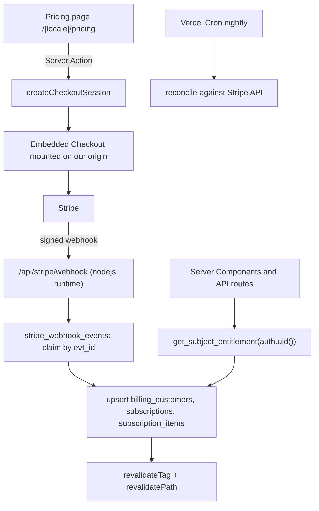

# B2C In-App Payments with Stripe

## Decisions locked

- **Provider: Stripe direct + Stripe Tax** (scored 8.05 vs Paddle 7.45, Polar 6.70). Stripe Managed Payments is the documented escape hatch if VAT ops become painful; it runs on the same API, so switching is not a re-platform.
- **UK VAT registration from day one** (zero threshold for digital services). Company operates from **Portugal**, so certified invoicing / ATCUD / SAF-T applies, not Spain's Verifactu.
- **Embedded Checkout on our own origin**, not hosted redirect to `checkout.stripe.com`. In iOS standalone PWA a redirect out and back tears down the app context.
- **Entitlements never read `user_metadata`.** Resolved server-side by a `SECURITY DEFINER` function keyed on `auth.uid()`.
- **RLS fix strategy: SECURITY DEFINER functions, not access-token-hook.** Apply the existing `supabase/migrations/20260804_rls_security_fix.sql` (860 lines, already written for this codebase). The plan's original `custom_access_token_hook` + `app_metadata` rewrite is dropped — it required Auth-config hook registration and created a JWT-refresh outage window for active sessions.
- **B2C subject model: personal orgs.** The codebase already implements org-less signup via personal organizations (`organizations.is_personal = true`, `isPersonal` middleware account mode). `get_subject_entitlement` must exclude personal orgs from the org-seat fallback so a consumer's own personal org never grants seat entitlements.
- **Checkout funnel: account required, signup-first.** `/pricing` is public; plan selection is preserved through signup (e.g. `?plan=pro`) and flows straight into embedded checkout after email confirmation.
- **No billing columns on `profiles`.** A `billing_customers` bridge table with a user-XOR-organization arc is the subject.
- **Garmin sync stays free.** Gate depth (history window, fusion analytics, AI), not ingestion.
- **AI billed as flat tiers with conversation caps**, not credits. Token-level usage is instrumented from day one so overage can be added later without a rewrite.

## Live database ground truth

Project `PeakPerformanceDataV2` (`bcfwtgqvusjhlrqsztod`), Postgres 15.8.1.054, eu-west-2. 69 profiles, 60 auth users, 11 organizations, 69 public tables all with RLS enabled. No billing tables and no subscription columns exist — billing is greenfield. `profiles.organization_id` is nullable and is the only membership mechanism (no join table). `pgcrypto` installed; `pg_cron` and `pg_net` are not, so scheduled reconciliation runs on Vercel Cron.

**Migration drift (verified 2026-08-08):** production's latest applied migration is `20260719213611`, but the repo contains ~10 unapplied migrations (`20260727`–`20260807`: genetics, insight_store, lab_panels, `is_personal`, auth-hook strip, RLS security fix, consent_events, onboarding, solo_user_achievements, sample_data). The deployed B2C signup path calls `create_personal_organization` and inserts `organizations.is_personal` — neither exists in production, so org-less signup currently fails. **Decision: audit and apply all pending migrations in order, skipping `20260803_sample_data.sql`, before any billing migration.**

Note that [src/lib/supabase/database.types.ts](PeakPerformanceData/peak_performance_data/src/lib/supabase/database.types.ts) has bidirectional drift: missing `profiles.created_by_parent_id` (exists in prod) while containing `organizations.is_personal` (does not exist in prod yet). Regenerate it only **after** the backlog migrations are applied, or compiling code breaks.

## Architecture



---

## Phase 0 — Security prerequisites (REVISED: gates everything — backlog migrations block Phase 1+)

Supabase's advisor returns **85 ERROR-level `rls_references_user_metadata` findings across 36 tables**. `user_metadata` is user-writable via `supabase.auth.updateUser({ data })`. The worst instance is on `profiles`:

```
policy: admin_full_access   cmd: ALL
qual:   ((auth.jwt() -> 'user_metadata') ->> 'role') = 'admin'
```

Any authenticated user can self-assign `role: 'admin'` and gain read/write on every profile. The same pattern scopes orgs, so a user can also relocate into any academy. This is pre-existing and independent of payments, but billing must not extend it.

**0a. Apply the migration backlog.** Audit each pending migration `20260727`–`20260807`, apply in order via Supabase MCP `apply_migration`. Skip **two** files:

- `20260803_sample_data.sql` (seed/demo tooling, not for prod).
- `20260807_consent_events.sql` — it conflicts with `20260803_consent_events.sql`: both `CREATE TABLE IF NOT EXISTS consent_events` with incompatible schemas (0803: `subject_id`/append-only triggers, matches the codebase types at `database.types.ts` via `consent_events_subject_id_fkey`; 0807: `user_id`/`consent_type`/RLS). Applying 0803 first makes 0807 fail on `idx_consent_events_user_id`. Apply 0803 and port 0807's RLS policies into a reconciling follow-up — **verify 0803 enables RLS at all**, since a consent table without RLS is a data-exposure risk.

This includes `20260803_add_organizations_is_personal.sql` (its `type='personal'` backfill is safe — the column exists in prod) and `20260803_auth_hook_strip_role_metadata.sql`. Note the strip trigger only fires on UPDATE, not INSERT — signup still writes `role` into `user_metadata` (`auth.ts` createUser calls) and `middleware/auth.ts:280` falls back to it; verify the RLS fix makes this fallback non-authoritative.

**0b. Apply `20260804_rls_security_fix.sql`** — the existing SECURITY DEFINER rewrite (`get_current_user_role()`, `get_current_user_organization_id()`, `current_user_has_role()`) replacing all 85 `user_metadata` policies. Verify afterwards with `get_advisors` returning zero `rls_references_user_metadata`. The original access-token-hook approach is superseded (see Decisions locked).

**0c. Fix `getRouteUserFast()`.** Its comment in [src/lib/supabase/server.ts](PeakPerformanceData/peak_performance_data/src/lib/supabase/server.ts) claims middleware validated the session, but [src/middleware.ts](PeakPerformanceData/peak_performance_data/src/middleware.ts) skips `/api/` at line 68, and `getSession()` does not verify the JWT. Additionally, even page routes are only `getUser()`-validated once per 30 minutes via the `ppd-session-validated` cookie. Add a `getRouteUserVerified()` using `auth.getUser()` and use it in **every billing surface**: API routes, checkout server actions, and billing/checkout server components. Leave existing callers alone for now; migrating ~90 routes is separate work.

**0d.** Enable leaked-password protection, shorten OTP expiry, schedule the Postgres patch upgrade.

---

## Phase 1 — Billing schema

One migration creating: `billing_customers`, `subscriptions`, `subscription_items`, `billing_invoices`, `billing_events`, `stripe_webhook_events`, plus `get_subject_entitlement(uuid)`. Full DDL was produced by the schema research; the load-bearing parts:

```sql
create table public.billing_customers (
  id uuid primary key default gen_random_uuid(),
  user_id uuid references public.profiles(id) on delete cascade,
  organization_id uuid references public.organizations(id) on delete cascade,
  stripe_customer_id text unique,
  plan_key text not null default 'free',
  status text not null default 'none',
  constraint billing_customers_subject_xor
    check (num_nonnulls(user_id, organization_id) = 1)
);
```

Critical details:

- **Periods live on `subscription_items`, not `subscriptions`.** Stripe removed `current_period_start/end` from the Subscription object in the Basil release (2025-03-31). Both memory-bank plans call `subscription.current_period_end` directly, which now returns `undefined` and makes `new Date(undefined * 1000).toISOString()` throw inside the webhook — causing infinite Stripe retries. Read from `subscription.items.data[]` and denormalize the max onto `subscriptions` as a documented convenience.
- Use `text` + `CHECK` for status, not an enum, so adding `paused` later is a constraint swap.
- Partial unique index for one live subscription per subject.
- RLS: SELECT-own for `authenticated`; all writes via service role. No policies at all on `stripe_webhook_events`.
- No `ALTER TABLE profiles` anywhere.

Entitlement precedence in `get_subject_entitlement`: a personal subscription wins; otherwise fall back to the org's subscription via `profiles.organization_id` **only when the org is not personal** (`organizations.is_personal = false`). A consumer's auto-created personal org must never grant seat entitlements. This resolves the coach-with-both-a-personal-plan-and-a-seat case that a `profiles.subscription_tier` column cannot represent.

Apply via Supabase MCP `apply_migration`, then regenerate types.

---

## Phase 2 — Stripe setup

Products and prices: Free (no price), Pro €11.99/mo and €119.99/yr, Premium €19.99/mo and €179.99/yr, plus an academy per-seat price. Annual discount is roughly 17 percent, framed as "2 months free"; annual is the default selection.

Environment variables scoped in Vercel so **live keys exist only in Production**. Preview and Development get test keys. Sharing `sk_live_` with Preview means every PR deploy can charge real cards and receive production webhooks.

Enable Stripe Tax, register for UK VAT, configure the Customer Portal (payment method update, invoice history, cancel with `at_period_end`).

---

## Phase 3 — Webhook and entitlement core

New file `src/app/api/stripe/webhook/route.ts`:

```ts
export const runtime = 'nodejs';      // NOT edge - Stripe Node SDK
export const dynamic = 'force-dynamic';
export const maxDuration = 60;
```

Sequence: read `await req.text()` raw (never `req.json()`, it breaks HMAC) → verify signature with rotation support → `insert into stripe_webhook_events ... on conflict do nothing returning` to claim → if not claimed, return 200 immediately → re-fetch the canonical object from Stripe rather than trusting payload ordering → upsert subject, subscription, items → `revalidateTag(\`subscription:${userId}\`)` → return 200 → `after()` for non-critical work like receipt emails.

Note `revalidateTag` in Next 15.2.6 takes **one argument**; the two-argument form is Next 16 only.

Entitlement read path: a cached server helper calling `get_subject_entitlement`, with a 30–60 second cache. Do not gate features on JWT claims alone — subscription state changes mid-session and the JWT lives an hour.

---

## Phase 4 — Pricing page and checkout

- Install dependencies first: `stripe`, `@stripe/stripe-js`, `@stripe/react-stripe-js` (none are in `package.json` yet).
- Signup-first funnel: anonymous plan selection on `/pricing` redirects to signup with `?plan=` preserved, then into embedded checkout after email confirmation.
- `src/app/[locale]/pricing/page.tsx` — hand-built, translated into en/es/ca/zh. Skip `<stripe-pricing-table>`: its language is a per-table dashboard setting, which does not work across four locales.
- Checkout initiated by a **Server Action**. Server Actions are publicly callable HTTP endpoints, so authenticate and authorize inside the action; never rely on the action ID being unguessable. Call `redirect()` outside any `try/catch` or the `NEXT_REDIRECT` throw gets swallowed.
- Mount **Embedded Checkout** at `/[locale]/checkout`. Do not redirect to Stripe's hosted page.
- Return flow copies the proven pattern in [src/components/integrations/WearableIntegrationsPanel.tsx](PeakPerformanceData/peak_performance_data/src/components/integrations/WearableIntegrationsPanel.tsx): optimistic update plus staggered refetch, since the webhook may land after the user returns.
- Add `/pricing` to `publicPaths` in [src/middleware.ts](PeakPerformanceData/peak_performance_data/src/middleware.ts) line 82, and `/checkout` to `protectedPaths` (it is currently in neither list).
- Add PWA cache exclusions in [next.config.js](PeakPerformanceData/peak_performance_data/next.config.js): the navigation rule at line 63 currently NetworkFirst-caches every locale path including billing pages. Exclude `/checkout`, `/settings/billing`, `/pricing`, and `/api/stripe/*`. Also exclude entitlement-bearing responses from `user-context-cache` (StaleWhileRevalidate, 30 min) and `supabase-cache` (NetworkFirst, 1 hr) so plan changes propagate immediately after upgrade.
- Add new i18n message keys for pricing/billing/paywall UI to all four locale message files (en/es/ca/zh), and add pricing/billing links to the sidebar/nav (`AppShell` and sidebar components).

---

## Phase 5 — Billing settings (hybrid)

Branded summary page at `/[locale]/settings/billing` showing plan, renewal date, status, and seat count. Deep-link into the Stripe Customer Portal for card updates, invoices, and cancellation via `flow_data`.

Locale handling: the portal supports `en`, `es`, and `zh` but **not Catalan**. Map `ca` to `es` for the portal session only and keep surrounding UI in Catalan.

Set `dynamic = 'force-dynamic'` and `revalidate = 0` on this page so a stale plan is never displayed.

---

## Phase 6 — B2C individual signup (REVISED: verify, don't build)

The original claim (hard-block at `auth.ts` lines 129–131) is stale. [src/lib/auth/auth.ts](PeakPerformanceData/peak_performance_data/src/lib/auth/auth.ts) lines 164–190 already implement org-less signup by creating a **personal organization** via the `create_personal_organization` RPC with a direct-insert fallback (`is_personal: true`), and [src/middleware/authorization.ts](PeakPerformanceData/peak_performance_data/src/middleware/authorization.ts) lines 44–50 already gate org-only routes for `isPersonal` accounts.

Work here:

- **Write `create_personal_organization` from scratch** — no migration defines it (verified: absent from `supabase/migrations` and from prod). The current call site passes `p_user_id: ''` (the user doesn't exist yet at that point in `signUp`), and the RLS fallback insert runs on the anon client with no session, so both paths fail today. Recommended: restructure `signUp` to create the personal org **after** `admin.createUser` via a SECURITY DEFINER RPC that takes the real user id, sets `admin_user_id`, and bypasses RLS safely.
- After Phase 0a applies the `is_personal` migration, end-to-end test signup → personal org → player dashboard, and confirm the `?plan=` param survives signup into checkout.
- Do **not** add an `organization_id = null` path.

---

## Phase 7 — Feature gating and paywall UX

Free tier: unlimited match upload and basic stats, Garmin sync, 90-day analytical history, 3 AI insights per month, always-on data export.
Pro: unlimited history, multi-season trends, 60 AI insights, personalized training plans.
Premium: unlimited AI, wearable-load fusion, up to 3 athletes.

Blur and tease locked charts rather than hiding them; hide binary features like the AI tab entirely. Never blur a user's current-match core stats. Reuse [src/components/ui/action-card.tsx](PeakPerformanceData/peak_performance_data/src/components/ui/action-card.tsx) for upgrade prompts.

Publish trust commitments alongside pricing: sync stays free, export always works, cancel in two taps, 30 days notice on price changes, founding users price-locked 12 months, no silent deletion of free-tier data.

---

## Phase 8 — Academy seat billing

Per-seat subscription on the organization's `billing_customers` row, quantity driven by active member count. Self-serve card checkout, same as consumers. Seat count reconciled nightly by Vercel Cron rather than on every membership change.

---

## Phase 9 — AI metering

`ai_usage_events` ledger plus `ai_usage_monthly` counters, with `reserve_ai_quota` / `commit_ai_quota` functions using `FOR UPDATE` and a unique `(user_id, request_id)` for idempotency under concurrent requests. Integrate with (or replace) the existing 50 req/hour rate limit in `src/lib/ai/agentConfig.ts` and `src/lib/ai/utils/rateLimit.ts` rather than layering a second uncoordinated limiter.

Economics: a multi-turn coach conversation costs roughly $0.07 with prompt caching and mid-tier routing, so a €20 plan supports about 74 conversations monthly at a 25 percent cost-of-goods target. Cut costs with model routing first (50–90 percent), then prompt caching (up to 90 percent on cached input), then prompt-size control.

Log tokens and estimated cost from day one even though the UI only shows "chats left."

---

## Phase 10 — Compliance and operations

- Stripe Tax enabled, UK VAT registered, invoice PDFs available (Stripe email receipts are not valid VAT invoices).
- EU 14-day withdrawal right with explicit consent to immediate performance at checkout.
- Nightly Vercel Cron reconciliation against the Stripe API, guarded by a `CRON_SECRET` bearer check. Add the cron entries to [vercel.json](PeakPerformanceData/peak_performance_data/vercel.json) (currently only has `cleanup-conversations`); note functions run in `iad1`.
- Alerting on webhook failures and on `stripe_webhook_events` rows stuck unprocessed.

## Explicitly superseded

Both [_memory_bank/features/b2c-consumer-app-implementation-plan.md](PeakPerformanceData/peak_performance_data/_memory_bank/features/b2c-consumer-app-implementation-plan.md) and [_memory_bank/features/b2c-individual-athlete-implementation.md](PeakPerformanceData/peak_performance_data/_memory_bank/features/b2c-individual-athlete-implementation.md) should be marked superseded. They add billing columns to `profiles`, dual-write from the webhook, and call the removed `subscription.current_period_end`.
