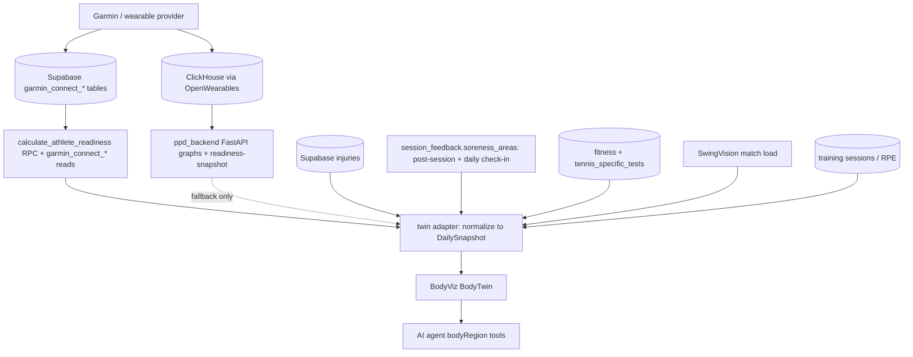

# BodyViz to Athlete Digital Twin: Research Findings and Build Plan

## 1. What BodyViz actually is today

`PeakPerformanceDataMarketing/ThreeJS` is a standalone pnpm/turbo monorepo (`bodyviz`, v0.0.0) deliberately mirroring the courtviz layout: five packages, a Vite demo, a Ladle gallery. Roughly 7k hand-written lines plus a 6k-line generated muscle manifest.

- `@bodyviz/react` (~4.6k LOC): the R3F scene. [body-canvas.tsx](PeakPerformanceDataMarketing/ThreeJS/packages/react/src/body-canvas.tsx) sets up ACES tone mapping, lights, fog, bloom/SMAA/noise/vignette, orbit controls, view snaps, quality tiering, WebGL gate with SVG fallback, and `prefers-reduced-motion`. [body-twin.tsx](PeakPerformanceDataMarketing/ThreeJS/packages/react/src/body-twin.tsx) composes the body plus procedural brain/heart/lungs/spine driven by metrics. [body-model.tsx](PeakPerformanceDataMarketing/ThreeJS/packages/react/src/body-model.tsx) loads the GLB, parses muscle meshes, assigns materials, and raycasts for selection.
- `@bodyviz/core` (~830 LOC + generated manifest): [types.ts](PeakPerformanceDataMarketing/ThreeJS/packages/core/src/types.ts) defines the `DailySnapshot` contract; [normalize.ts](PeakPerformanceDataMarketing/ThreeJS/packages/core/src/normalize.ts) reshapes flat `RawMetrics` into it; [injuries.ts](PeakPerformanceDataMarketing/ThreeJS/packages/core/src/injuries.ts) defines `BodyRegionId` and `injurySeverityOnDay`; [muscle-manifest.ts](PeakPerformanceDataMarketing/ThreeJS/packages/core/src/muscle-manifest.ts) holds 315 muscles with centroids and bounds; [muscle-map.ts](PeakPerformanceDataMarketing/ThreeJS/packages/core/src/muscle-map.ts) maps regions to muscle names.
- `@bodyviz/data` (~510 LOC): Zod schemas and a 7-day hand-authored fixture set.
- `@bodyviz/shaders` (~460 LOC): fresnel, anatomical shell, heat, organ glow, pulse, injury overlay GLSL.
- `@bodyviz/tokens` (~370 LOC): brand and body-system colours.
- Asset: `body-muscles.glb`, ~2.7 MB Draco-compressed (2,854,804 bytes), 315 named nodes, produced by [build-body.mjs](PeakPerformanceDataMarketing/ThreeJS/assets/models/build-body.mjs) from Z-Anatomy. Note it lives at `apps/demo/public/models/body-muscles.glb` — `assets/models/` holds only the 8 MB `body-original.glb` source — and the Draco decoder (~760 KB) is at `apps/demo/public/draco/gltf/`.

Honest grade: strong as a marketing demo, roughly a third of the way to a product foundation.

### What is real vs. what is theatre

Real: the scene, the model pipeline, the tour state machine, the day scrubber, the WebGL fallback, ~780 LOC of unit tests, the injury overlay rendering path.

Theatre, and this is the single most important finding: **there is no per-muscle physiology.** `muscleHeatIntensity()` derives one scalar from global `trainingLoad` (0-300 mapped to 0-1) and paints every muscle with it. Nothing in Garmin, ClickHouse, or Supabase produces per-muscle load. The 315-muscle manifest is a selection and labelling asset, not a data surface. Any roadmap that promises "muscle-level insight from wearables" is promising something we cannot source, and shipping it would be the fastest way to lose athlete trust.

Also unfinished: all data is fixtures (no PPC/ClickHouse adapter exists despite the README implying otherwise), the visual/Playwright tests referenced in docs do not exist, asset paths are hardcoded to `/models/` and `/draco/gltf/` (`body-model.tsx:38-39`), `useGLTF.preload(MODEL_URL)` fires at module scope so any import of `@bodyviz/react` immediately fetches the 2.7 MB GLB, and there is no Next.js consumer, auth, i18n, or feature flag.

## 2. The licensing problem, and the zero-budget answer

The mesh descends from Z-Anatomy under **CC BY-SA 4.0**, which [SOURCES.md](PeakPerformanceDataMarketing/ThreeJS/assets/models/SOURCES.md) already flags. Commercial use is permitted; the constraint is share-alike on the adapted mesh plus attribution.

Paid alternatives all fail the zero-budget test, but recording them for later: Zygote Body / Solid 3D models run roughly $500-$5,000 per model or more for a full-body muscular system; 3D4Medical (Complete Anatomy) and BioDigital license per-seat or per-API at four to five figures annually; TurboSquid and CGTrader anatomy assets sit at $150-$900 but rarely ship clean per-muscle node naming; SMPL/SMPL-X is free for research only and commercial licensing is a paid negotiation with Max Planck.

Free options that actually exist:

- **Z-Anatomy** (current, CC BY-SA 4.0), itself partly derived from BodyParts3D.
- **BodyParts3D** from Japan's Database Center for Life Science, CC BY-SA 2.1 JP, same share-alike shape.
- **MakeHuman / MPFB2** base meshes, effectively CC0, excellent topology for a body but no muscle layer.
- **Blender Studio Human Base Meshes**, CC0, same limitation.

Recommended zero-budget path: **keep Z-Anatomy and comply properly.** Publish the derived `body-muscles.glb` plus `build-body.mjs` in a small public repository under CC BY-SA 4.0 with full attribution, and keep it a separately-fetched runtime asset rather than something inlined into a JS bundle. Under the standard reading, share-alike attaches to the adapted mesh, not to application code that merely loads it. Two disciplines make this hold: never bundle the mesh into JS, and surface attribution in an in-app credits line. This is a legal-review item before any public launch, not before internal work. The fallback if counsel disagrees is a CC0 MakeHuman base plus hand-sculpted region-level muscle groups, which costs no cash but a meaningful block of modelling time and drops us from 315 muscles to roughly 20 regions. Because the region-level UX is the honest one anyway, that fallback is less painful than it sounds.

## 3. Where the twin lives in the app

Confirmed: dedicated full-page route in the same Next.js app, `/[locale]/player/body` for the athlete and `/[locale]/coach/athlete/[id]/twin` for the coach view later. Not a dashboard card at first; a card entry point comes only once the route earns its keep.

App facts that constrain the work:

- Next 15.2.6, React 19, App Router under `src/app/[locale]/`. BodyViz peers target React 19, so they are compatible on paper.
- No `three`, `@react-three/fiber`, `drei`, or `postprocessing` in the app today. These are new heavy client dependencies.
- Courtviz is already vendored with `file:` deps, `transpilePackages` in [next.config.js](PeakPerformanceData/peak_performance_data/next.config.js), and a `prebuild` hook running `build:courtviz` in [package.json](PeakPerformanceData/peak_performance_data/package.json). We copy this exactly — with one correction: `vendor/courtviz` is a **git submodule** (`.gitmodules` → ppd-courtviz.git), not copied files, so mirroring it means adding `vendor/bodyviz` as a submodule of ppd-threejs (remote already exists). Two consequences: CI must check out `submodules: recursive`, and Vercel's `installCommand` in `vercel.json` explicitly runs `build:courtviz` because pnpm does not fire `prebuild` — `build:bodyviz` must be added there too, not just to `prebuild`.
- `next-pwa` precaches `public/` by default, so the 2.7 MB GLB **and** the ~760 KB Draco decoder need a deliberate decision: `publicExcludes: ['!models/**', '!draco/**']` plus a runtime caching rule. Separately, the CSP in `next.config.js` has `script-src 'self' 'unsafe-inline' 'unsafe-eval' ...` with **no `'wasm-unsafe-eval'`** — Chrome will refuse to compile the Draco wasm decoder under that policy, so the CSP must gain `'wasm-unsafe-eval'` (verified gap; the demo works only because it has no CSP).
- `check-bundle-budgets.js` is currently a silent no-op: it reads `.next/analyze/client.json` while `@next/bundle-analyzer` writes `client.html`. Budgets are not being enforced today, which matters a lot the moment we add WebGL.
- CI runs `npm ci` without recursive submodules while Vercel uses pnpm with recursive submodules. This divergence will bite on the first BodyViz build.
- `next-intl` across en/es/zh/ca with generated route namespaces, so any shipped route needs four locales.
- [BottomNav.tsx](PeakPerformanceData/peak_performance_data/src/components/navigation/BottomNav.tsx) has four hardcoded slots in organisation mode but a **five-tab consumer IA in personal mode** (Today, Matches, Log+, Progress, You) with a centre FAB; [navigationItems.tsx](PeakPerformanceData/peak_performance_data/src/components/navigation/Sidebar/navigationItems.tsx) is role-filtered. The twin enters via the sidebar, not by displacing a bottom slot — but the sidebar is desktop-only and BottomNav is `md:hidden`, so a **mobile entry point** (e.g. a card on the `/player` home) must be named explicitly or mobile users have no path to the twin. Middleware already treats `/player/*` as protected, so `/player/body` inherits auth gating for free.

## 4. Data sources, and which ones are honest

A real conflict must be resolved before Phase 1: the BodyViz README says never to use stale `garmin_connect_*`, while the existing `/api/dashboard/player/body-data` route does exactly that. ~~Readiness comes from the PPC path at `api.wearablesync.app`~~ — **verified wrong during review.** The authoritative readiness score comes from the Supabase RPC `calculate_athlete_readiness` inside `fetchReadinessSnapshot` (`src/lib/dashboard/readiness-snapshot.ts:304`), which *also* reads `garmin_connect_*` tables for sleep/battery/HRV; the PPC graph API is only a fallback (`fetchWearableGraphSnapshot`, skippable via `skipPpcFallback`). There are in fact **three** readiness computations in the app: the RPC, the PPC fallback, and a third heuristic in `body-data/route.ts` (`calculateTrainingReadiness`, which fabricates defaults of 50 when data is missing). **Decision (locked): the twin adapter reuses `fetchReadinessSnapshot` verbatim (RPC-first, PPC fallback) as the single source of truth**, so parity with the existing ReadinessCard is structural rather than re-implemented. A twin that shows different numbers from the dashboard is worse than no twin.

Signal quality by source, being blunt about it:

- Genuinely systemic and reliable: sleep, HRV, RHR, stress, body battery, training load. These drive the whole-body glow, organs, and colour state. This is the twin's real content.
- Region-capable but human-entered: injuries and daily soreness. This is the only honest route to "this part of your body is highlighted."
- Region-capable but heuristic: SwingVision serve/stroke volume mapped to shoulder/elbow/trunk load, and training-session type mapped to worked regions. Usable if and only if labelled as an estimate with the reasoning visible, per your instruction. Every heuristic surface gets an inline "estimated from N serves, not measured" note plus a tap-through explanation.
- Anthropometrics and fitness tests: good for body proportions and for a capability radar beside the twin, not for colouring muscles.

The AI agent already has a tool pattern in `src/lib/ai/tools/`; a `bodyRegionTools.ts` giving it read access to twin state (and only read access, never diagnosis) is a Phase 5 item.

## 5. Market positioning

The digital twin space splits three ways. Clinical and simulation twins (Dassault Living Heart, Q Bio, Twin Health, OpenSim/MuJoCo/MyoSuite) are regulated, expensive, and not our fight. Anatomy education (Complete Anatomy, Visible Body, BioDigital) has beautiful meshes and no athlete data. Consumer fitness (Whoop, Oura, Garmin, Ultrahuman) has the data and deliberately avoids 3D, while workout apps (Fitbod, Hevy, Strong) use flat 2D muscle heatmaps precisely because per-muscle truth is thin.

Nobody is combining longitudinal multi-source youth-athlete data with an anatomical body. That gap is the opportunity, and the reason to be conservative about claims: the moment we look like a medical device we inherit EU MDR, and the moment the AI explains injuries we inherit EU AI Act obligations. With minors in the user base, GDPR Article 8 and health-data special-category rules apply to soreness and injury capture from day one. Position it as an athlete wellness visualisation, freeze the copy guidelines before any beta, and keep a documented clinical boundary.

## 6. Build phases

Estimates are conservative developer-days for a competent full-stack engineer who is not a Three.js specialist. Assume 1.5-2x if mobile Safari fights back. No deadline means we optimise for doing it properly, so nothing is compressed.

### Phase 0: prove the job-to-be-done (3-6 days)

Show the existing Vite demo to 5-10 coaches and athletes with a structured script: does seeing readiness on a body change how you'd have the morning conversation, versus the cards you have now? Write down one concrete job-to-be-done and every objection. Do not vendor anything yet.

Gate to continue: a majority say they would open it weekly if it showed their own data, and at least one named recurring use.

### Phase 1: technical beachhead, fixtures only (12-20 days)

- **Infrastructure first, before any WebGL dep lands**: make `check-bundle-budgets.js` actually read the analyzer output (it reads `.next/analyze/client.json`, which `@next/bundle-analyzer` never writes — it writes `client.html` — so budgets are vacuous today), align CI with Vercel on pnpm plus `submodules: recursive`, and converge the dual lockfiles (`package-lock.json` for CI's `npm ci`, `pnpm-lock.yaml` for Vercel) so new deps don't fork them.
- Vendor BodyViz as a **git submodule** at `PeakPerformanceData/peak_performance_data/vendor/bodyviz` (ppd-threejs, mirroring the courtviz submodule), with `file:` deps, `transpilePackages` entries, and a `build:bodyviz` step in `prebuild` **and** in `vercel.json`'s `installCommand` (`pnpm run build:courtviz && pnpm run build:bodyviz && pnpm install --frozen-lockfile`) because pnpm does not run `prebuild` on Vercel. Confirm Vercel can clone the private submodule (deploy key may be needed). The whole ThreeJS monorepo comes along, including the demo, gallery, and 8 MB `body-original.glb` — accept the weight or trim upstream later.
- Add `three@^0.173`, `@react-three/fiber@^9`, `@react-three/drei@^10`, and **`@react-three/postprocessing@^3`** (peers per `packages/react/package.json` — the package is `@react-three/postprocessing`, not `postprocessing`) to the app, updating both lockfiles until CI converges.
- Copy `body-muscles.glb` (2.7 MB, from `apps/demo/public/models/`) and the Draco decoder (`apps/demo/public/draco/gltf/`, ~760 KB) into `public/`; add `publicExcludes: ['!models/**', '!draco/**']` to next-pwa and `'wasm-unsafe-eval'` to the CSP `script-src`.
- During vendoring, parameterise the hardcoded `/models/` and `/draco/gltf/` paths and move `useGLTF.preload(MODEL_URL)` out of module scope so the 2.7 MB fetch only fires on the gated route.
- One gated route rendering the twin from fixtures via `next/dynamic(..., { ssr: false })`, wrapped in an error boundary with the SVG fallback.
- Gate with `NEXT_PUBLIC_BODYVIZ` plus a role/email allowlist. There is no real flag system (verified), so keep it crude and explicit.
- Enter via the role-filtered sidebar plus a mobile entry point (card on the `/player` home), and ship four locales (en/es/zh/ca) from day one.

Acceptance: builds in CI, loads on desktop Chrome and one iOS Safari device, falls back cleanly without WebGL, and provably does not touch the home or dashboard bundles.

### Phase 2: one real athlete day (10-18 days)

A new dedicated **`/api/player/body-snapshot` route** (locked decision — the dashboard init payload stays lean and its 5-minute cache untouched) calls `fetchReadinessSnapshot` for the logged-in athlete and maps the result through `normalize()` into `DailySnapshot`, showing readiness plus HRV and sleep for the latest day. Read-only, still gated, SWR on the client. Honest empty states: no data means grey, never an invented glow.

Acceptance: numbers match the existing ReadinessCard within documented rounding (trivially true when both consume the same helper — assert rounding only), and a no-data athlete sees a clear empty state.

### Phase 3: full systemic twin plus mobile performance (25-45 days)

Complete `DailySnapshot` mapping including sleep stages, RHR, load, stress, and body battery, with the provider capability matrix enforced so a Whoop user does not see fake Garmin-only fields. Multi-day scrubber over real history. Mobile quality tier: drop bloom and particles, cap DPR, switch to `frameloop="demand"`. Four locales. Open and engage analytics.

This is where 3D schedules die. Budget the full range and hold a device matrix: a mid-tier Android, an older iPhone, and low-power mode.

Acceptance: no thermal spiral or crash in a two-minute mobile session, every null field degrades gracefully.

### Phase 4: injury and daily soreness capture (20-35 days)

This is the phase that makes the body meaningful rather than decorative, and you asked for it explicitly.

- Normalise the free-text `injuries.body_part` column onto the `BodyRegionId` enum: add a `body_region` column with a mapping table, **keeping the original string** — it is still a live write/search path: the AI agent's `injuryTools.ts` inserts injuries and finds them with `ilike '%bodyPart%'` fuzzy matching, and `lib/validations/injury.ts` plus the injury forms write the same column. Review RLS so coaches and parents read (but never edit) athlete injuries appropriately for minors.
- Soreness check-in, corrected after verification: **no morning-check-in flow exists**, but `session_feedback.soreness_areas` (`string[]`) already does — with two API routes (`/api/dashboard/player/session-feedback`, `/api/feedback/session`), an AI read tool (`sessionFeedbackTools.ts`), and a form (`SessionFeedbackForm.tsx`) that currently submits `soreness_areas: []` hardcoded. **Decision (locked): extend `session_feedback` rather than create a parallel table** — wire the dormant field with a 2D silhouette region picker (tap a region, 0-4 severity, optional note; not the 3D model, not 315 muscles) in the post-session form, and add a standalone daily check-in that writes the same table with `session_id` nullable. Ten seconds or it will not get used. Note this health-data capture exists today without consent gating, so the compliance work below is not purely additive.
- Bind both onto the twin through the existing `injury-overlay` shader path, with severity decaying over days via `injurySeverityOnDay`.
- Add the labelled heuristic layer here: SwingVision and training-type derived regional load, always visually distinct from reported soreness and always with the "estimated from X" explanation visible.
- Compliance work lands here too: parental consent path for minors, special-category health data handling, retention policy, and an audit trail on who entered what.

Acceptance: logging soreness updates the twin the same day, coaches can see it without editing it, and no copy implies diagnosis.

### Phase 5: coach roster, AI, and productisation (40-80+ days)

Coach roster skim view using 2D status badges with a single selected 3D twin, never N live WebGL canvases. AI tools that read twin state and never generate medical advice. Entitlements, support docs, attribution compliance, monitoring, and a documented kill switch.

Cumulative: roughly 50-90 days to a gated real-data beta, 70-125 days including soreness capture, and often another quarter for the full vision.

## 7. Decisions that cannot be deferred past Phase 1

1. Licence posture: publish the derived GLB under CC BY-SA with attribution and keep it a separate runtime asset, subject to legal review before public launch.
2. Source of truth (locked after verification): reuse `fetchReadinessSnapshot` — Supabase RPC `calculate_athlete_readiness` first, PPC graph API as its built-in fallback. The earlier "PPC readiness snapshot, not `garmin_connect_*`" framing was wrong: the authoritative path itself reads `garmin_connect_*`, and there are three readiness computations in the app (RPC, PPC fallback, and the fabricating heuristic in `body-data/route.ts`). Document the freshness characteristics.
3. Vendor rather than publish private packages, matching courtviz until the API stabilises — concretely a **git submodule** (`vendor/bodyviz` → ppd-threejs), with `build:bodyviz` in both `prebuild` and `vercel.json`'s `installCommand`.
4. `@bodyviz/core`'s `DailySnapshot` stays the contract; the app owns adapters only.
5. Claims: athlete wellness visualisation, explicitly not diagnostic. Copy guidelines frozen before beta.
6. Success metric for Phases 2 and 3, chosen before building: weekly opens among connected athletes is the obvious candidate.
7. Phase 2 data delivery (locked): a dedicated `/api/player/body-snapshot` route; the dashboard init payload stays untouched.
8. Phase 4 soreness storage (locked): extend the existing `session_feedback.soreness_areas` field; no parallel soreness table.
9. CSP (locked): add `'wasm-unsafe-eval'` to `script-src` so Chrome can compile the Draco decoder.
10. Gating (locked): `NEXT_PUBLIC_BODYVIZ` env flag plus a role/email allowlist — no flag system exists.

## 8. Explicitly not doing in the first six months

Per-muscle wearable physiology or AI-inferred muscle damage. A coach roster of live WebGL twins. Deep AI anatomy explanation. Whoop and Polar parity as a launch blocker. Remotion or social export of the 3D twin. Rewriting BodyViz into the app instead of vendoring it. Replacing ReadinessCard with the twin. A clinical injury workflow overhaul. Shader perfectionism before Phase 2 parity. Buying any model, since the budget is zero.

## 9. Open items I could not resolve

Both ClickHouse MCP servers refused connections throughout, so wearable field availability and freshness were inferred from `ppd_extraction_backend` schema and code rather than sampled live. Phase 2 should begin by verifying the real payload shape. Separately, several AI tools in `src/lib/ai/tools/` reference Supabase fields that do not appear in the generated `database.types.ts`, suggesting drift worth a short audit before the twin adds more tools.