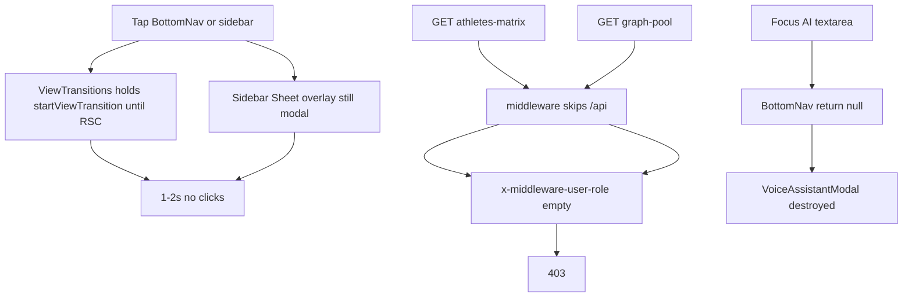

# Coach UX freeze, data 403s, and app-wide polish

Work lives in [PeakPerformanceData/peak_performance_data](PeakPerformanceData/peak_performance_data). Parent repo only bumps the submodule pointer.

This supersedes stale bits of [_plans/fix_mobile_ux_regressions_fb123b34.plan.md](_plans/fix_mobile_ux_regressions_fb123b34.plan.md) and [_plans/fix_recent_ux_regressions_f7efcaf4.plan.md](_plans/fix_recent_ux_regressions_f7efcaf4.plan.md). Already landed: no `flushSync` close, messages not `fixed` inside `contain: paint`, Footer dashboard calc (not `pb-safe` only), charts wave 1a/1b split, graph empty-vs-error on timeout.

---

## Issue map (what you reported → root cause → section)

| You see | Root cause | Section |
|---------|------------|---------|
| Long time on logo | iOS splash until HTML; `start_url` `/{locale}` then 307 to `/coach`; cold-start CSS has **no logo** | P1-H |
| First 1–2s cannot click | View Transitions rendering suppression until pathname; sidebar overlay stays modal | P0-A |
| Fitness tests not loading | graph-pool 403 (missing API headers); players RLS/admin-client | P0-F |
| Readiness matrix not loading | athletes-matrix **always 403** for coaches | P0-B |
| Overview / physio slow | matrix 403 + stubs as empty; charts wave 2 waits for 1b; DelayedFallback 200ms | P0-B, P1-G, P0-A |
| Messages slow; composer cut | no SSR list; missing `min-h-0`; BottomNav hide one frame late | P0-E |
| Health tabs overlap / content leaving cards | `top-16` vs `h-14`; `grid-cols-3` truncate; native file inputs; table `w-max` | P1-I |
| Cannot type in AI | BottomNav `return null` on `isKeyboardVisible` **unmounts the modal** | P0-C |
| Account pending approval as coach | `coach_requests` missing row = pending; athlete page fail-closed; OAuth never creates row | P0-D |
| Read a message, still unread | realtime `+1` on open thread; `last_read_at = now()` clock skew | P0-E |

---

## P0-A. Clicks work immediately (the freeze)

### A1. View Transitions — exact replacement

**File:** [ViewTransitions.tsx](PeakPerformanceData/peak_performance_data/src/components/navigation/ViewTransitions.tsx)

**Bug:** `document.startViewTransition` callback returns a Promise that only resolves when `usePathname()` changes (lines 64–77, 118–134). Safety timeout 2500ms. While pending, the browser suppresses hit-testing on the **entire document** (BottomNav included). CSS `::view-transition { pointer-events: none }` only helps **after** resolve.

**Fix:** Resolve on double `requestAnimationFrame` after `pushState`/`popstate`. Remove pathname `useEffect`, `SAFETY_TIMEOUT_MS`, `resolveTransitionRef`. Keep `vt-active` so [globals.css](PeakPerformanceData/peak_performance_data/src/app/globals.css) still disables `.animate-page-transition` ([template.tsx](PeakPerformanceData/peak_performance_data/src/app/[locale]/template.tsx) lines 23–28).

Keep `#main-content` 120ms fade. Do **not** wait for RSC.

### A2. Sidebar overlay dismiss (not drawer close)

**Keep pathname-only `closeMobile()`** in [SidebarMobile.tsx](PeakPerformanceData/peak_performance_data/src/components/navigation/Sidebar/SidebarMobile.tsx) 49–62.

**Add** to [types.ts](PeakPerformanceData/peak_performance_data/src/components/navigation/Sidebar/types.ts) / [SidebarContext.tsx](PeakPerformanceData/peak_performance_data/src/components/navigation/Sidebar/SidebarContext.tsx):

- `isOverlayDismissed: boolean`
- `dismissMobileOverlay()`

On nav tap in [SidebarNavItem.tsx](PeakPerformanceData/peak_performance_data/src/components/navigation/Sidebar/SidebarNavItem.tsx) (not current page): call `dismissMobileOverlay()` — overlay `pointer-events-none opacity-0 !duration-0` via new `overlayClassName` on [sheet.tsx](PeakPerformanceData/peak_performance_data/src/components/ui/sheet.tsx) `SheetOverlay`. Drawer stays until pathname. Reset overlay flag inside `closeMobile()` and `setMobileOpen(false)`.

### A3. Blank gap during nav (UX)

- Remove `DelayedFallback` from [charts/loading.tsx](PeakPerformanceData/peak_performance_data/src/app/[locale]/charts/loading.tsx) and [performance-tests/loading.tsx](PeakPerformanceData/peak_performance_data/src/app/[locale]/performance-tests/loading.tsx) (same as messages).
- Align [coach/loading.tsx](PeakPerformanceData/peak_performance_data/src/app/[locale]/coach/loading.tsx) with exported `CoachDashboardSkeleton` (today it is a CoachHome-only editorial skeleton; 4 tab pills vs 3 real tabs in [dashboard-skeletons.tsx](PeakPerformanceData/peak_performance_data/src/components/ui/dashboard-skeletons.tsx) 131–135).
- Optional: `PROGRESS_DELAY_MS` in [NavigationProgress.tsx](PeakPerformanceData/peak_performance_data/src/components/navigation/NavigationProgress.tsx) 17 from 150 → 0 on mobile so the 3px bar appears with the skeleton.

**Verify:** BottomNav Charts → Health → Messages; taps work on destination immediately. Sidebar: dim gone on tap.

---

## P0-B. Readiness matrix + all broken API role headers

Middleware **never** sets `x-middleware-user-role` / `x-middleware-user-org` on `/api/*` ([middleware.ts](PeakPerformanceData/peak_performance_data/src/middleware.ts) 69 and matcher 247).

### B1. Hard 403 — athletes-matrix

[athletes-matrix/route.ts](PeakPerformanceData/peak_performance_data/src/app/api/dashboard/coach/athletes-matrix/route.ts) 24–27: empty role → 403 → [CoachDashboard.tsx](PeakPerformanceData/peak_performance_data/src/components/dashboard/CoachDashboard.tsx) 539, 555–570 banner `matrixLoadError`.

**Fix:** `export const GET = withCoachAuth(async (_req, { supabase, user }) => { ... })` ([with-auth.ts](PeakPerformanceData/peak_performance_data/src/lib/api/with-auth.ts) line 230). Same roles: `coach`, `club_admin`, `admin`. Drop header check.

### B2. graph-pool 403 when `?athleteId=` (fitness analysis)

[graph-pool/route.ts](PeakPerformanceData/peak_performance_data/src/app/api/performance-tests/graph-pool/route.ts) 178–180, 204–205. `canAccessAthlete` with `role: null` only allows self.

**Fix:** `getUserProfile(supabase, user.id)` into `viewerProfile`. On client, if graph-pool errors, render charts from SSR `tennisTests` + `poolDegraded` ([PerformanceTestsClient.tsx](PeakPerformanceData/peak_performance_data/src/components/performance/PerformanceTestsClient.tsx) 277–282).

### B3. Degrade — coach/init empty pending requests

[init/route.ts](PeakPerformanceData/peak_performance_data/src/app/api/dashboard/coach/init/route.ts) 28: missing org → skip pending member/coach requests → false “No pending requests.”

**Fix:** `jwtOrgId = header ?? (await getUserProfile(...)).organization_id`.

### B4. Degrade — athlete APIs treat admins as non-admin

Replace header role with `getUserProfile` in:

- [readiness/route.ts](PeakPerformanceData/peak_performance_data/src/app/api/athletes/[id]/readiness/route.ts) 36–37
- [injury-risk/route.ts](PeakPerformanceData/peak_performance_data/src/app/api/athletes/[id]/injury-risk/route.ts) 18–19
- [training-load/route.ts](PeakPerformanceData/peak_performance_data/src/app/api/athletes/[id]/training-load/route.ts) 40–41

Grep `src/app/api` for `x-middleware-user-` after — must be zero hard gates.

### B5. Overview UX while matrix loads (after 403 is gone)

Today [CoachDashboard.tsx](PeakPerformanceData/peak_performance_data/src/components/dashboard/CoachDashboard.tsx) 144–232 builds stubs (`has_real_data: false`) and [CoachHome.tsx](PeakPerformanceData/peak_performance_data/src/components/dashboard/home/CoachHome.tsx) has **no** `isLoading`. Result: “All clear”, “No wearable data”, `—` readiness.

**Fix:** Pass `isMatrixLoading={matrixLoading}` (flag at line 153). Skeletons in [RosterHero.tsx](PeakPerformanceData/peak_performance_data/src/components/dashboard/home/cards/RosterHero.tsx) and [AttentionListCard.tsx](PeakPerformanceData/peak_performance_data/src/components/dashboard/home/cards/AttentionListCard.tsx) (do **not** show empty copy while loading). Pass `isLoading` into `ReadinessHero` md path in [FocusedAthletePanel.tsx](PeakPerformanceData/peak_performance_data/src/components/dashboard/home/cards/FocusedAthletePanel.tsx).

**Prefetch:** [PrefetchLinks.tsx](PeakPerformanceData/peak_performance_data/src/components/navigation/PrefetchLinks.tsx) after line 103 — always add `/api/dashboard/coach/athletes-matrix` for coach (do not skip on `/coach` home). [useDataPrefetch.ts](PeakPerformanceData/peak_performance_data/src/hooks/useDataPrefetch.ts) 92 and 97 append the same URL. Delete orphan `/coach/readiness` map at 98.

**Coach tabs UX:** [CoachDashboard.tsx](PeakPerformanceData/peak_performance_data/src/components/dashboard/CoachDashboard.tsx) 573–607 — add icons + `hideLabelOnMobile: true` (like TrainingTabs) **or** drop `cols={3}` for horizontal scroll. Dark-mode: [accent-tabs.tsx](PeakPerformanceData/peak_performance_data/src/components/ui/accent-tabs.tsx) `dark:data-[state=active]:bg-primary` so selected tab is visible ([tabs.tsx](PeakPerformanceData/peak_performance_data/src/components/ui/tabs.tsx) 63 currently overrides).

---

## P0-C. AI assistant: typing must work

### C1. Modal must not live inside BottomNav unmount

[BottomNav.tsx](PeakPerformanceData/peak_performance_data/src/components/navigation/BottomNav.tsx) 307–308: `return null` when `isKeyboardVisible` (textarea `focusin` in [useMobileOptimizations.ts](PeakPerformanceData/peak_performance_data/src/hooks/useMobileOptimizations.ts) 352–367) **and** when `hideAssistantFab`. Modal is lines 399–405 — destroyed.

**Fix (preferred):**

1. New [assistant-state.ts](PeakPerformanceData/peak_performance_data/src/lib/ai/assistant-state.ts) mirroring [thread-state.ts](PeakPerformanceData/peak_performance_data/src/lib/messaging/thread-state.ts).
2. New `VoiceAssistantHost.tsx` — only modal owner.
3. Mount in [layout.tsx](PeakPerformanceData/peak_performance_data/src/app/[locale]/layout.tsx) **after** `<LazyBottomNav />` (~649).
4. BottomNav FABs call `openVoiceAssistant()`. Remove local `isAIAssistantOpen` and modal JSX.
5. [VoiceAssistantButton.tsx](PeakPerformanceData/peak_performance_data/src/components/ai/VoiceAssistantButton.tsx) same — one modal instance.

When keyboard visible: hide **only** `<nav>`, never the host.

### C2. Composer typing UX

[VoiceAssistantModal.tsx](PeakPerformanceData/peak_performance_data/src/components/ai/VoiceAssistantModal.tsx):

- Remove `INPUT_CONTAINER_STYLE` (line 28, 351) — fights auto-resize.
- Pass `disabled={isLoading}` to mic; block Enter while `isTranscribing`.
- [MobileSheetContent.tsx](PeakPerformanceData/peak_performance_data/src/components/mobile/MobileSheetContent.tsx) line 169: when `scrollable={false}`, add `flex flex-col` so header / scroll / composer flex correctly.

---

## P0-D. Coach “pending approval”

Copy: `overview.coachPendingMessage`. Redirects: [CoachApprovalGate.tsx](PeakPerformanceData/peak_performance_data/src/components/dashboard/CoachApprovalGate.tsx) 53–56; [coach/athlete/[id]/page.tsx](PeakPerformanceData/peak_performance_data/src/app/[locale]/coach/athlete/[id]/page.tsx) 70–71 (raw English URL).

**Logic:** [approval-status/route.ts](PeakPerformanceData/peak_performance_data/src/app/api/coach/approval-status/route.ts) 69: missing row → `approved: false`. Gate `!res.ok` → unapproved. Athlete page treats query **error** as pending; **no** personal-org bypass.

**Fixes:**

1. Shared helper: personal org → approved; `status === 'approved'` → approved; **`role === 'coach' && !row` → approved (legacy)**; only explicit `pending`/`rejected` block.
2. SQL backfill migration: insert `approved` rows for `profiles.role = 'coach'` with no `coach_requests`.
3. Athlete page: same helper; redirect `?message=coach_pending` only.
4. Gate: on fetch error, **do not redirect**.
5. [switch-role/route.ts](PeakPerformanceData/peak_performance_data/src/app/api/auth/switch-role/route.ts) 77–86: same fail-open for legacy.
6. OAuth: [auth/callback/route.ts](PeakPerformanceData/peak_performance_data/src/app/[locale]/auth/callback/route.ts) after session — call create-coach-request (password login does; OAuth does not).
7. Server `signIn` in [auth.ts](PeakPerformanceData/peak_performance_data/src/lib/auth/auth.ts) 475–480: fetch **without cookies** → 401. Either forward session cookies or rely on client [login/page.tsx](PeakPerformanceData/peak_performance_data/src/app/[locale]/login/page.tsx) `credentials: 'include'` only.
8. Truly pending UX: [overview/page.tsx](PeakPerformanceData/peak_performance_data/src/app/[locale]/overview/page.tsx) 128–135 use `variant="warning"` not `destructive`; slim layout (hide Garmin athlete chrome); stop Home bouncing `/coach` → overview.

---

## P0-E. Messages: speed, composer, unread, polish

### E1. Speed

Keep skipping SSR list. Prefetch `/api/conversations/list` on BottomNav **mount** (not only touchStart). Suspense shell on coach/player/club-admin like parent. List-shaped skeleton in `*/messages/loading.tsx` (not a gray slab).

### E2. Composer not cut

- [ConversationThread.tsx](PeakPerformanceData/peak_performance_data/src/components/messaging/ConversationThread.tsx) 429, 440: `min-h-0` on root and ScrollArea.
- [MessagingView.tsx](PeakPerformanceData/peak_performance_data/src/components/messaging/MessagingView.tsx) 447–503: `min-h-0` on flex chain.
- Call `setMessagingThreadOpen(true)` **synchronously** in `handleSelectConversation` (today `useEffect` 100–102 — BottomNav one frame late).
- [ConversationList.tsx](PeakPerformanceData/peak_performance_data/src/components/messaging/ConversationList.tsx) 315: replace `pb-24 sm:pb-2` with `has-bottom-nav-fab` (new token; see P1-I). `sm:pb-2` is wrong — BottomNav is `md:hidden`.

### E3. Unread after read

- [useConversationRealtime.ts](PeakPerformanceData/peak_performance_data/src/hooks/data/useConversationRealtime.ts) 150, 167, 172: skip `+1` when viewing that thread (arg1 already is `activeConversationId`).
- [conversations/[id]/read/route.ts](PeakPerformanceData/peak_performance_data/src/app/api/conversations/[id]/read/route.ts) 37: `last_read_at` = max(now, MAX(messages.created_at)) — match send path [messages/route.ts](PeakPerformanceData/peak_performance_data/src/app/api/conversations/[id]/messages/route.ts) 274–279.
- [useConversations.ts](PeakPerformanceData/peak_performance_data/src/hooks/data/useConversations.ts) 345: always mutate unread-count cache after successful POST, not only if `last_read_at` truthy.

### E4. Messages UX polish

- Empty inbox: CTA in [ConversationList.tsx](PeakPerformanceData/peak_performance_data/src/components/messaging/ConversationList.tsx) 222–231 (not icon-only header).
- [MessageInput.tsx](PeakPerformanceData/peak_performance_data/src/components/messaging/MessageInput.tsx) 73–80: attachment X always visible on mobile (`opacity-100 sm:opacity-0 sm:group-hover:opacity-100`).
- [NewConversationDialog.tsx](PeakPerformanceData/peak_performance_data/src/components/messaging/NewConversationDialog.tsx) 376–389: pass footer via `footer` prop ([AddReportDialog.tsx](PeakPerformanceData/peak_performance_data/src/components/coach/reports/AddReportDialog.tsx) pattern). Same for [AddParticipantsDialog.tsx](PeakPerformanceData/peak_performance_data/src/components/messaging/AddParticipantsDialog.tsx).
- Hide personal-mode secondary AI FAB on messages list (`BottomNav.tsx` 378) so it does not cover last rows.

---

## P0-F. Fitness tests

### F1. Coach analysis

graph-pool `getUserProfile` (P0-B2). Degrade UI on 403.

### F2. Player empty page

[performance-tests/page.tsx](PeakPerformanceData/peak_performance_data/src/app/[locale]/performance-tests/page.tsx) 141–175: players never set `useAdminClient`. After parent branch, `else if (isPlayer && targetAthleteId === user.id) useAdminClient = true`. Comment about `20260815` is wrong.

### F3. Coach no athlete selected

Lines 259–267: if `!targetAthleteId && canSelectAthlete`, Card + EmptyState (`noAthleteSelected` keys under `performanceTests` — copy from `health`).

### F4. RLS

New migration `20260901_tennis_specific_tests_athlete_self_read.sql`: SELECT `auth.uid() = athlete_id` plus assignment coaches. Check if `20260815_fix_tennis_specific_tests_rls.sql` exists in deployed DB; do not duplicate blindly.

---

## P1-G. Physiological performance faster

[ChartsContent.tsx](PeakPerformanceData/peak_performance_data/src/components/charts/ChartsContent.tsx) SequentialGraphBatchWaves 516–542: wave 2 still waits for **1a and 1b complete**.

**Fix:** In `handleWave1aStart` also `setEnableWave2(true)`. Delete completion `useEffect`. If 1a is SSR-seeded and `onStart` never fires, enable 1b/wave2 from 1a `onComplete`.

Empty vs error already timeout-safe in GraphContainerRecharts — keep it.

---

## P1-H. Splash / logo wait (do **not** rewrite dashboards)

[auth.ts](PeakPerformanceData/peak_performance_data/src/middleware/auth.ts) dashboard hops are **307 redirect**, not rewrite. Rewrite would leave URL `/` while rendering `/coach` and break [authorization.ts](PeakPerformanceData/peak_performance_data/src/middleware/authorization.ts) + nav active state.

**Do instead:**

1. Cold-start logo in [layout.tsx](PeakPerformanceData/peak_performance_data/src/app/[locale]/layout.tsx) 554–597: `#ppd-cold-start-logo` fixed-size box matching `getHeaderLogoProps()` (31×31 or 100×28), local base64 via `loadLocalLogoBase64`, position = NavBar (`h-14` + safe-area + `px-4`). Remove on hydration with the cold-start bar ([LazyLayoutExtras.tsx](PeakPerformanceData/peak_performance_data/src/components/layouts/LazyLayoutExtras.tsx) 55–60).
2. Login already sends coaches to `/coach` ([login/page.tsx](PeakPerformanceData/peak_performance_data/src/app/[locale]/login/page.tsx) 174–175). PWA still opens `/{locale}` then redirects — acceptable one hop if first HTML has a logo.
3. Do not bake role into manifest `start_url` without `private` cache / `Vary: Cookie`.

---

## P1-I. Health tabs, overflow, FAB clearance

### Tabs

[HealthHub.tsx](PeakPerformanceData/peak_performance_data/src/components/health/HealthHub.tsx) 49–61:

- Sticky: `top-[calc(3.5rem+env(safe-area-inset-top,0px))]` (not `top-16`). Drop `-mx-4`.
- Triggers: `min-w-0`. New i18n `health.tabs.injuries|labs|genetics`: **Injuries / Labs / Genetics**, **Lesions / Analítiques / Genètica**, **Lesiones / Análisis / Genética**. Do not shorten `injuryRecords.title` (used as card heading).

### Padding

[health/layout.tsx](PeakPerformanceData/peak_performance_data/src/app/[locale]/health/layout.tsx) 14: remove `spacing.page` (keep on page only).

### Labs / Genetics

- Custom dropzone: copy [TennisAnalyticsContent.tsx](PeakPerformanceData/peak_performance_data/src/components/tennis-analytics/TennisAnalyticsContent.tsx) 938–1056 (Labs = success/xlsx variant; Genetics = primary). Hidden `input`. Truncate filenames.
- [LabProgressionChart.tsx](PeakPerformanceData/peak_performance_data/src/components/labs/LabProgressionChart.tsx) 98: stack header; 104: `w-full sm:w-48`; 187: `flex-wrap` legend; cards `min-w-0`.
- [modern-form-card.tsx](PeakPerformanceData/peak_performance_data/src/components/ui/modern-form-card.tsx): `overflow-visible` for upload cards.
- Genetics banner: muted, not green “secure” ([GeneticUpload.tsx](PeakPerformanceData/peak_performance_data/src/components/genetics/GeneticUpload.tsx) 95).

### Injuries

[InjuryTestForm.tsx](PeakPerformanceData/peak_performance_data/src/components/injury/InjuryTestForm.tsx) 126–127: drop `overflow-hidden` and `w-max`. Mobile cards 102–105: `min-w-0 break-words`. Add timeline/notes to mobile cards (parity with InjuryTable).

### FAB token

[globals.css](PeakPerformanceData/peak_performance_data/src/app/globals.css): `.has-bottom-nav-fab` = `4rem + 2.5rem + safe`. Apply on Footer (replace inline calc) and ConversationList. Do **not** stack on page wrappers (remove duplicate `has-bottom-nav` on [performance-tests/page.tsx](PeakPerformanceData/peak_performance_data/src/app/[locale]/performance-tests/page.tsx)). Health/charts last content still sits under FAB until Footer mounts (~3.5s idle) — either eager Footer on those routes or add `has-bottom-nav-fab` on charts last section / health page bottom.

---

## Implementation order

1. P0-A freeze (VT + overlay + skeletons)
2. P0-B API roles + CoachHome skeletons + prefetch
3. P0-C AI host
4. P0-D approval
5. P0-E messages
6. P0-F fitness
7. P1-G charts wave 2
8. P1-H splash logo
9. P1-I health + FAB + coach tabs

---

## Verification (coach, mobile, Catalan)

- Cold open: logo visible in gap; `/coach` without 2s dead taps.
- Overview: no matrix 403; skeletons then scores; no fake “All clear”.
- Fitness: analysis charts or degraded SSR; empty athlete card if none selected.
- AI FAB: type with keyboard up; modal stays.
- Messages: list &lt;2s warm; composer fully on screen; badge 0 after opening thread; empty CTA; new-conversation footer sticky.
- Charts: HRV/RHR then sleep without waiting SpO2; skeleton immediately on nav.
- Health: Lesions / Analítiques / Genètica readable; dropzones; no overflow; tabs not under header.
- Legacy coach (role=coach, no `coach_requests`): stays on `/coach`. Truly pending: warning, not error, no Garmin athlete dashboard.
- Club coach with `pending` row: still gated.
