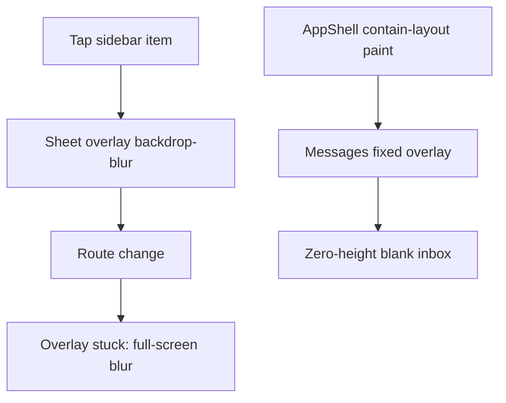

# Fix mobile UX: blur, messages, charts, live score, Health

Work lives in [PeakPerformanceData/peak_performance_data](PeakPerformanceData/peak_performance_data). Parent repo only bumps the submodule pointer.

Previous plans ([fix_recent_ux_regressions](_plans/fix_recent_ux_regressions_f7efcaf4.plan.md), [ux_velocity_and_data](_plans/ux_velocity_and_data_214966f9.plan.md)) already landed parts of P0 (no `flushSync`, SSR sidebar, messages skip server fetch, chart waves). The screenshots show **new or leftover** bugs those patches did not close.

---

## P0-1. Kill the stuck full-screen blur (do this first)

**What you see:** After opening the hamburger, the page stays a frozen frosted overlay even after the drawer is gone (tennis analytics, dashboard, etc.).

**Cause:** Mobile drawers use heavy `backdrop-filter` on a Radix overlay, then close while the next route is still committing. Android Chrome often **leaves the composited blur layer** after the portal unmounts.

- Overlay: [`sheet.tsx`](PeakPerformanceData/peak_performance_data/src/components/ui/sheet.tsx) — `backdrop-blur-[6px]` + 150–300ms close animation + `data-[state=closed]:pointer-events-none` (layer can still paint).
- Same pattern: [`MobileSheetContent.tsx`](PeakPerformanceData/peak_performance_data/src/components/mobile/MobileSheetContent.tsx) `backdrop-blur-sm`, [`dialog.tsx`](PeakPerformanceData/peak_performance_data/src/components/ui/dialog.tsx) `backdrop-blur-[8px]`.
- Close race: [`SidebarNavItem.tsx`](PeakPerformanceData/peak_performance_data/src/components/navigation/Sidebar/SidebarNavItem.tsx) schedules `closeMobile()` at rAF+200ms **and** [`SidebarMobile.tsx`](PeakPerformanceData/peak_performance_data/src/components/navigation/Sidebar/SidebarMobile.tsx) closes again on pathname change. Overlay starts closing before the destination paints; navigation then fights the GPU blur.

**Fix:**

1. **No backdrop-blur on mobile overlays.** Use a solid dim only: `bg-black/50` (or `/40`). Keep blur optional for `md+` if desired. Apply to Sheet, Dialog, AlertDialog, MobileSheetContent.
2. On `open=false`, **unmount the overlay immediately** on viewports `< md` (skip fade-out). Radix `forceMount` must not keep a closed overlay in the tree.
3. **One close path:** remove the 200ms fallback in `SidebarNavItem`. Close only when `pathname` changes (or when the user taps the current item / X / backdrop). That keeps the drawer visible until the new page is ready *without* starting a blur teardown mid-navigation.
4. On route change, force `setMobileOpen(false)` and restore `document.body.style.overflow` (MobileSheetContent already locks body; a leaked `overflow: hidden` plus leftover overlay feels like a frozen blur).

**Verify:** Android: open sidebar on Tennis / Charts / Messages, tap another item, go back, reopen. Background must never stay frosted after the drawer is gone.

---

## P0-2. AI assistant: actually scroll the quick actions

**What you see:** “Com et puc ajudar avui?” with chips; the last chip is clipped; finger-scroll does nothing.

**Cause:** [`VoiceAssistantModal.tsx`](PeakPerformanceData/peak_performance_data/src/components/ai/VoiceAssistantModal.tsx) sets `scrollable={false}` on [`ResponsiveDialogContent`](PeakPerformanceData/peak_performance_data/src/components/mobile/ResponsiveDialog.tsx). Welcome UI is `h-full` + `justify-center`, so the column never overflows and [`QuickActions.tsx`](PeakPerformanceData/peak_performance_data/src/components/ai/QuickActions.tsx) (7 athlete chips) cannot scroll. [`MobileSheetContent`](PeakPerformanceData/peak_performance_data/src/components/mobile/MobileSheetContent.tsx) pan-on-handle is fine; the body still needs `overflow-y-auto`. `maxHeight` is `90dvh` but the inner welcome block is locked to full height.

**Fix:**

1. Welcome column: `min-h-0 overflow-y-auto`, **not** `h-full justify-center`. Top-align content; add bottom padding so the last chip clears the composer (`pb-4`).
2. Keep `scrollable={false}` only if the inner messages pane owns scroll — that pane must be `flex-1 min-h-0 overflow-y-auto` (already present) **and** the welcome branch must use the same scroller, not a centered non-overflowing flex.
3. Chip list: `flex-col w-full` on mobile (full-width rows) instead of wrapping pills that clip.
4. Sheet `maxHeight`: `min(90dvh, 100dvh - nav)` so the composer stays above the home indicator.

**Verify:** Open FAB, scroll through all 7 athlete actions, send one, scroll the thread.

---

## P0-3. Messages page actually paints

**What you see:** Missatges tab active, chrome visible, **white void** — no skeleton, no empty state.

**Cause A (layout — highest confidence):** [`AppShell.tsx`](PeakPerformanceData/peak_performance_data/src/components/layouts/AppShell.tsx) wraps pages in `contain-layout`, which is `contain: layout style paint` in [`globals.css`](PeakPerformanceData/peak_performance_data/src/app/globals.css). **`contain: paint` makes that div the containing block for `position: fixed` descendants.** [`MessagesPageClient.tsx`](PeakPerformanceData/peak_performance_data/src/components/messaging/MessagesPageClient.tsx) is `fixed inset-0`. The page wrapper’s in-flow height is **0** (fixed child is out of flow) → the inbox is a 0×0 box. Header + BottomNav still show because they live outside that wrapper.

**Cause B (data):** [`/api/conversations/list`](PeakPerformanceData/peak_performance_data/src/app/api/conversations/list/route.ts) still `.order('conversation(last_message_at)', …)`. If PostgREST rejects that, the API 500s; SWR sets `conversations = []` with **no error UI** ([`useConversations.ts`](PeakPerformanceData/peak_performance_data/src/hooks/data/useConversations.ts) + [`ConversationList.tsx`](PeakPerformanceData/peak_performance_data/src/components/messaging/ConversationList.tsx)).

**Fix:**

1. Messages shell: **not `fixed` inside `contain-layout`.** Use `absolute`/`relative` filling `#main-content`, or drop `contain-paint` for messaging routes, **or** give the messages wrapper `min-h-[calc(100dvh-nav-bottom)]` so the containing block has height. Preferred: `relative h-[calc(100dvh-top-bottom)]` on the page, MessagingView `h-full min-h-0`, no `fixed`.
2. Fix list query: order by a real column (e.g. `last_message_at` on a flattened select, or sort in JS). Surface SWR `error` as a retry empty-state, not a blank list.
3. Keep visible skeleton while `isLoading` (already in ConversationList; it never appears today because the box has no height).

**Verify:** Open Missatges on a phone: skeleton then list or a real empty inbox with “new conversation”. Never a white hole.

---

## P0-4. Footer no longer under the FAB / nav

**What you see:** “© 2026 Peak Performance Data. Tots els drets…” sitting under the robot FAB.

**Cause:** After removing double padding, [`Footer.tsx`](PeakPerformanceData/peak_performance_data/src/components/ui/Footer.tsx) uses only `pb-safe` on dashboard routes. BottomNav is ~4rem + FAB half-overlap. `.has-bottom-nav` exists but Footer does not use it.

**Fix:** On authenticated dashboard routes, Footer `className` includes `has-bottom-nav` **plus** extra space for the FAB (`pb-[calc(4rem+2.5rem+safe)]` or hide Footer on mobile dashboard entirely). Messages already hide Footer — keep that.

**Verify:** Scroll to bottom of Health, Tennis, Charts: copyright fully above nav, not under the FAB.

---

## P0-5. Sidebar shows the current section (including tennis)

**What you see:** On Analítica de tenis, no row is selected. Live score (`/tennis-scorekeeper/...`) is a **different path** from [`/player/tennis-analytics`](PeakPerformanceData/peak_performance_data/src/components/navigation/Sidebar/navigationItems.tsx).

**Fix:**

1. `isItemActive` in [`SidebarMobile.tsx`](PeakPerformanceData/peak_performance_data/src/components/navigation/Sidebar/SidebarMobile.tsx) and [`SidebarNavigation.tsx`](PeakPerformanceData/peak_performance_data/src/components/navigation/Sidebar/SidebarNavigation.tsx): treat `/tennis-scorekeeper` and `/tennis-scorekeeper/*` as tennis-analytics for the matching role item. Same for `/player/tennis-analytics/progress`.
2. Strengthen active styles (background + left bar already exist; if still invisible, bump contrast: `bg-primary/15` + `text-primary`).
3. Truncate brand title in the drawer header (`Peak Performa…`) — show a shorter label or allow two lines.

---

## P1-1. Physiological charts: first graphs first, real empty vs fake error

**What you see:** HRV/RHR spin a long time, then “Error en carregar les dades del gràfic” with range `2026-06-03`–`2026-09-01` (90-day default). Biomarker Ferritina shows a generic load error.

**Charts:**

- SSR already seeds only HRV + RHR ([`chart-defaults.ts`](PeakPerformanceData/peak_performance_data/src/lib/chart-defaults.ts) `SSR_SEED_PRIORITY_GRAPH_TYPES`).
- Client wave 1 still batches **all 5** above-the-fold types together ([`ChartsContent.tsx`](PeakPerformanceData/peak_performance_data/src/components/charts/ChartsContent.tsx) `SequentialGraphBatchWaves`). Slow `blood_oxygen` / `recovery_score` still occupy the same worker pool as HRV.
- Empty range is titled **failedToLoadGraph** when `error` is set ([`GraphContainerRecharts.tsx`](PeakPerformanceData/peak_performance_data/src/components/charts/GarminConnectGraphs/GraphContainerRecharts.tsx) ~1235–1241), so a timeout looks like a hard error.
- Eager `noDataConfirmationMs` is 800ms — too aggressive on mobile; poll expires into “error”.

**Fix:**

1. Split wave 1: **immediate stream of `hrv_trends` + `resting_heart_rate` only**; start remaining above-the-fold types in a follow-on stream **without waiting** for the slow ones to finish (overlap, don’t block). Wave 2 sleep/workouts still after heart scalars have *started*, not after all 5 complete.
2. Treat timeout / empty traces as **empty state** (“no data in this range / sync wearable”), not `failedToLoadGraph`. Reserve error title for HTTP/5xx.
3. Increase eager `noDataConfirmationMs` on mobile (~2.5–3s) so the first cards stay in skeleton until the stream lands.
4. Keep fail-open providers from the prior plan (do not flash connect-wearable when PPC is slow).

**Labs Ferritina:** [`LabProgressionChart.tsx`](PeakPerformanceData/peak_performance_data/src/components/labs/LabProgressionChart.tsx) maps any `useApi` error to `common.errors.loadError`. Empty athlete labs should be empty copy; retry only on real 5xx. Check `/api/ai-agent/labs/trend` auth/athlete_id.

---

## P1-2. Live score: lighter first paint, faster back, better mobile form

Routes: [`tennis-scorekeeper/page.tsx`](PeakPerformanceData/peak_performance_data/src/app/[locale]/tennis-scorekeeper/page.tsx), [`new/page.tsx`](PeakPerformanceData/peak_performance_data/src/app/[locale]/tennis-scorekeeper/new/page.tsx) (`force-dynamic` + athlete list + profile), [`MatchSetupForm.tsx`](PeakPerformanceData/peak_performance_data/src/components/tennis-scorekeeper/MatchSetupForm.tsx).

**Fix:**

1. **Do not block HTML on the full athlete roster.** Stream the form with the viewer as default host; load athlete `Select` client-side. Add `loading.tsx` skeleton for `/tennis-scorekeeper` and `/new`.
2. Prefetch `/tennis-scorekeeper/new` from the tennis analytics CTA ([`TennisAnalyticsContent.tsx`](PeakPerformanceData/peak_performance_data/src/components/tennis-analytics/TennisAnalyticsContent.tsx) ~542).
3. **Back:** `router.back()` to analytics with the list already in SWR; avoid a full `getServerUserProfile` waterfall on return. Soft-nav, not `location`.
4. **Design (mobile):** single-column card, large 44px controls, sticky “Start match” above BottomNav (`has-bottom-nav` + FAB clearance), Visitant field never clipped. Compact format/surface as segmented controls, not stacked native-looking dropdowns.

---

## P1-3. Redesign Health’s three tabs + honest genetics copy

You confirmed: **Injuries + Labs + Genetics**, same visual language as the new live-score form.

Files: [`HealthHub.tsx`](PeakPerformanceData/peak_performance_data/src/components/health/HealthHub.tsx), [`LabPanelForm`](PeakPerformanceData/peak_performance_data/src/components/labs/), [`GeneticUpload.tsx`](PeakPerformanceData/peak_performance_data/src/components/genetics/GeneticUpload.tsx), [`InjuryTestForm`](PeakPerformanceData/peak_performance_data/src/components/injury/).

**Copy (required):** Remove the false claim in `genetics.privacyBody` (en/ca/es/zh): “never sent to public LLMs”. Replace with honest text: genetic files **are** processed with the app’s AI pipeline (including model providers); do not upload if you are not comfortable with that. Keep a real consent checkbox ([`GeneticUpload.tsx`](PeakPerformanceData/peak_performance_data/src/components/genetics/GeneticUpload.tsx) `privacyBody` + `consent`).

**Design:** Sticky segmented tab bar; drop raw “Choose file / No file chosen” — custom dropzone; Ferritina empty/error as above; Injuries list as cards with clear add CTA; Genetics without the green “secure / never public LLM” banner.

---

## P1-4. Tennis analytics list (same visual pass)

[`TennisAnalyticsContent.tsx`](PeakPerformanceData/peak_performance_data/src/components/tennis-analytics/TennisAnalyticsContent.tsx): match cards, live vs imported sections, progress CTA. Align spacing, type, and primary button with the new live-score setup. Hide Footer overlap via P0-4. Prefetch live-score route. Do not load full shot payloads on the list page (keep list query slim — already separate from match-detail).

---

## Suggested order

1. P0-1 blur overlays  
2. P0-3 messages containing-block + list query  
3. P0-2 AI scroll  
4. P0-4 footer clearance  
5. P0-5 sidebar active  
6. P1-1 charts + labs empty/error  
7. P1-2 live score speed + form  
8. P1-3 Health tabs + consent  
9. P1-4 tennis list polish  

Do not block this pass on splash logos, Body Twin vendor, or coach Health athlete-selector (those stay in the older velocity plan).

---

## Verification (phone, Catalan, player)

- Sidebar: open/close/navigate 10 times — no leftover blur; tennis + live score highlight tennis; current page always marked.
- AI FAB: scroll all chips; dismiss; page not blurred.
- Missatges: list or empty state in &lt;2s warm; never white void.
- Charts: HRV/RHR skeleton then data (or honest empty), **before** later cards; no “failed to load” for empty range.
- Health: three tabs look consistent; no “not sent to public LLMs”; Ferritina empty vs error correct.
- Live score: setup form fully scrollable above nav; back to analytics feels instant.
- Footer never under FAB.
