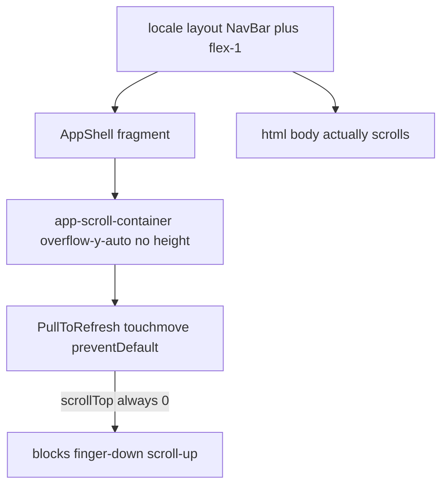

# Fix last-week regressions (scroll, messages, charts, sidebar, data)

Work lives in [PeakPerformanceData/peak_performance_data](PeakPerformanceData/peak_performance_data), with wearable truth in [PeakPerformanceData/ppd_backend/api/routes/graphs.py](PeakPerformanceData/ppd_backend/api/routes/graphs.py). Parent repo only bumps the submodule pointer.

Highest-confidence smoking guns from git + code (not guesses):

- **Aug 30 `d1f13739`** — pull-to-refresh, `flushSync` sidebar close, 800ms/1.5s messages `Promise.race`, charts provider timeout, fitness-test charts stripped.
- **Aug 26 `623a350d`** — UX-velocity pass: providers error = hide charts, empty-provider cache, loading/nav changes.
- **Aug 25 `e3af19da` + sidebar `ssr: false`** — chrome missing until hydration; nav feels like it “vanishes.”

---

## P0-1. Restore scroll-up (do this first)

**Cause:** Dashboard scrolling is supposed to happen on `#app-scroll-container`, but that div has `overflow-y-auto` **without a bounded height** (`h-full` / `min-h-0` / `calc(100dvh - nav)`). The AppShell wrapper is a React fragment, so flex height never reaches the scroller. **The document (`html`/`body`) actually scrolls.** Container `scrollTop` stays `0`.

[pull-to-refresh-indicator.tsx](PeakPerformanceData/peak_performance_data/src/components/ui/pull-to-refresh-indicator.tsx) then treats every gesture as “started at top.” Finger-down (scroll toward earlier content) hits `preventDefault()` when `distance > 10`. The Aug 30 `startedAtTop` guard cannot help because it reads the wrong element.

Same mismatch: [AppShell.tsx](PeakPerformanceData/peak_performance_data/src/components/layouts/AppShell.tsx) `scrollTo(0,0)` on navigate and [NavBar.tsx](PeakPerformanceData/peak_performance_data/src/components/ui/NavBar.tsx) hide-on-scroll listen to a container that never moves.

**Fix:**

1. Make one real scrollport: `#app-scroll-container` must be `flex-1 min-h-0 h-[calc(100dvh-nav)] overflow-y-auto` (or lock `html/body` overflow on dashboard routes and pass height through a non-fragment wrapper). Parent in [layout.tsx](PeakPerformanceData/peak_performance_data/src/app/%5Blocale%5D/layout.tsx) (`flex-1 … pt-[nav]`) needs `min-h-0 flex flex-col`.
2. PTR: only `preventDefault` if **that** container is at top **and** the touch target is not an inner scroller (messages thread, nested `overflow-y-auto`). Prefer `touch-action: pan-y` and skip PTR when `e.target` is inside `[data-scroll-lock-ignore]` / messages.
3. If keeping document scroll is simpler: **remove custom container scrolling** and attach PTR to `window` with `window.scrollY === 0`. Do not leave both.
4. Verify on iPhone: mid-page scroll-up works; PTR only at true top; messages thread still scrolls.

---

## P0-2. Sidebar: stay visible until content is ready, then close subtly

**Cause of “click → immediately gone, then wait”:** [SidebarNavItem.tsx](PeakPerformanceData/peak_performance_data/src/components/navigation/Sidebar/SidebarNavItem.tsx) always `flushSync(closeMobile)` **before** navigation. [sheet.tsx](PeakPerformanceData/peak_performance_data/src/components/ui/sheet.tsx) close is `duration-100` + `opacity-0`. The drawer is gone while the destination RSC is still running.

**Cause of stuck/clunky:** close animation vs heavy route JS fighting the main thread; leftover `isMobileOpen` applies `md:hidden brightness-50` on `<main>` in AppShell (desktop content can vanish if mobile open state leaks); [Sidebar](PeakPerformanceData/peak_performance_data/src/components/layouts/AppShell.tsx) and [SidebarMobile](PeakPerformanceData/peak_performance_data/src/components/ui/NavBar.tsx) are `dynamic(..., { ssr: false })` so chrome is missing on first paint.

**Fix:**

1. **Do not `flushSync` close on click.** Navigate first; close the sheet when `pathname` changes **or** after `requestAnimationFrame` + ~200ms, with the original ~300ms slide (not opacity-0 instant).
2. Optional: keep the drawer open with a content-only skeleton until the new segment commits (chrome stays; only main swaps — [loading.tsx](PeakPerformanceData/peak_performance_data/src/app/%5Blocale%5D/loading.tsx) is already content-only).
3. SSR the desktop sidebar (drop `ssr: false` on `LazySidebar`). Keep collapsed-default to avoid hydration width flash. Hamburger can stay client-only but render a static Menu button immediately.
4. Remove `isMobileOpen && "md:hidden"` from `<main>`; overlay should never hide desktop main.
5. Prefetch: keep [PrefetchLinks.tsx](PeakPerformanceData/peak_performance_data/src/components/navigation/PrefetchLinks.tsx) role-correct; [NavigationProgress.tsx](PeakPerformanceData/peak_performance_data/src/components/navigation/NavigationProgress.tsx) already delays 150ms — confirm `ppd:navigation-start` still fires for `router.push`.

---

## P0-3. Messages page actually loads

**Cause of slow then blank:**

1. All role pages (`player`/`coach`/`parent`/`club-admin` `messages/page.tsx`) **block HTML** on `Promise.race(fetchConversationsServer, 800ms timeout)`. Timeout yields `null` → no SWR `fallbackData` → client fetch starts after paint. The in-flight server query is **not aborted**.
2. [fetch-conversations-server.ts](PeakPerformanceData/peak_performance_data/src/lib/messaging/fetch-conversations-server.ts) uses `.order('conversation(last_message_at)', …)` — if PostgREST rejects that, the function returns `null` every time.
3. Overlay: [MessagesPageClient.tsx](PeakPerformanceData/peak_performance_data/src/components/messaging/MessagesPageClient.tsx) is `fixed inset-0` **inside** the broken scroll container (`overflow-x-hidden` on a parent). Combined with z-30 vs BottomNav, the list can paint at 0 height or under chrome — “nothing loads.”
4. [messages/loading.tsx](PeakPerformanceData/peak_performance_data/src/app/%5Blocale%5D/player/messages/loading.tsx) uses `DelayedFallback` (200ms hide) so navigation looks empty before a skeleton.

**Fix:**

1. **Do not await conversations on the server for TTFB.** Stream the shell immediately; pass fallback only if the fetch already completed (or use `connection()` / after() — simplest: skip server list fetch, let SWR + `/api/conversations/list` load with a visible skeleton).
2. If keeping SSR seed: abort with `AbortController` on timeout; never leave a hanging admin query. Align timeout with commit intent (1.5s) or drop it.
3. Fix the list query to match the API route (order on a real column, then sort in JS).
4. Messages layout: `absolute`/`fixed` relative to `#main-content` with explicit `h-full min-h-0`, not a second viewport competing with AppShell. Give the list `data-scroll-lock-ignore` so PTR cannot eat thread scroll.
5. Remove DelayedFallback on messages loading (or 0ms). Empty vs loading must be distinct in [ConversationList.tsx](PeakPerformanceData/peak_performance_data/src/components/messaging/ConversationList.tsx).
6. Carry forward known composer bugs only after the list renders: FAB z-index, send spinner, unread `mutate` ([MessagesPageClient](PeakPerformanceData/peak_performance_data/src/components/messaging/MessagesPageClient.tsx), [useMessages.ts](PeakPerformanceData/peak_performance_data/src/hooks/data/useMessages.ts)).

---

## P0-4. Physiological performance: data, not connect-wearable banner

User path: Fitness Tests and/or **Charts** (`/charts`, “Physiological performance”). Banner is [ChartsContent.tsx](PeakPerformanceData/peak_performance_data/src/components/charts/ChartsContent.tsx) `noDevice` when `!hasAnyProvider && !isProviderResolutionPending && syncPhase === 'idle'`.

**Cause:**

1. SSR [fetchUserProvidersSnapshot](PeakPerformanceData/peak_performance_data/src/lib/dashboard/user-providers-snapshot.ts) with **450ms** timeout returns `[]`. Timeout is indistinguishable from “no wearable.” **Empty results are cached 5 minutes** — a slow PPC call poisons charts and dashboard.
2. [useUserProviders.ts](PeakPerformanceData/peak_performance_data/src/hooks/useUserProviders.ts) on error/`success: false` **hides all provider charts** (comment: previously defaulted `hasGarmin: true`). That is exactly “banner instead of data” when ClickHouse/`user-providers` is slow.
3. `user-providers` in [graphs.py](PeakPerformanceData/ppd_backend/api/routes/graphs.py) hits ClickHouse (`ow_workouts`, `ow_sleep_summaries`, …). Exception → `{ success: false, providers: [] }`. Frontend treats that as disconnected.
4. Charts page still waits up to **1500ms** for graph seed + athlete list before leaving Suspense — feels like Fitness Tests → Charts is stuck.

**Fix:**

1. **Never cache failures or timeouts.** Cache only `success: true`. Do not cache `[]` unless the request completed successfully and PPC said empty.
2. Raise providers timeout (align with player-init 1500ms) or run providers **only on the client** with fail-open: while unknown, **show graph sections** (skeletons), not the connect CTA.
3. Connect banner only if providers fetch **succeeded** with empty list **and** graph batch also empty. If graphs have data, ignore empty providers.
4. Fail-open: API error → show all common graphs (heart/sleep/workouts), not `noDevice`.
5. Wave 1 stays heart-only; do not disable batch during `syncPhase === 'syncing'`. Treat `success !== true` as unseeded.
6. Honor `?athleteId=` (already on charts page) when navigating from performance-tests so coaches/parents do not seed the viewer’s empty profile.

---

## P0-5. App entry speed and “data not showing”

Stack on first dashboard paint:

- Layout: brand + `getServerUserFast` + providers.
- Player init: readiness `Promise.race` + PPC; Garmin RPCs still called as fallback ([readiness-snapshot.ts](PeakPerformanceData/peak_performance_data/src/lib/dashboard/readiness-snapshot.ts) still hits `garmin_connect_sleep` / `calculate_athlete_readiness` when PPC misses). Those tables **do not exist in production** → errors, defaults (~50 readiness), wrong sleep if Deep-trace fallback still used on some paths.
- Sidebar/Nav extras: `ssr: false` → late chrome.
- Duplicate session after middleware.

**Fix:**

1. Seed `hasConnectedWearable` from providers **only on success**; keep skeleton until score **or** confirmed empty (PlayerHome already ORs `isLoadingProviders` — keep that; do not flash connect CTA).
2. Stop calling missing Garmin tables in production (skip legacy path when PPC ran, even if snapshot is null). Prefer PPC/ClickHouse only.
3. Confirm `latestSleepTotalHours` uses `customdata[1]` / summed bars (already in snapshot file) and the same helper in chart summary UI.
4. Wire login prefetch with real role; avoid `/overview` hop.
5. After P0-2, SSR sidebar so entry is not “blank then chrome then data.”

---

## P1 (after P0 is green on a real phone)

Carry remaining items from [_plans/ux_velocity_and_data_214966f9.plan.md](_plans/ux_velocity_and_data_214966f9.plan.md) that are **not** the regressions above:

- Splash/logo plate vs background (only if still visible).
- Tennis analytics cache/`hasVideo`/evolution pagination.
- Health hub for coach/parent.
- Backend: cache `load_timeseries`; cap coach-matrix PPC fan-out.
- Fitness tests: `d1f13739` removed donut/progression/heatmap — restore only if product still wants them; do not block P0.

---

## Suggested implementation order

1. P0-1 scrollport + PTR (unblocks all pages).
2. P0-2 sidebar close timing + SSR chrome + drop `md:hidden` on main.
3. P0-3 messages TTFB, query, overlay height.
4. P0-4 providers fail-open + no empty-timeout cache + charts athleteId.
5. P0-5 readiness/sleep source; login/entry.
6. P1 leftover velocity items.

## Verification (required)

- iPhone (or device mode + touch): mid-list scroll-up; PTR only at top; messages list + thread scroll.
- Open Messages: conversations visible in &lt;2s warm; no infinite blank.
- Open Charts with a connected athlete: graphs, not connect-wearable hero.
- Mobile nav: drawer stays until new page paints, then slides closed; no freeze; desktop sidebar never unmounts on click.
- Cold open player home: chrome present; readiness/sleep match ClickHouse, not 50% / 1.7h Deep.
