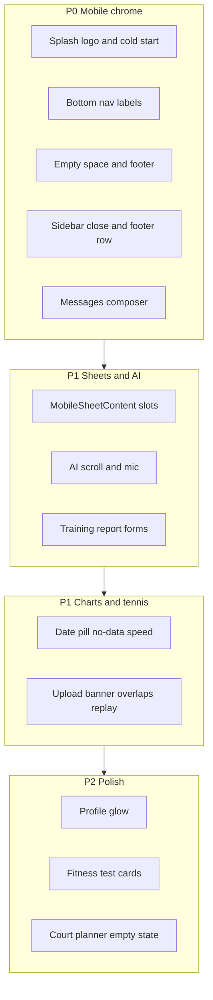

# Mobile UX, layout, and performance overhaul

Phased after your choice: **P0 chrome/splash/messages first**, then charts/tennis, then polish. All work is in [PeakPerformanceData/peak_performance_data](PeakPerformanceData/peak_performance_data). Verify each P0 on a real phone (or browser device mode + safe-area) before moving on.

---

## P0 — Launch, chrome, messaging (must-fix)

### 1. Splash: logo plate vs app background + 5s launch

**What you see:** Circular BCNPTA mark sitting on a darker rounded square, then the navy page. Load ~5s instead of 1–2s.

**Causes (stacked):**
- Academy landing / PWA compositing: [AcademyLanding.tsx](PeakPerformanceData/peak_performance_data/src/components/landing/AcademyLanding.tsx) uses `drop-shadow-[0_4px_24px_rgba(0,0,0,0.25)]` which reads as a box around the circular [BCNPTA_Logo.webp](PeakPerformanceData/peak_performance_data/public/BCNPTA_Logo.webp). Sidebar uses `rounded-lg overflow-hidden` on a 36×36 container.
- Default brand splash still composites [Logo-512.png](PeakPerformanceData/peak_performance_data/public/Logo-512.png) (baked `#F1F1EE` card) onto `#0d1726` in [src/app/api/splash/route.tsx](PeakPerformanceData/peak_performance_data/src/app/api/splash/route.tsx).
- Background hex drift: splash `#0d1726` vs PWA icon `#0f172a` vs apple-icon `#0a1628` vs BCN `#111726` (`224 36% 11%`). Light-mode override in [layout.tsx](PeakPerformanceData/peak_performance_data/src/app/[locale]/layout.tsx) (~line 546) can flash white after a dark iOS splash.
- Cold start: 15 dynamic `/api/splash` ImageResponses (uncached in SW), middleware auth, 424KB i18n parse, nested async layouts, `pages-cache-v3` vs `pages-cache-v2` mismatch in [cache-warm-sw.js](PeakPerformanceData/peak_performance_data/public/cache-warm-sw.js).

**Fixes:**
- BCN landing: drop or soften drop-shadow; do not wrap circular logos in a filled `rounded-lg` plate. Splash/PWA: composite circular logo on **exact** `hslToHex(brand.colors.background)` with no extra card.
- Unify `#0d1726` / brand bg in [pwa-icon/route.tsx](PeakPerformanceData/peak_performance_data/src/app/api/pwa-icon/route.tsx), [offline.html](PeakPerformanceData/peak_performance_data/public/offline.html), [apple-icon.tsx](PeakPerformanceData/peak_performance_data/src/app/apple-icon.tsx). Gate light-mode cold-start CSS until theme hydrates.
- Cache `/api/splash` and `/api/pwa-icon` CacheFirst in [next.config.js](PeakPerformanceData/peak_performance_data/next.config.js); fix cache name to `pages-cache-v2`; add `[locale]/loading.tsx`; defer SW register until after hydration; extend SW locale regex to `nl|de|fr|pt`.

### 2. Bottom nav: Training / Messages clipped

**Cause:** `pb-safe` is on `<nav>` *below* a fixed `h-16` row, so labels sit in the home-indicator zone. Plus `leading-none` clips the `g` in Training.

**Fix in** [BottomNav.tsx](PeakPerformanceData/peak_performance_data/src/components/navigation/BottomNav.tsx) **and** [LazyBottomNav.tsx](PeakPerformanceData/peak_performance_data/src/components/navigation/LazyBottomNav.tsx):
- Move `pb-safe` onto the inner flex row; `h-16` → `min-h-16`.
- Labels: `leading-tight`, `text-[10px]`, `min-w-0`, drop `leading-none`.
- Align `.has-bottom-nav` in [globals.css](PeakPerformanceData/peak_performance_data/src/app/globals.css) to `calc(4rem + max(1rem, env(safe-area-inset-bottom)))`.

### 3. Empty space between content and footer

**Cause (double clearance + stretch):**
- [AppShell.tsx](PeakPerformanceData/peak_performance_data/src/components/layouts/AppShell.tsx) `pb-28` sits **above** the in-flow footer.
- [Footer.tsx](PeakPerformanceData/peak_performance_data/src/components/ui/Footer.tsx) adds another `pb-[calc(8.5rem+safe-area)]`.
- Role layouts force `min-h-screen` (coach, player, parent, admin, club-admin, management) plus root `flex-1` + footer `mt-auto`.

**Fix:**
- Remove AppShell `pb-28` on routes that render Footer; keep one clearance **on the footer only** when BottomNav is shown. When BottomNav is hidden (legal pages), use `pb-10`.
- Replace `min-h-screen` on role layouts with natural height (`min-h-0` inside flex). Same for [overview/layout.tsx](PeakPerformanceData/peak_performance_data/src/app/[locale]/overview/layout.tsx), [charts/layout.tsx](PeakPerformanceData/peak_performance_data/src/app/[locale]/charts/layout.tsx), [performance-tests/layout.tsx](PeakPerformanceData/peak_performance_data/src/app/[locale]/performance-tests/layout.tsx).
- Add `/faq` and `/terms-of-service` to public hide lists in AppShell and BottomNav (privacy already hidden).

### 4. Sidebar: close overlaps academy name; language / settings / logout on 3 lines

**Files:** [SidebarMobile.tsx](PeakPerformanceData/peak_performance_data/src/components/navigation/Sidebar/SidebarMobile.tsx), [sheet.tsx](PeakPerformanceData/peak_performance_data/src/components/ui/sheet.tsx).

- Header: `pr-16` + `truncate`/`min-w-0` so the absolute 44px X at `right-4` does not cover `brand.name`.
- Footer: one `flex items-center justify-center gap-1` row matching [SidebarFooter.tsx](PeakPerformanceData/peak_performance_data/src/components/navigation/Sidebar/SidebarFooter.tsx) — icon-only language (no `showLabel`), settings, logout.

### 5. Messages: cannot send — composer under footer

**Cause:** [MessagesPageClient.tsx](PeakPerformanceData/peak_performance_data/src/components/messaging/MessagesPageClient.tsx) is `z-30`; [BottomNav.tsx](PeakPerformanceData/peak_performance_data/src/components/navigation/BottomNav.tsx) is layout `z-40`. Thread overlay in [MessagingView.tsx](PeakPerformanceData/peak_performance_data/src/components/messaging/MessagingView.tsx) uses `fixed inset-0` (no `bottom-16`) intending to cover nav, but a child `z-40` cannot escape a parent `z-30`. Comment still says nav is `z-20`.

**Fix (pick one, recommend 1+2):**
1. When thread is open, raise messaging shell to `z-50` **or** hide BottomNav (extend existing `isMessagingThreadOpen` beyond FAB-only).
2. Pad composer in [ConversationThread.tsx](PeakPerformanceData/peak_performance_data/src/components/messaging/ConversationThread.tsx) with nav height if nav stays visible.

---

## P1 — Sheets, AI, forms

### 6. Shared mobile sheet: scroll, keyboard, sticky footer

Root of AI + Create Training Report “stranded” UX: [MobileSheetContent.tsx](PeakPerformanceData/peak_performance_data/src/components/mobile/MobileSheetContent.tsx) wraps **all** children in one `overflow-y-auto` with **no `min-h-0`**, `drag="y"` on the whole sheet, no keyboard `scrollIntoView` (that only exists in [dialog.tsx](PeakPerformanceData/peak_performance_data/src/components/ui/dialog.tsx)).

**Fix `MobileSheetContent`:**
- Slots: `header` / scroll `body` (`flex-1 min-h-0 overflow-y-auto`) / sticky `footer`.
- `scrollable={false}` for consumers that own flex (AI modal).
- Drag **handle only**; port focus `scrollIntoView`; shrink height with `visualViewport`; use `dvh` not `vh`.

Then [AddReportDialog.tsx](PeakPerformanceData/peak_performance_data/src/components/coach/reports/AddReportDialog.tsx): sticky Create/Cancel; tighter `FormSection` padding on mobile. Remove nested `max-h-[calc(85vh-10rem)]` in [GroupTrainingSchedule.tsx](PeakPerformanceData/peak_performance_data/src/components/management/training/GroupTrainingSchedule.tsx).

### 7. AI Assistant: cannot scroll; mic not real-time

[VoiceAssistantModal.tsx](PeakPerformanceData/peak_performance_data/src/components/ai/VoiceAssistantModal.tsx):
- Remove `INPUT_CONTAINER_STYLE` `{ height: 44px, overflowY: hidden }` (clips placeholder and live transcript). Auto-resize like [MessageInput.tsx](PeakPerformanceData/peak_performance_data/src/components/messaging/MessageInput.tsx).
- After sheet slots: pin header + input; messages `min-h-0 flex-1 overflow-y-auto`.

[useSpeechRecognition.ts](PeakPerformanceData/peak_performance_data/src/hooks/ai/useSpeechRecognition.ts):
- iOS/Android are **hard-disabled** from Web Speech and poll Groq Whisper every 1.5s on the **full** blob (`>8000` bytes) — 2–4s first word.
- P1: Android Chrome Web Speech with `continuous: false` + auto-restart; iOS keep Whisper with 800ms sliding 3–5s window; fix MIME (`audio/mp4` on iOS, not hardcoded `audio/webm`); add `de`/`fr`/`nl` language maps; surface `error`; wire [MicrophonePermissionDialog.tsx](PeakPerformanceData/peak_performance_data/src/components/ai/MicrophonePermissionDialog.tsx).
- P2 optional: Deepgram/AssemblyAI WebSocket for true iOS real-time.

---

## P1 — Physiological performance (`/charts`)

### 8. 1M pill vs 90-day data

Data default is 90 days in [ExplorationDateRangeProvider.tsx](PeakPerformanceData/peak_performance_data/src/components/exploration/ExplorationDateRangeProvider.tsx) and [charts/page.tsx](PeakPerformanceData/peak_performance_data/src/app/[locale]/charts/page.tsx). [ExplorationDateRangeSlider.tsx](PeakPerformanceData/peak_performance_data/src/components/exploration/ExplorationDateRangeSlider.tsx) initializes `activeQuickSelect` to **30**. Highlight 3M (`90`) and derive pill from `dateRange.daysBack`.

### 9. “No Data Available” despite data + slow HRV

[useGraphData.ts](PeakPerformanceData/peak_performance_data/src/hooks/useGraphData.ts): 25s poll cap then lock empty. [useGraphBatchPrefetch.ts](PeakPerformanceData/peak_performance_data/src/hooks/useGraphBatchPrefetch.ts) treats any SWR hit (`success: false`) as seeded. Wave 1 in [ChartsContent.tsx](PeakPerformanceData/peak_performance_data/src/components/charts/ChartsContent.tsx) batches **14** graphs; `hrv_trends` missing from `SYNC_GRAPH_TYPES`. Hover prefetch uses **30-day** keys vs page **90-day**. `sleep_stages` filter drops Light/Awake-only payloads.

**Fixes:** heart-only wave 1 (~5 graphs); `hrv_trends` first in SSR seed; 90-day constant shared with prefetch hooks; do not skip `success: false`; invalidate cache on sync complete; raise/extend poll during sync; add HRV to sync types.

### 10. Cleaner graphs (actionable, not denser)

[GraphContainerRecharts.tsx](PeakPerformanceData/peak_performance_data/src/components/charts/GarminConnectGraphs/GraphContainerRecharts.tsx) (~1600 lines): every card stacks title + pills + chips + all series + static legend on a 260px mobile chart. `enhanced/` (legend, zoom, tooltip) is **built but unused**.

P1: one headline metric; hide 7-day avg until legend tap; primary-first tooltip with units; denser X ticks for long ranges; fix dual-axis pace (`reversed`); more `margin.right` on mobile. P2: wire InteractiveLegend / zoom for ranges >90 days; essential vs all metrics in ChartsContent.

---

## P1 — Tennis analytics

### 11. Load speed

List SSR is already seeded; **detail** waits on a monolithic shots payload ([match-detail.ts](PeakPerformanceData/peak_performance_data/src/lib/tennis/match-detail.ts), 6 parallel queries) + lazy [TennisAnalyticsDetail.tsx](PeakPerformanceData/peak_performance_data/src/components/tennis-analytics/TennisAnalyticsDetail.tsx). Parallelize pipeline job with detail load in [matches/[id]/route.ts](PeakPerformanceData/peak_performance_data/src/app/api/tennis/matches/[id]/route.ts). SSR-seed `?match=` deep links. Longer term: `?fields=summary|shots`.

### 12. Stuck “Ready for upload” 100% + spinner

[PipelineStatusBanner](PeakPerformanceData/peak_performance_data/src/components/tennis-analytics/TennisAnalyticsDetail.tsx) renders `status`, raw `progress_stage`, and `progress_percent` independently. Typical stale row: `status: ready_for_upload`, `progress_stage: uploading`, `percent: 100`. `ready_for_upload` is **non-terminal** (ops handoff, not user upload).

**Fix:** Treat `ready_for_upload` (and later ops states) as “waiting on ops” — no spinner, hide stale stage/percent when they contradict `status`. Single `TERMINAL_STATUSES` source. Coach copy: e.g. “Processing complete — analysis pending”, not “Ready for upload”.

### 13. Chart label overlaps

Critical: [TennisAnalyticsPlayPatternsTab.tsx](PeakPerformanceData/peak_performance_data/src/components/tennis-analytics/TennisAnalyticsPlayPatternsTab.tsx) `RallyChart` `XAxis interval={0}` + long labels + `margin.bottom: 4`. Use short ticks (`Serve` / `2–4` / `5–8` / `9+`), angle or wrap, larger bottom margin. Also truncate Match Stats rally subtitles, Insights `ColoredBar` label/value rows, Shot Stats direction rows.

### 14. Point replay “empty bar”

Two layers: vendored `@courtviz` **dist stubs** (`PointReplayCourt = Noop`, no `buildMatchPlayback`) so [PointReplayPanel.tsx](PeakPerformanceData/peak_performance_data/src/components/tennis-analytics/PointReplayPanel.tsx) shows an empty `rounded-lg` card; when built, the seek control is an **unstyled** `<input type="range">` on a dark theme.

Rebuild vendor from Marketing courtviz (or `pnpm build` in vendor) so dist exports the real court. Style the range with accent color. Keep bounce-only empty state copy for scorekeeper matches.

---

## P2 — Polish (after P0/P1)

### 15. Profile “weird color”

[ProfilePageClient.tsx](PeakPerformanceData/peak_performance_data/src/components/profile/ProfilePageClient.tsx): `from-primary/30 to-accent/30 blur-sm` + `surface-hero` / `surface-mesh` (primary/accent bleed). Flatten to `bg-card` + simple avatar, no blur halo.

### 16. Fitness tests cleaner cards

[TennisTestMetricCard.tsx](PeakPerformanceData/peak_performance_data/src/components/tennis/TennisTestMetricCard.tsx): one card per metric, red value **and** “Needs Improvement” badge, tiny reference line. Switch to one section container + `divide-y` rows, left level bar, short i18n `needs_improvementShort`, group avg only when expanded. No scoring-logic changes.

### 17. Court planner empty day

[CourtsBoardGrid.tsx](PeakPerformanceData/peak_performance_data/src/components/coordination/CourtsBoardGrid.tsx): drop `min-h-[520px]`; render unused i18n `nothingScheduled` / `swipeHint`. Hide or shrink [coach/training/page.tsx](PeakPerformanceData/peak_performance_data/src/app/[locale]/coach/training/page.tsx) StatCards (`0`) on Courts tab. Reconcile `mb-24 pb-20` with AppShell after P0 padding fix.

### 18. Overview short content

[CoachHome.tsx](PeakPerformanceData/peak_performance_data/src/components/dashboard/home/CoachHome.tsx) hides most sections when empty; leftover gap is mostly P0 layout. Optional: compact empty states for court / pending so the page does not look unfinished.

---

## Performance notes (cross-cutting)

Highest first-paint levers besides splash: `[locale]/loading.tsx`; do not block streaming on [RouteMessagesProvider](PeakPerformanceData/peak_performance_data/src/components/providers/RouteMessagesProvider.tsx); defer SW; Inter weight reduction; avoid duplicate `getSession` in page vs middleware. Graph/tennis speed as in P1.

---

## Verification (each phase)

- iPhone PWA launch: splash bg = first paint; no square plate; <2s to chrome on warm cache.
- Bottom nav: Training/Messages fully visible above home indicator; FAB does not clip labels.
- Short pages (overview, profile, legal): footer sits under content, not a third of the screen down.
- Messages thread: composer usable, send works.
- Sidebar: name fully visible; one-row actions.
- AI: scroll to input; mic shows text while speaking (Android) or within ~1s (iOS Whisper).
- Charts: 3M selected; HRV not stuck No Data when ClickHouse has data.
- Tennis: banner not spinning at 100% ready_for_upload; rally labels readable; replay not an empty card if vendor is built.
