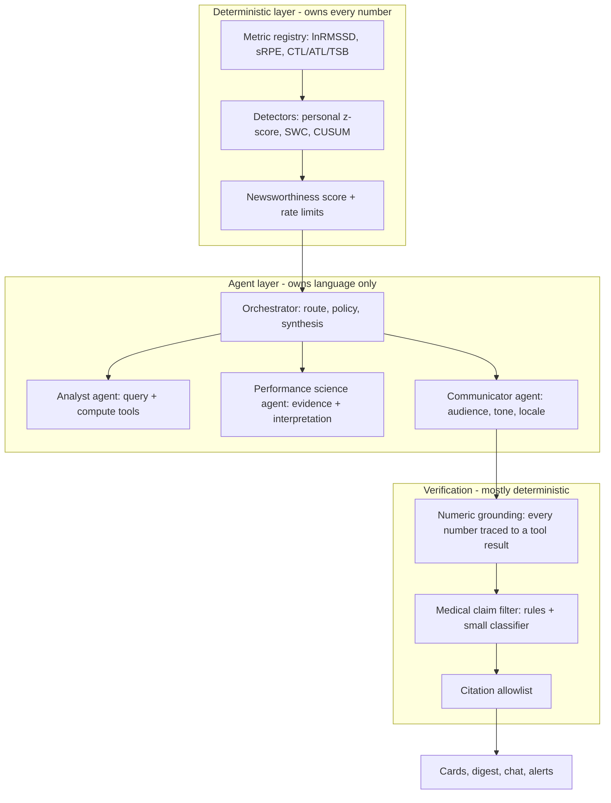

# PPD Agentic System v2

Supersedes [ppd_agentic_layer_0167692b.plan.md](PeakPerformanceData/ppp_ai_agent/_plans/ppd_agentic_layer_0167692b.plan.md), whose "codebase truth" section is now substantially wrong. 80 research dossiers backing this plan are in [_plans/research/](_plans/research/), numbered 01-81 and cited inline below.

## The one-sentence thesis

Deterministic Python owns every number **and decides whether there is anything worth saying**; the LLM only decides **how to say it**. Everything else in this plan follows from that.

## What the research actually changed about the original plan

- **Multi-agent, but split by cognitive role, not by data type.** Google's Personal Health Agent (Analyst / Domain Expert / Coach + orchestrator) beat a strong single tool-using agent in ~80% of expert rankings; a naive parallel three-agent version was no better than single-agent. Six modality peers (wearable, tennis, biomarker...) is the topology their ablation shows *hurts*. Modalities become tools. [35]
- **Real multi-agent is justified for exactly one workload.** Anthropic measures ~15x token cost for multi-agent vs chat; Google measures +80% on parallel tasks but **−70% on sequential ones**. Nightly insights (500 runs/night) must be a deterministic pipeline. Only the open-ended "why has this athlete regressed over 3 months" case earns orchestrator-workers. [42]
- **DeepSeek has to go, now.** Italy's Garante ordered a block, Berlin's DPA found an Article 46(1) transfer breach, data sits in the PRC with no adequacy route, and DeepSeek's own terms forbid submitting health, genetic, or children's data — which is exactly what we send it. [67]
- **The nightly-insight-for-everyone idea is the biggest product risk.** Clinical decision support with indiscriminate alerts sees 80-90% override rates. A deterministic detector must gate whether an insight exists at all. [65]
- **ACWR is not defensible as injury risk**, and we currently ship an injury-risk score. Coupled ratios produce spurious correlation, and 0 of 30 sports injury-prediction models have been externally validated. Combined with MDR, injury prediction is the single most likely thing to sink this product. [81][80][66]
- **PydanticAI is no longer a stale pin.** `requirements.txt` pins `pydantic-ai==0.0.13` and never imports it; the library is now at **2.22.0** with first-class Temporal/DBOS/Prefect durability and OTel that works without Logfire cloud. It is the best fit for an existing FastAPI + Pydantic v2 service. [47]

## Ground truth: what actually exists today

`ppp_ai_agent` is **not** empty. It is a real FastAPI service with 14 routes, auth middleware, 16 Python tools, three specialists, an Insight schema, and 171 pytest tests. But it is a **prompt-and-parse pipeline, not an agent**: no tool loop, no planner, no memory, no scheduler, hand-rolled `httpx` POSTs with `json_object` mode. [01][05][06]

Corrections to widely-held assumptions, each verified: identity is **session-derived**, not body-trusted [13]; memory write **is** wired, but extracts from the previous turn's assistant message [15]; the real tool count is **121, of which 61 mutate** [16]; the Python service already reads ClickHouse correctly — the dual-read gap is only in the athlete-side TypeScript tool [79].

## Blocking decision I need from you

**B2C tenancy is unresolved and it blocks the entire authorization layer.** [75]

- [b2c_consumer_transformation](_plans/b2c_consumer_transformation_6e7f8585.plan.md) proposes a hidden personal organization plus an `accountMode` flag.
- [b2c_stripe_payments](_plans/b2c_stripe_payments_5349075e.plan.md) proposes `organization_id = null`.

Every tool signature, every RLS policy, and `insights.organization_id NOT NULL` depend on which one wins. This plan assumes **personal-org + `accountMode`** because it preserves org-scoped RLS and requires no null-handling in ~40 tools. Confirm or correct before Phase 1.

## Target architecture

**Workload routing**, per the multi-agent economics evidence [42]:

- Nightly athlete insight (~500/night) — deterministic pipeline plus a single narration call. Batch API plus prompt caching.
- Coach roster digest — single agent over precomputed features.
- Interactive chat — single agent with tools, latency-bounded.
- Lab/event-triggered insight — pipeline plus single agent, critic pass.
- Deep regression investigation — **the only orchestrator-worker multi-agent path**, using the Magentic task-ledger/progress-ledger pattern (~300 lines, no Microsoft framework dependency). [44]

## Stack decisions

- **Framework:** PydanticAI 2.22.x. Runner-up LangGraph (better explicit state machine, heavier dependency). [47][45]
- **Durability:** DBOS on the existing Postgres first; graduate to Temporal Cloud EU (Frankfurt, ~$100/mo) when multi-day approval waits and audit pressure justify it. **Do not self-host Temporal** on the shared Hetzner box. [46][39]
- **Providers:** frontier models reached through EU-resident enterprise channels — Bedrock EU or Vertex `europe-west4` or Azure EU — so we get Claude/Gemini quality with EU residency and a DPA. Mistral EU as the sovereign option. DeepSeek removed from every path. [67][38][41]
- **Gateway:** LiteLLM `Router` **in-process**, not a separate proxy, with our own Redis+Postgres budget guard. Mandatory smoke test that Anthropic `cache_control` survives — a gateway that strips it destroys the batch cost model. [69]
- **Observability:** self-hosted Langfuse (MIT) on Hetzner, OTel GenAI attributes plus a `ppd.*` domain namespace so "show me every agent decision about athlete X" is a single query for GDPR access requests. [56]
- **Memory:** build on Supabase pgvector with bi-temporal `valid_from`/`valid_to`. Do not buy Zep/Mem0/Letta — they add a second datastore and US residency without solving athlete scoping or Article 17 erasure. [50]
- **Streaming:** emit the Vercel AI SDK UI Message Stream (SSE) from FastAPI. Requires upgrading the client off `ai@4.3.19`. [61]

## Phase 0 — Stop the bleeding (about 1 week, do this regardless of the rest)

Security, in priority order [57][30][17][22]:

1. `peak_performance_data/.env.production` and the extraction repo's `garmin_tokens/*.json` are **committed to git**. Rotate every credential, purge from history.
2. `ppd_backend` at `api.wearablesync.app/ppc` has **no authentication** — it ignores the `x-internal-service` header the frontend sends. Athlete wearable data is publicly reachable.
3. `ai_memories` and `ai_audit_logs` RLS use `WITH CHECK (true)`; the AI `SECURITY DEFINER` RPCs are executable by `anon`, including `cleanup_old_ai_data`, which deletes globally.
4. Break the lethal trifecta: the agent currently has private health data, untrusted text concatenated into the system prompt, and message-sending tools in one context.

Correctness bugs that mean parts of the service have never run [02][04][09][19][21][78][79]:

- `Dockerfile` never copies `agent/`, so insight routes cannot import at boot.
- The `insights`, labs, and genetics migrations exist as files but were **never applied** — the nightly batch writes to a table that does not exist.
- `tools/training.py` queries `training_sessions`, which does not exist. The real join is `group_training_attendance.player_id` → `group_training_sessions`.
- `get_alerts` and `get_wearable_summary` select columns that do not match their tables.
- Genetics upload/parse is broken (schema drift plus `PATCH` unsupported in `db.py`).
- DeepSeek base URL is missing `/v1`, so the configured primary provider likely always fails over.
- Roughly 15 TypeScript tools query nonexistent tables or columns.

Also: **AI Act Article 50 transparency obligations are live as of today, 2 Aug 2026.** The chat needs an AI disclosure. [66]

## Phase 1 — Foundations (about 3 weeks)

**Canonical metric registry** — the single highest-leverage piece. Today there are three different readiness formulas, `acute_chronic_load_ratio` sometimes means ACWR and sometimes a raw weekly volume ratio, and sleep debt is computed against 7 hours in one place and 8 in another. The agent will contradict the UI until one definition wins. [23][81]

- One Python module per metric with a version, a formula, minimum data requirements, interpretation bands with citations, and an explicit "what this may not claim" field.
- Adopt lnRMSSD with 7-day mean and personal CV; Foster sRPE as the system-of-record internal load; CTL/ATL/TSB at tau 42/7; age-aware sleep targets (teens 8-10h).
- **Demote ACWR to a descriptive "7-day vs 28-day load ratio" and remove all injury-risk framing.** Remove wearable sleep-stage coaching.

**Tool layer**: consolidate 121 TypeScript tools into roughly 9 parameterized Python read tools (`resolve_athletes`, `get_wearable_metrics(mode=...)`, `get_tennis_performance`, ...), targeting ~20-28 total. Standard envelope `{ok, status, data, error, meta}` on every tool. Replace the English keyword router with native LLM tool calling plus multilingual tool descriptions. [52][79][16]

**Authorization**: every tool takes a server-derived `ActorContext` and checks it internally. The service_role key cannot be the trust boundary. Coach scope is `coach_player_assignments`; parent scope is `parent_child_relationships`. [18][57]

**Provider migration** off DeepSeek onto the EU-resident tier, with the data-minimization gate: wearable-derived features only, never raw series; biomarker flags not values; genetics never leaves our infrastructure. [67]

## Phase 2 — The insight engine (about 3 weeks)

**Detection before narration.** A deterministic detector emits a `CandidateEvent` or the system stays silent. No detector event, no insight — ever. [65]

- Personal-baseline z-scores and smallest worthwhile change, CUSUM for chronic drift, explicit tests per metric.
- Newsworthiness score combining effect size, confidence, actionability, novelty. Publish thresholds: card 0.55, digest 0.60, push 0.85.
- Hard caps: at most 3 insights per athlete per week, at most 7 digest items, 72-hour cooldown on the same fingerprint. Dismissal above 60% auto-demotes an insight type.

**Insight schema v2**: add generation/trace IDs, model attribution, cost, `is_model_generated` (today a template fallback is indistinguishable from a real generation — a real defect), locale narratives, dedup key, audience, and severity. [03][54][74]

**Verification is mostly deterministic**, because the evidence says intrinsic self-critique degrades factual accuracy: numeric grounding and citation validity are parser jobs at 100% coverage; medical claims are rules plus a small classifier at 100%; only tone gets a sampled cross-family LLM judge at ~15%. About $0.004-0.015 per insight. [51]

**Delivery** through existing channels, with a system bot profile so AI messages never impersonate a coach (today `messages.sender_id` forces a real human). Plus the missing notification preferences and user timezone — a proactive agent without quiet hours is a liability. [78]

## Phase 3 — Interactive agent (about 3 weeks)

Move the brain from the Next.js Edge route to Python; the route becomes a Node BFF that pipes SSE. Requires disabling Traefik buffering and sending `X-Accel-Buffering: no`, or streaming silently breaks. Rebuild memory on the bi-temporal pgvector design and fix the extraction-from-wrong-message bug. [61][28][50][15]

## Phase 4 — Oversight and learning (about 2 weeks)

Risk-tiered approval R0-R7: observational insights auto-publish, training-load changes and any athlete/parent message need coach approval, genetics is disabled by default. Target: a coach clears 40 athletes in **under 5 minutes** via batching and diffs, or approval fatigue kills it. [60]

Three-tier evals: free deterministic checks on every PR, cost-capped live runs nightly with hard blocks on numeric grounding and medical overreach, and biweekly human error analysis. Behavior ships as git-native versioned bundles (prompt + pinned model snapshot + tools + schemas + safety policy) with a shadow night, then a 5-10% athlete canary. [55][73]

Feedback closes the loop through error analysis, gold few-shot selection, and GEPA-style prompt optimization — **not** fine-tuning. At hundreds of labels per year, DPO/KTO is not reachable, and optimizing for thumbs-up invites sycophancy in a product where the true answer is sometimes unwelcome. [70]

## Phase 5 — Deep investigation (about 2 weeks)

The one genuine multi-agent path: read-only workers, a single writer, Magentic dual-ledger orchestration, bounded rounds. Runs as a background job with progress streaming, not a held-open chat request. [42][44][61]

## Phase 6 — B2C mode

One engine, two policies. Consumer mode swaps the coach gate for a narrower action space plus stronger guardrails, strips roster/messaging/genetics tools, and enforces entitlements server-side. Spain's digital consent age is **14**; under-13 is parent-managed with no free-form AI chat. [75][60][68]

## Cost

At the balanced tier: roughly **$336-471/month for 500 athletes**, or **$0.67-0.94 per athlete per month**. Economy is ~$0.08-0.12 and Premium ~$1.67-2.33. The dominant lever is prompt caching stacked with the Batch API on the nightly job — roughly 95% off cached input — which requires the system prompt and tool schemas to be byte-identical across all 500 runs. A single dynamic field in the prefix collapses cache hits from ~70% to ~7%. [58][49]

## Explicitly cut or deferred

- **Cut:** injury-risk prediction, clinical interpretation of labs and CGM (pass-through only), ACWR as risk, wearable sleep-stage coaching. [66][81]
- **Out of scope:** `ppd_vision` — scaffold with no weights, nothing consumes it, duplicates SwingVision. [26]
- **Skip:** A2A. **Defer:** internal MCP (keep tools MCP-shaped), sandboxed code execution (fixed metric library first), full-text research RAG (metadata-only evidence cards first), voice beyond dictation. [37][48][53][59][71]

## How this fails, and the gates against it

1. The injury-risk score becomes a liability — gated by cutting it in Phase 1.
2. The agent gives doctor-like advice to a minor — gated by deterministic filters running before delivery, plus age-tiered tool access.
3. Multi-agent complexity dies on cost and ROI (Gartner projects over 40% of agentic projects cancelled by 2027) — gated by shipping the coach morning digest as one beachhead workflow with a 90-day kill decision before anything else is built. [80]