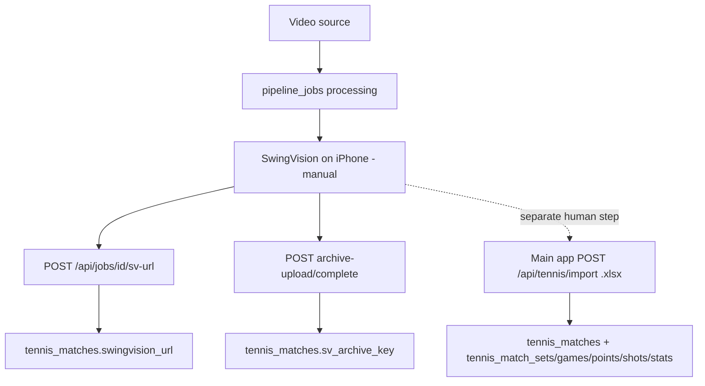

# 25 — SwingVision Pipeline Architecture & Integration Surface

**Status:** Read-only research dossier  
**Date:** 2026-08-02  
**Scope:** Document `PeakPerformanceData/swingvision-pipeline/` architecture, data model, API surface, path into `tennis_match_*`, auth, operational signals, and whether the multi-agent system should expose tools over it.  
**Sources (primary):**
- `PeakPerformanceData/swingvision-pipeline/README.md` (L1–312)
- `_plans/pipeline_overhaul_v2_4bf613e9.plan.md` (L1–236)
- `lib/types.ts`, `components/pipeline-stepper.tsx`, `middleware.ts`, `lib/auth.ts`, `lib/supabase.ts`, `lib/matches.ts`
- `app/api/**/route.ts` (24 routes)
- `supabase/migrations/0001`–`0015`
- `workers/ingestion_watcher.py`, workers overview via README
- Main-product import path: `peak_performance_data/src/app/api/tennis/import/route.ts`

**Do not confuse:** this ops pipeline processes *video* for SwingVision analysis. It does **not** populate shot/point analytics tables. Those land via a separate Excel import in the main PPD app.

---

## 1. Overall architecture

### 1.1 What runs where

| Component | Where | Role |
|-----------|-------|------|
| Next.js 15 dashboard ("Mission Control") | Vercel | Operator UI + API routes (service-role Supabase writes, R2 presigns) |
| Supabase PostgreSQL | Cloud project `bcfwtgqvusjhlrqsztod` | **Same project as PeakPerformanceDataV2 / main app** (README L76–77, migration 0001 L2–3) |
| Cloudflare R2 bucket `ppd-tennis-videos` | Cloudflare | Shared with PPD: raw/enhanced pipeline prefixes + `{userId}/{matchId}/match.mp4` and `archive.mp4` |
| `processing_worker.py` | Mac Mini (launchd) | Claim pending jobs → yt-dlp/R2 download → ffprobe → HEVC enhance → R2 upload → `ready_for_upload` |
| `ingestion_watcher.py` | Mac Mini (launchd) | Poll `tennis_matches` with `video_upload_status='ready'` lacking a job → insert `pipeline_jobs` |
| `cron.py` | Mac Mini (launchd) | Stale-claim release, quota reset, event pruning, inbox cleanup |
| `rclone_distributor.py` | Mac Mini (optional) | Pull enhanced files to local inbox when `PIPELINE_PULL_TO_INBOX=true` |
| SwingVision iOS | 5× iPhone SE | Manual analysis; no Appium/automation |

Sources: README L5–37, L45–68, L223–231.

### 1.2 End-to-end lifecycle (operator + workers)

```
Source (YouTube API / PPD upload / direct upload)
  → tennis_matches row + pipeline_jobs (status=pending)
  → Mac Mini processing_worker: downloading → probed → rife/rife_done/enhancing → uploading → ready_for_upload
  → Operator downloads enhanced.mp4 from R2 → mark delivered → on_iphone
  → Operator imports into SwingVision → mark uploaded → uploaded_to_sv
  → Operator pastes SV share URL → analyzed (+ tennis_matches.swingvision_url)
  → Operator uploads SV video export via Videos page → sv_archived (+ tennis_matches.sv_archive_key)
```

README L251–270; stepper captions `components/pipeline-stepper.tsx` L25–48.

**Critical gap for agent provenance:** status `analyzed` means “SV share URL recorded,” **not** “shot-level data is queryable.” Shot/point/set rows require a separate Excel `.xlsx` import in the main product (see §5).

### 1.3 Job lifecycle statuses (canonical)

From `lib/types.ts` L6–19 and migration `0015_add_uploading_status.sql` L12–26:

| Status | Meaning |
|--------|---------|
| `pending` | Queued; waiting for Mac Mini worker claim |
| `downloading` | yt-dlp or R2 raw download in progress |
| `probed` | ffprobe done (resolution/fps known) |
| `rife` / `rife_done` | Interpolation stage (often frame-dupe path historically; overhaul wants native fps + opt-in) |
| `enhancing` | HEVC encode (note: overhaul plan said worker may skip writing this) |
| `uploading` | Enhanced file uploading to R2 |
| `ready_for_upload` | Enhanced on R2; operator should download to an iPhone |
| `on_iphone` | Delivered to a phone (`suggested_account_id` set; was `airdropped` before migration 0008) |
| `uploaded_to_sv` | Operator confirmed import into SwingVision; hours quota charged |
| `analyzed` | SV share URL written to `tennis_matches.swingvision_url` |
| `sv_archived` | SV export video archived to R2; phone storage counter reclaimed |
| `error` | Failed or cancelled |

Sources: `0008_rename_airdrop_to_delivered.sql` L17–21; `0015` L12–26; `lib/types.ts` L6–19.

### 1.4 Pipeline stepper stages (UI)

`components/pipeline-stepper.tsx` L25–64 collapses statuses into **8 operator-facing stages**:

| Stage label | Statuses | Operator caption |
|-------------|----------|------------------|
| Download | `downloading` | — |
| Probe | `probed` | — |
| Enhance | `rife`, `rife_done`, `enhancing` | — |
| Upload | `uploading` | — |
| Deliver | `ready_for_upload`, `on_iphone` | — |
| SV Upload | `uploaded_to_sv` | Import into SV, then confirm |
| Analyzed | `analyzed` | Paste SV share URL |
| Archive | `sv_archived` | Export from SV and upload permanently to R2 |

`pending` is shown as “Queued” (L158–163). `error` shows a retry hint (L152–157).

### 1.5 Intended direction (overhaul v2)

`_plans/pipeline_overhaul_v2_4bf613e9.plan.md` describes a seven-phase overhaul after a 48-agent audit: unbreak production (dead-worker watchdog, launchd path, ingestion starvation, fail-closed auth), mobile workbench, encode quality, worker reliability, CI. Several Phase 0–3 items appear already reflected in current code (HMAC auth fail-closed, anti-join RPC, atomic counters, Next Actions workbench, error boundaries, `uploading` status). Treat the plan as direction + remaining risk list, not as “all still broken.”

---

## 2. Data model

### 2.1 Database: same Supabase as main app

- Project ref: **`bcfwtgqvusjhlrqsztod`** (README L76–77; migration 0001 L2–3).
- Pipeline tables live **alongside** `tennis_matches` / `profiles` / `organizations` in that project.
- Dashboard writes use `SUPABASE_SERVICE_ROLE_KEY` (`lib/supabase.ts` L29–37). Anon clients are read-only on pipeline tables via RLS (0001 L177–209).

### 2.2 Pipeline-owned tables

#### `pipeline_jobs` (0001 L97–149 + later migrations)

One row per match in flight. Key columns (see also `lib/types.ts` L27–57):

| Column | Role |
|--------|------|
| `id` | UUID PK |
| `match_id` | FK → `tennis_matches(id)` ON DELETE CASCADE |
| `source` | `ppd_upload` \| `youtube` \| `direct_upload` (0006 L20–25) |
| `youtube_url` | YouTube source URL (dedupe key for YouTube jobs) |
| `target_resolution` | `1080p` \| `1440p` \| `auto` \| `native` |
| `status` | See §1.3 |
| `assigned_machine` | Worker claim label |
| `suggested_account_id` | FK → `swingvision_accounts` (which iPhone holds the clip) |
| `progress_*` | Worker progress telemetry |
| `enhanced_size_bytes` | For phone storage accounting |
| `sv_archive_key` | R2 key of archived SV export |
| `inbox_cleared` | Mac inbox cleanup flag |
| Timestamps | `downloaded_at`, `rife_at`, `enhanced_at`, `delivered_at`, `uploaded_to_sv_at`, `analyzed_at`, `sv_archived_at` |

Unique on `match_id` (migration 0011, referenced by ingestion watcher).

#### `pipeline_events` (0001 L156–174)

Append-only log: `job_id`, `machine`, `level` (`debug|info|warn|error`), `message`, `acknowledged`, `created_at`. Realtime-published. Mission Control activity feed.

#### `pipeline_machines` (0001 L76–89; disk cols in 0005)

Mac Mini fleet row(s): `label`, `is_orchestrator`, `tailscale_ip`, `local_inbox_path`, `parallel_jobs`, `last_seen_at`, `current_job_id`, disk telemetry, per-role heartbeats (`last_seen_processing` / ingestion / distributor from 0010).

#### `swingvision_accounts` (0001 L52–69; storage in 0002 L65–76)

Five SV accounts / iPhones: quota hours, `storage_used_bytes`, `storage_total_gb`, `storage_reserve_gb`, device labels. Atomic bump RPCs in `0012_atomic_counters.sql`.

### 2.3 Shared / main-product tables the pipeline touches

| Table / fields | How pipeline uses them |
|----------------|------------------------|
| `tennis_matches` | Creates rows (YouTube / direct upload); reads `video_upload_status='ready'` for ingestion; writes `swingvision_url`, `sv_archive_key`, `cloudflare_video_key`, `video_upload_status`, opponent/date |
| `profiles`, `organizations` | Listed by `/api/players` for assigning uploads |
| `tennis_match_*` (sets/games/points/shots/stats) | **Not written by this repo** |

### 2.4 “Videos” and “uploads”

There is **no** separate `videos` table. Video state hangs off `tennis_matches`:

| Field | Meaning |
|-------|---------|
| `cloudflare_video_key` | R2 key `{userId}/{matchId}/match.mp4` after direct/PPD source upload completes |
| `video_upload_status` | e.g. `uploading` → `ready` (upload complete route L107–112) |
| `video_file_size_bytes` | Size after upload |
| `sv_archive_key` | Permanent SV export `{userId}/{matchId}/archive.mp4` |
| `swingvision_url` | Public/share URL into SwingVision web |

`tennis_match_uploads` is used by the **main app** Excel import (`import/route.ts` L276–284), not by the pipeline dashboard.

### 2.5 Sources of jobs

| Source | How created |
|--------|-------------|
| `youtube` | `POST /api/jobs` creates `tennis_matches` + `pipeline_jobs` for `PIPELINE_OWNER_USER_ID` |
| `ppd_upload` | Main product (or elsewhere) sets match video `ready`; `ingestion_watcher` enqueues via `svp_matches_needing_jobs` RPC |
| `direct_upload` | `POST /api/matches/create` (+ optional `enqueuePipeline`); browser multipart upload to R2 then `video_upload_status='ready'` |

---

## 3. Complete API route inventory

All routes are session-gated by middleware except `/login`, `/api/login`, `/api/logout` (`middleware.ts` L19–23). Methods and purposes:

### Auth

| Method | Path | Purpose | File |
|--------|------|---------|------|
| POST | `/api/login` | Password login → HMAC `svp_session` cookie; IP rate limit | `app/api/login/route.ts` L40+ |
| POST | `/api/logout` | Clear session cookie | `app/api/logout/route.ts` L9+ |

### Jobs

| Method | Path | Purpose | File |
|--------|------|---------|------|
| POST | `/api/jobs` | Queue YouTube video: create `tennis_matches` + `pipeline_jobs` | `app/api/jobs/route.ts` L19+ |
| DELETE | `/api/jobs/[id]` | Delete terminal job (`error` / `sv_archived`) + events; reclaim counters | `app/api/jobs/[id]/route.ts` L13+ |
| POST | `/api/jobs/[id]/cancel` | Cancel active job → `error` | `…/cancel/route.ts` L14+ |
| POST | `/api/jobs/[id]/reprocess` | Reset job for another processing pass | `…/reprocess/route.ts` L12+ |
| POST | `/api/jobs/[id]/mark-delivered` | `ready_for_upload` → `on_iphone`; bump phone storage | `…/mark-delivered/route.ts` L16+ |
| POST | `/api/jobs/[id]/mark-uploaded` | `on_iphone` → `uploaded_to_sv`; bump hours quota | `…/mark-uploaded/route.ts` L13+ |
| POST | `/api/jobs/[id]/sv-url` | Write `tennis_matches.swingvision_url`; advance to `analyzed` (or URL-only if already analyzed/archived) | `…/sv-url/route.ts` L16+ |
| PATCH | `/api/jobs/[id]/match` | Edit linked match `opponent_name` / `match_date` | `…/match/route.ts` L12+ |
| GET | `/api/jobs/[id]/progress` | Poll `progress_percent/stage/updated_at` + status | `…/progress/route.ts` L8+ |
| GET | `/api/jobs/[id]/events` | List `pipeline_events` for a job | `…/events/route.ts` L8+ |
| GET | `/api/jobs/[id]/download-url` | Presigned GET for enhanced R2 object | `…/download-url/route.ts` L16+ |

### Matches / uploads

| Method | Path | Purpose | File |
|--------|------|---------|------|
| GET | `/api/matches` | List matches (+ pipeline job embed) via `loadAllMatches` | `app/api/matches/route.ts` L8+ |
| POST | `/api/matches/create` | Create `tennis_matches` (`direct_upload`); optional enqueue job | `app/api/matches/create/route.ts` L18+ |
| POST | `/api/matches/[id]/upload` | Start multipart upload for source `match.mp4` | `…/upload/route.ts` L25+ |
| POST | `/api/matches/[id]/upload/complete` | Complete multipart; set `cloudflare_video_key`, `video_upload_status='ready'` | `…/upload/complete/route.ts` L21+ |
| POST | `/api/matches/[id]/upload/abort` | Abort multipart; reset upload status | `…/upload/abort/route.ts` L13+ |
| POST | `/api/matches/[id]/archive-upload` | Start multipart for SV `archive.mp4` | `…/archive-upload/route.ts` L25+ |
| POST | `/api/matches/[id]/archive-upload/complete` | Complete archive; set `sv_archive_key`; job → `sv_archived`; reclaim storage | `…/archive-upload/complete/route.ts` L21+ |
| POST | `/api/matches/[id]/archive-upload/abort` | Abort archive multipart | `…/archive-upload/abort/route.ts` L13+ |

### YouTube / players

| Method | Path | Purpose | File |
|--------|------|---------|------|
| GET | `/api/youtube/search` | YouTube Data API search (quota-heavy) | `app/api/youtube/search/route.ts` L7+ |
| GET | `/api/youtube/lookup` | Resolve a YouTube URL/video id | `app/api/youtube/lookup/route.ts` L7+ |
| GET | `/api/players` | List profiles + orgs (service role) for upload assignment | `app/api/players/route.ts` L8+ |

---

## 4. Authentication model

| Layer | Behavior |
|-------|----------|
| Middleware | Fail-**closed** if `PIPELINE_DASHBOARD_PASSWORD` unset: APIs 503, HTML config page (`middleware.ts` L43–64) |
| Session | HMAC-signed cookie `svp_session` = `expiresMs.hmacHex`; secret derived from password (`lib/auth.ts` L13–72) |
| Login | Timing-safe password compare; 10 attempts / 15 min / IP (`login/route.ts` L19–71) |
| Redirect | Allowlisted same-origin paths only (`lib/auth.ts` L80–95) |
| Data access | API routes use **service role** — bypasses RLS; not Supabase Auth / not coach JWT |
| Audience | Single-operator private dashboard, not multi-tenant academy auth |

Implication for agents: there is no coach-scoped API. Any agent tool would need its own auth layer and should prefer querying Supabase directly (same project) rather than calling this Vercel app’s cookie-gated APIs.

---

## 5. Path into `tennis_match_*` (freshness & provenance)

### 5.1 What this pipeline writes (and what it does not)



**Pipeline writes to main product tables:**
1. Creates/updates `tennis_matches` metadata (YouTube/direct create, opponent/date patch, video keys/status).
2. `POST …/sv-url` → `tennis_matches.swingvision_url` (`sv-url/route.ts` L70–74). Advances job to `analyzed` from `on_iphone` / `uploaded_to_sv` (L80–85).
3. Archive complete → `tennis_matches.sv_archive_key` (`archive-upload/complete/route.ts` L89–93).

**Pipeline does not:**
- Call SwingVision’s API to pull match JSON.
- Parse Excel exports.
- Insert into `tennis_match_sets`, `_games`, `_points`, `_shots`, `_stats`.

### 5.2 Where shot-level data actually lands

Main app: `peak_performance_data/src/app/api/tennis/import/route.ts`

- `POST` with multipart `.xlsx` (SwingVision export) — L210–237.
- Auth: Supabase user (`getRouteUserFast`); coaches/parents can import for athletes — L239–274.
- Creates `tennis_match_uploads` row (`processing`) — L276–284.
- Parses sheets Settings / Sets / Games / Points / Shots / Stats — L300–305.
- Upserts `tennis_matches` (optional `swingvisionUrl` form field) — L406–426.
- Inserts sets (L492), games (L640), points (L818), shots (L983), stats (L1074).

UI triggers: tennis analytics import UI and `ReimportButton` (`TennisAnalyticsDetail.tsx` L688–709) → `fetch('/api/tennis/import')`.

There is **no** automatic fetch from `swingvision_url` into these tables anywhere in the searched codebase.

### 5.3 Provenance rules for an agent citing tennis data

| Signal | Means | Safe to cite shot stats? |
|--------|-------|--------------------------|
| `pipeline_jobs.status = analyzed` | SV URL pasted in ops dashboard | **No** |
| `tennis_matches.swingvision_url` set | Link to SV web match | **No** (link only) |
| `tennis_matches.sv_archive_key` set | Archived video in R2 | **No** |
| Rows in `tennis_match_shots` / `_stats` for `match_id` | Excel import completed | **Yes** |
| `source = 'swingvision'` (or import upsert) | Imported analytics match | Prefer this |

Freshness of analytics = time of last successful `/api/tennis/import`, not pipeline `analyzed_at`.

---

## 6. Operational signals an agent could surface

### 6.1 Exists today (ops / DB)

| Signal | Location | Coach-useful? |
|--------|----------|---------------|
| Job status + progress | `pipeline_jobs.status`, `progress_*` | Weak — internal stages |
| Attention queue | Mission Control: `error`, `ready_for_upload`, `on_iphone`, `uploaded_to_sv`, `analyzed` (`app/page.tsx` L70–109) | Ops only |
| Machine liveness | `pipeline_machines.last_seen_*` | Ops only |
| Phone quota / storage | `swingvision_accounts` | Ops only |
| Event log | `pipeline_events` | Ops debugging |
| “SV URL ready” | `tennis_matches.swingvision_url` / job `analyzed` | Mild — “analysis done in SV” |
| “Video archived” | `sv_archive_key` / `sv_archived` | Mild |
| “Match data in product” | Presence of `tennis_match_shots` (or stats) | **Strong** for coaches |

### 6.2 Honest coach-facing message

> “Your match from Tuesday is processed and ready”

Today that sentence is ambiguous:
- Ops “ready” ≈ `ready_for_upload` (enhanced file waiting for phone) — **not** coach-ready.
- Product “ready” ≈ Excel imported and visible in Tennis Analytics.

There is **no** product notification path from `pipeline_jobs` → coach inbox. Mission Control is the attention surface (`NextActionsWorkbench`).

---

## 7. Existing automation / AI in this repo

| Kind | Present? | Notes |
|------|----------|-------|
| LLM / agent / OpenAI / Anthropic | **No** | Grep finds no AI integration in app/workers |
| Video automation | **Yes** | Python workers: download, probe, encode, R2 |
| Ingestion automation | **Yes** | Polls ready PPD uploads → jobs |
| SwingVision analysis automation | **No** | Explicitly human-driven (0001 comment L64–65: “no Appium”) |
| Cron / watchdog | **Yes** | `cron.py` + launchd |
| “48-agent audit” | Planning only | Overhaul plan meta; not runtime AI |

---

## 8. Multi-agent tool assessment

### Verdict: **Low priority** for coach-facing multi-agent tools over this pipeline

**Why low:**
1. **Wrong audience.** The pipeline is a single-operator ops console (password + service role), not an academy-scoped product surface.
2. **Wrong readiness signal.** Coaches care about imported `tennis_match_*` rows; the pipeline stops at URL + video archive. Tooling `pipeline_jobs` would answer “is the encode on a phone?” not “can I see my serve stats?”
3. **Auth mismatch.** Cookie/password + service role is unsafe to expose to multi-tenant agents without a new ACL design.
4. **Manual bottleneck.** Even with tools to *read* status, triggering SV analysis or Excel import still needs a human (or a future importer). Write tools (`mark-delivered`, reprocess, queue YouTube) are operator actions, not coach actions.
5. **Overlap.** Existing tennis tools / Supabase reads on `tennis_matches` + child tables already cover what coaches ask (“how did I play Tuesday?”).

### When tools *would* be valuable (narrow)

| Tool (hypothetical) | Audience | Priority |
|---------------------|----------|----------|
| `get_match_analytics_ready(athlete_id, date)` — checks shots/stats presence (+ optional `swingvision_url`) | Coach agent | **Medium** — but implement against main DB, **not** pipeline APIs |
| `get_pipeline_job_status(match_id)` | Internal ops / founder agent | Low–medium if you operate the fleet via chat |
| `list_stuck_pipeline_jobs` / machine health | Ops | Low unless ops agent is a goal |
| `enqueue_youtube_match` / `reprocess_job` | Ops | Low; dashboard already does this; high blast radius |

### Recommended agent strategy

- **Do not** wrap swingvision-pipeline HTTP APIs for the coach multi-agent system.
- **Do** treat `tennis_matches` + `tennis_match_shots|stats` (and import timestamps) as the source of truth for “match ready.”
- Optionally join `pipeline_jobs` **read-only** in the same Supabase project if you want a secondary status line (“video still encoding”) — same DB, no new auth to the Vercel ops app.
- Defer write/trigger tools until Excel ingest is automated or product exposes coach-visible processing status.

---

## 9. Key file index

| Path | Why |
|------|-----|
| `PeakPerformanceData/swingvision-pipeline/README.md` | Architecture, lifecycle, env, setup |
| `…/_plans/pipeline_overhaul_v2_4bf613e9.plan.md` | Intended direction / known risks |
| `…/lib/types.ts` | Job/machine/account/event TypeScript model |
| `…/components/pipeline-stepper.tsx` | Stage definitions |
| `…/middleware.ts` + `…/lib/auth.ts` | Auth model |
| `…/lib/supabase.ts` | Anon vs service-role clients |
| `…/app/page.tsx` | Mission Control signals |
| `…/app/api/**/route.ts` | Full integration surface |
| `…/workers/ingestion_watcher.py` | PPD → job enqueue |
| `…/supabase/migrations/0001_pipeline_tables.sql` | Schema + same-project note |
| `peak_performance_data/src/app/api/tennis/import/route.ts` | True path into `tennis_match_*` |

---

## 10. One-line summary

The swingvision-pipeline is a shared-Supabase, Mac-Mini + 5-iPhone ops system that prepares video for SwingVision and records URL/archive keys on `tennis_matches`; coach-citable analytics only appear after a separate Excel import in the main app — so multi-agent **pipeline** tools are low priority versus reading imported `tennis_match_*` data directly.
