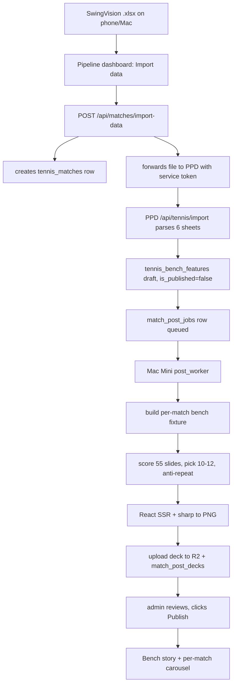

---
name: SwingVision auto pipeline
overview: "Turn the SwingVision loop into an automated path: upload an .xlsx export to the pipeline dashboard with no pre-existing match, have it parsed into PPD, land as a Tennis Bench draft, and auto-generate a per-match 10-12 slide social deck chosen by notability with anti-repeat — plus fix the unapplied migrations and R2 retention that are silently breaking production today."
todos:
  - id: p0-migrations
    content: "Phase 0: apply migrations 0012-0015 to live Supabase via the Supabase MCP in numeric order (the svp_bump_* and svp_matches_needing_jobs RPCs are missing, breaking mark-delivered and ingestion), then confirm the 48 stranded ready matches acquire jobs"
    status: pending
  - id: p0-bench-drift-check
    content: "Phase 0: drift-check the live tennis_bench_features table against the existing repo migrations 20260710/20260804 via Supabase MCP (the table already has SQL in the PPD repo; fix only if drift exists)"
    status: pending
  - id: p0-r2-lifecycle
    content: "Phase 0: make set-r2-lifecycle.ts apply every rule in r2-lifecycle.json additively, including the pipeline/raw 7-day and pipeline/enhanced 14-day deletes that are declared but never applied"
    status: pending
  - id: p0-rotate-secrets
    content: "Phase 0: rotate SUPABASE_SERVICE_ROLE_KEY and R2 keys exposed in plaintext in PROGRESS.md/.env, then scrub the files and rely on Vercel env vars"
    status: pending
  - id: p1-service-token
    content: "Phase 1: add a bearer service-token branch to PPD /api/tennis/import following the CRON_SECRET convention, swapping to createAdminClient and an explicit userId when service-authenticated"
    status: pending
  - id: p1-import-fields
    content: "Phase 1: add optional createBenchDraft and sourceJobId form fields to the importer, plus a new migration adding tennis_match_uploads.source_job_id (the column does not exist)"
    status: pending
  - id: p2-import-route
    content: "Phase 2: add POST /api/matches/import-data to the pipeline that creates the match (source 'swingvision', video_upload_status 'none'), forwards the xlsx to PPD with the service token, and enqueues a post-generation job"
    status: pending
  - id: p2-post-tables
    content: "Phase 2: migration 0016 creating match_post_jobs and match_post_decks, moved up from Phase 5 so import-data can enqueue from day one"
    status: pending
  - id: p2-xlsx-guard
    content: "Phase 2: add maxDuration and a ~4MB file-size guard with a clear error on the PPD import route (Vercel serverless body/timeout limits)"
    status: pending
  - id: p2-import-ui
    content: "Phase 2: build components/data-import-form.tsx (xlsx picker plus date/surface/opponent/SV-URL) and surface it as a second tab on /search"
    status: pending
  - id: p3-bench-draft
    content: "Phase 3: create the unpublished tennis_bench_features row on import, reusing buildBenchSlug and suggestBenchHeadline"
    status: pending
  - id: p3-admin-review
    content: "Phase 3: extend TennisBenchAdminPanel with a pending-review grouping and deck thumbnails, adding new i18n keys to all four locales"
    status: pending
  - id: p4-fixture-permatch
    content: "Phase 4: refactor generate-bench-fixture.cjs to source from loadMatchContext (--matchId/--cache) and emit the full 12-key bench fixture for any match"
    status: pending
  - id: p4-exporter-flags
    content: "Phase 4: add --matchId, --cache, --slides and --out flags to export-bench-posts.cjs so it can render a subset to an arbitrary directory"
    status: pending
  - id: p4-selector
    content: "Phase 4: build scripts/select-slides.cjs with data-eligibility gates, notability scoring reusing the coach-insight sample floors, and a decaying anti-repeat penalty"
    status: pending
  - id: p5-post-worker
    content: "Phase 5: add workers/post_worker.py that claims post jobs, shells the courtviz exporter, uploads PNGs to R2, and writes the deck row"
    status: pending
  - id: p5-deck-tables
    content: "Phase 5: add the R2 lifecycle exclusion for the bench-posts prefix (the match_post_jobs/match_post_decks tables moved to Phase 2)"
    status: pending
  - id: p5-carousel-permatch
    content: "Phase 5: give BenchSocialCarousel an optional manifestUrl prop, add GET /api/tennis-bench/[slug]/posts returning presigned GET URLs per PNG (bucket stays private), and keep the global deck as the index fallback"
    status: pending
  - id: p5-captions
    content: "Phase 5: generate a caption per deck by pointing generate-captions.cjs at the selected slide subset"
    status: pending
  - id: p6-new-slides
    content: "Phase 6: implement the new slide types from unused columns - spin court, kick-serve map, contact-height heat, strike stance, point/game/set clocks, tiebreak court, ace/DF map, athlete workload, overhead map, return diamond"
    status: pending
  - id: p7-delete-on-iphone
    content: "Phase 7: extend the cron sweep so reaching on_iphone deletes the R2 pipeline/enhanced object and the local inbox copy, leaving the canonical match.mp4 and archive.mp4 untouched"
    status: pending
  - id: p7-fifo-leak
    content: "Phase 7: sweep orphaned encode FIFOs left behind when the worker is SIGKILLed mid-encode"
    status: pending
  - id: p7-provision-mac
    content: "Phase 7: provision the Mac Mini (working directories, rclone, launchd jobs, heartbeats) incl. courtviz: clone, Node+pnpm, package builds, sharp arm64, COURTVIZ_ROOT + Supabase/R2 env; add the post_worker plist"
    status: pending
  - id: p7-docs
    content: "Phase 7: correct the docs on PIPELINE_MIN_FREE_GB, log paths, the missing boto3 dependency, and the delivery mechanism"
    status: pending
  - id: p8-tests
    content: "Phase 8: test the slide selector, add the first SwingVision xlsx fixture and importer tests including the service-token branch, and cover the new pipeline route and R2 deletion"
    status: pending
isProject: false
---
2# SwingVision Data-Only Upload, Auto-Publish and Per-Match Social Decks

Based on an 86-agent audit of `swingvision-pipeline`, `peak_performance_data`, `courtviz`, and the live Supabase project `bcfwtgqvusjhlrqsztod` (PeakPerformanceDataV2).

Decisions you confirmed: data-only `.xlsx` upload; pipeline forwards to PPD's existing importer via a **full-scope** service token (timing-safe compare, documented as all-powerful); Mac deletes local copies on iPhone confirmation; matches land as Bench **drafts** for manual publish; rendering on the Mac Mini with images in R2; 10-12 slides scored on notability with anti-repeat; new capability first, storage hardening as a later phase.

Decisions added after a full code verification (2026-08-08): migrations 0012-0015 and the bench-table drift check run via the **Supabase MCP**; the phantom `enhancing` status is **deferred** (left in place); `match_post_jobs`/`match_post_decks` are created in **Phase 2** so enqueueing works from day one; deck PNGs are served as **presigned GET URLs** (bucket stays private); xlsx transport is direct multipart with a ~4MB size guard and `maxDuration`; data-only matches carry `source: 'swingvision'`; Phase 7 includes **courtviz provisioning** on the Mac Mini; the `p0-bench-migration` and `p4-catalog-drift` todos were dropped as stale (`tennis_bench_features` already has migrations 20260710/20260804; the slide catalog, manifest, and test already agree at 55).

## Repos involved

Four separate git repos need commits: `PeakPerformanceDataV2`, `swingvision-pipeline`, `ppd-courtviz`, plus the parent monorepo for submodule SHA bumps. Note `ppd-courtviz` is vendored **twice** — as `PeakPerformanceDataMarketing/courtviz` and as `peak_performance_data/vendor/courtviz` ([peak_performance_data/.gitmodules](PeakPerformanceData/peak_performance_data/.gitmodules)) — so a courtviz change must be pushed once and both pointers bumped.

## Target flow

## Phase 0 — Unblock what is silently broken

These are not polish. Each is failing in production now.

- **Apply the missing migrations to live, via the Supabase MCP, in numeric order.** Live has only `svp_set_updated_at`; `svp_bump_storage_used`, `svp_bump_hours_used` ([supabase/migrations/0012_atomic_counters.sql](PeakPerformanceData/swingvision-pipeline/supabase/migrations/0012_atomic_counters.sql)) and `svp_matches_needing_jobs` ([0013_ingestion_anti_join.sql](PeakPerformanceData/swingvision-pipeline/supabase/migrations/0013_ingestion_anti_join.sql)) do not exist. Consequences: `mark-delivered` 500s on its counter RPC, and `ingestion_watcher.py:33-45` calls a non-existent RPC on every poll — which is why **48 matches are stranded** at `video_upload_status='ready'` with no job. Apply `0012`–`0015`, then confirm the 48 drain.
- **Drift-check `tennis_bench_features` (no new migration).** Correction: the table already has repo SQL — `supabase/migrations/20260710_create_tennis_bench_features.sql` plus RLS fixes in `20260804_rls_security_fix.sql` (the original audit only searched the pipeline repo). Via the Supabase MCP, diff the live table (3 rows, all published) against those migrations and fix only if drift exists.
- **Actually apply the R2 delete rules.** [scripts/set-r2-lifecycle.ts](PeakPerformanceData/swingvision-pipeline/scripts/set-r2-lifecycle.ts) merges only the abort-multipart rule and never writes the `pipeline/raw/` 7-day or `pipeline/enhanced/` 14-day rules that [infra/r2-lifecycle.json](PeakPerformanceData/swingvision-pipeline/infra/r2-lifecycle.json) declares. Live has ~88.4 GB across 12 `ready_for_upload` jobs. Make the script apply every rule in the JSON, additively.
- **Defer the `enhancing` phantom status.** It is never written by any worker, but removing it would touch far more than originally scoped (also `workers/cron.py:38`, `workers/processing_worker.py:108`, `components/status-badge.tsx`, the cancel route, `queue-client.tsx`, `app/page.tsx`, and docs) and would require a new migration applied *after* 0015. Decision: leave it in place for now.
- **Rotate the exposed credentials.** `SUPABASE_SERVICE_ROLE_KEY` and the R2 keys sit in plaintext in `PROGRESS.md:40-47` and `.env`. Rotate first, then scrub the files and rely on Vercel env vars.

## Phase 1 — Machine-to-machine import into PPD

The importer at [src/app/api/tennis/import/route.ts](PeakPerformanceData/peak_performance_data/src/app/api/tennis/import/route.ts) is 1150 lines of hard-won SwingVision quirk handling (header drift, host/guest inversion, dual-perspective shot dedup). We call it, not fork it.

- Add a service-token branch at the `!user` gate (`route.ts:211-215`), following the only existing machine-auth convention in PPD — `Authorization: Bearer ${CRON_SECRET}` at [cron/cleanup-conversations/route.ts:24-29](PeakPerformanceData/peak_performance_data/src/app/api/cron/cleanup-conversations/route.ts). Use a new `PIPELINE_IMPORT_TOKEN` with a timing-safe compare.
- **The critical detail:** every write in that route uses the RLS-scoped `supabase` client from `getRouteUserFast`. With a service token there is no session, so RLS blocks everything. When service-authenticated, swap to `createAdminClient()` ([src/lib/supabase/admin-client.ts:15](PeakPerformanceData/peak_performance_data/src/lib/supabase/admin-client.ts)) and require an explicit `userId` in the form data instead of deriving it from the session. Keep the existing coach/parent branches untouched for human callers.
- Add two optional form fields for the automated caller: `createBenchDraft` and `sourceJobId`. Recording `sourceJobId` needs a **new PPD migration** adding `tennis_match_uploads.source_job_id UUID NULL` — the column does not exist today (verified `20260405_create_tennis_match_tables.sql:198-212`).
- Return the existing `201 { matchId, summary }` shape unchanged.

## Phase 2 — Data-only upload in the pipeline dashboard

`POST /api/matches/create` ([app/api/matches/create/route.ts](PeakPerformanceData/swingvision-pipeline/app/api/matches/create/route.ts)) hardcodes `source: 'direct_upload'` and `video_upload_status: 'uploading'`, so the new route inserts the `tennis_matches` row **directly** instead of reusing it: `source: 'swingvision'` (already allowed by the CHECK; keeps analytics honest) and `video_upload_status: 'none'` (valid per `20260405:27-28`), so [lib/matches.ts](PeakPerformanceData/swingvision-pipeline/lib/matches.ts) and the ingestion anti-join don't treat them as awaiting video.

- New route `POST /api/matches/import-data`: accepts a small multipart body with the `.xlsx` plus optional `matchDate`, `surface`, `opponentName`, `swingvisionUrl`. It creates the match (or accepts an existing `matchId` — the PPD importer upserts on `id` and deletes shots before re-insert, so re-import is safe), then streams the file to PPD's importer with the bearer token, then enqueues a post-generation job. Since it does not touch R2 and the file is small, no multipart upload machinery is needed — the existing `useMultipartUpload` hook is the wrong tool here.
- **Create the post tables here, not in Phase 5**: migration `0016` adds `match_post_jobs` (queue, mirroring `pipeline_jobs` status/error/heartbeat conventions) and `match_post_decks` (`match_id`, `selected_slides jsonb`, `manifest_key`, `fixture_hash`, `created_at`), so the route can enqueue from day one.
- The PPD import route gains `export const maxDuration = 60` and an explicit ~4MB file-size guard returning a clear 413 before parsing (Vercel serverless body/timeout limits).
- New client component `components/data-import-form.tsx`, modelled on [components/direct-uploader.tsx](PeakPerformanceData/swingvision-pipeline/components/direct-uploader.tsx) but simpler: file picker restricted to `.xlsx`, the four metadata fields, inline progress, and a link to the created match on success. `/search` currently renders `DirectUploader` as a plain section ([app/search/page.tsx](PeakPerformanceData/swingvision-pipeline/app/search/page.tsx)) — introduce a small tab container with "Import data" as the second tab.
- Add a new `PIPELINE_IMPORT_TOKEN` and `PPD_BASE_URL` to the pipeline env, and note the R2/Supabase env-name divergence: the pipeline uses `R2_ACCESS_KEY_ID` while PPD uses `CLOUDFLARE_R2_ACCESS_KEY_ID` for the same credential.

## Phase 3 — Land as a Tennis Bench draft

The draft workflow already exists and defaults correctly: `is_published` defaults to `false`, and [TennisBenchAdminPanel.tsx](PeakPerformanceData/peak_performance_data/src/components/admin/TennisBenchAdminPanel.tsx) has a publish `Switch` wired to `PATCH /api/admin/tennis-bench/[id]`.

- When `createBenchDraft` is set, the import route inserts a `tennis_bench_features` row with `is_published: false`, reusing the existing `buildBenchSlug` ([src/lib/tennis-bench/slug.ts:13-34](PeakPerformanceData/peak_performance_data/src/lib/tennis-bench/slug.ts)) and `suggestBenchHeadline` ([suggest.ts:12-25](PeakPerformanceData/peak_performance_data/src/lib/tennis-bench/suggest.ts)) so headlines match what the admin panel would have produced. Two real costs the original plan omitted: `suggestBenchHeadline` needs a full `TennisMatchDetailPayload`, so the route must reload the just-written match via the match-detail loader; and slugs must go through `ensureUniqueSlug` (`slug.ts:36-54`) with existing slugs fetched. `tennis_bench_features.match_id` is `UNIQUE`, so re-import of the same match must upsert or skip, not insert.
- Extend the admin panel with a "pending review" grouping (drafts first) and a deck thumbnail strip, using the existing `tennisBench.admin` i18n keys plus a small number of new ones added to all four locales (`en`, `ca`, `es`, `zh`).
- Fix the existing bug instead of inheriting it: `PATCH` sets `published_at` when publishing but never clears it on unpublish (`[id]/route.ts:36-38`) — unpublish must clear `published_at`.

## Phase 4 — Per-match fixture and slide selection (courtviz)

This is the real engineering. Today [scripts/export-bench-posts.cjs](PeakPerformanceDataMarketing/courtviz/scripts/export-bench-posts.cjs) accepts only `--svg-only` and reads the frozen `packages/data/src/fixtures/bench-landing.json` built from Boluda fixtures. A live `--matchId`/`--cache` path exists but only in [scripts/load-match-data.cjs](PeakPerformanceDataMarketing/courtviz/scripts/load-match-data.cjs) (`loadMatchContext`), and it returns a much smaller shape than `buildSlide` needs.

- **Make the fixture builder per-match.** Refactor [scripts/generate-bench-fixture.cjs](PeakPerformanceDataMarketing/courtviz/scripts/generate-bench-fixture.cjs) to source from `loadMatchContext()` (`--matchId` or `--cache`) instead of hardcoded Boluda imports, and to emit the full 12-key fixture (`aggregates`, `depthAggression`, `featured`, `matches`, `momentumSeries`, `patternStats`, `pooledShots`, `rallyBuckets`, `records`, `stats`, `winnersErrors`, `zoneWinRates`). All the aggregation logic already exists in the file — only the input source changes.
- **Add real CLI flags to the exporter:** `--matchId`, `--cache`, `--slides=id,id,...`, `--out=<dir>`. Today the slide loop is unconditional over all 55 ids (`export-bench-posts.cjs:174`), and the output directory is wiped hardcoded.
- **Build the selection engine** as a new `scripts/select-slides.cjs`. Two parts:
  - *Eligibility*, from the audit's data-dependency map: drop `set-2-density` when there is one set, `volley-map` when no volley shots (3 of 57 matches — re-measure, audit-derived), `serve-speed-court-*` and `fastest-serve` when `speed_kmh` is absent, and everything geometry-based when bounce coordinates are missing (the `toEnrichedShots` filter at `bench-post-helpers.cjs:602-605` silently empties those slides).
  - *Notability scoring*, reusing the sample floors and `winRate * log(n)` ranking already proven in `generateCoachInsights` ([packages/brand/src/insights/generate-coach-insights.ts](PeakPerformanceDataMarketing/courtviz/packages/brand/src/insights/generate-coach-insights.ts) — note: actual path, `src/story/` does not exist): zone ≥ 20, serve ≥ 10, rally ≥ 4/3, flow ≥ 5. Score each candidate slide on the extremity of the stat it shows.
  - *Anti-repeat*: subtract a decaying penalty for slide ids used in the last N decks. Keep the module I/O-free: the worker passes `previousDecks` (read from `match_post_decks`) into `selectSlides(context)` so it stays unit-testable. Always pin `cover` first and `cta` last, keep one slide per section for narrative shape, and seed any tie-break from the `matchId` so a re-run is reproducible.
- No count-drift fix needed: verified the catalog, the shipped `manifest.json`, and the integration test (`export.integration.test.ts:38` asserts 55) all agree at 55 slides; the legacy exclusion list at `:41-45` is an absence check, not a count reducer.

## Phase 5 — Render on the Mac Mini, store in R2, serve per match

Rendering needs no browser: `renderToStaticMarkup` → WOFF2 font embed → `sharp` ([packages/render/src/index.ts:42-88](PeakPerformanceDataMarketing/courtviz/packages/render/src/index.ts)). ffmpeg and Playwright are not on this path.

- New Python daemon `workers/post_worker.py` alongside the existing three, following the `processing_worker.py` claim/heartbeat/event pattern. It shells `pnpm --dir $COURTVIZ_ROOT exec node scripts/export-bench-posts.cjs --matchId=... --slides=... --out=...`, then uploads the PNGs to R2 and writes the deck row.
- The `match_post_jobs`/`match_post_decks` tables are created in Phase 2 (migration 0016) so import-data can enqueue immediately; the anti-repeat query reads `match_post_decks`.
- R2 keys as `bench-posts/{matchId}/{NN}-{slideId}.png` under the existing `ppd-tennis-videos` bucket, with a matching entry added to `infra/r2-lifecycle.json` explicitly **excluded** from expiry.
- **Make the carousel per-match, served via presigned URLs.** [BenchSocialCarousel.tsx](PeakPerformanceData/peak_performance_data/src/components/tennis-bench/BenchSocialCarousel.tsx) takes no props and fetches the single global `/tennis-bench/posts/manifest.json` (`:7`, `:41`). Add an optional `manifestUrl` prop, serve per-match manifests from a new `GET /api/tennis-bench/[slug]/posts` that resolves slug → `match_id` → deck row and returns **short-lived presigned GET URLs** per PNG (the `ppd-tennis-videos` bucket stays private; reuse the presign helpers in `src/lib/r2/`), and keep the existing global deck as the index-page fallback so nothing regresses.
- The worker's shell-out needs a working courtviz runtime on the Mac Mini (checkout, Node/pnpm, built `@courtviz/data`/`@ppd/brand`/`@courtviz/render` dists, `sharp` arm64, Supabase + R2 env) — provisioning lands in Phase 7, but Phase 5 cannot pass end-to-end without it.
- Generate a caption alongside each deck: [scripts/generate-captions.cjs](PeakPerformanceDataMarketing/courtviz/scripts/generate-captions.cjs) already supports `--matchId` and `--cache`, so it only needs its slide-count reference pointed at the selected subset rather than the full catalog.
- The existing [scripts/sync-bench-posts.cjs](PeakPerformanceDataMarketing/courtviz/scripts/sync-bench-posts.cjs), which copies PNGs into PPD's `public/`, stays for the global deck but is not used per-match — that is what avoids committing a deck per match into git.

## Phase 6 — New slide types

Data completeness makes this low-risk: across 36,240 shots, `speed_kmh`, `bounce_x/y`, `hit_x/y`, `direction`, `spin`, and `bounce_zone` are each 99.98% populated. The audit found 14 concepts the current 55 miss, all using columns the importer already writes. Highest value first:

- **Spin court** and **kick-serve map** — `spin` is fully populated and completely unused by all 55 slides.
- **Contact-height heat** (`hit_z`) and **strike stance** (`hit_depth`/`hit_side`, distinct from bounce depth).
- **Point clock**, **game pace**, **set clock** — `duration_sec` on points/games/sets is imported and unused.
- **Tiebreak court** — no slide currently reads `host_tiebreak`, `guest_tiebreak`, or `is_super_tiebreak`.
- **Ace / double-fault / service-winner map** from `points.detail` — gate this one on the 74.5% fill rate.
- **Athlete workload** — `tennis_match_stats` carries 30 SwingVision stat names across 42 matches including `Distance Run (KM)`, `Calories Burned (kCAL)`, and `Average Heart Rate (BPM)`, none of which appear on any slide today.
- **Overhead map** and **official return diamond** (`1st/2nd Returns Won`).

Skip the scorekeeper-only columns (`deuce`, `ended_by`, `server_side`, `match_point`) — the xlsx importer never writes them.

## Phase 7 — Storage and pipeline hygiene

- **Delete on iPhone confirmation.** `mark-delivered` ([app/api/jobs/[id]/mark-delivered/route.ts:73-84](PeakPerformanceData/swingvision-pipeline/app/api/jobs/[id]/mark-delivered/route.ts)) is the confirmation, already setting `inbox_cleared: false` as a cleanup signal. Extend the cron sweep so that when a job reaches `on_iphone`, it deletes the R2 `pipeline/enhanced/` object as well as the local inbox copy — `delete_object` already exists at [workers/shared/r2.py:126](PeakPerformanceData/swingvision-pipeline/workers/shared/r2.py) (the TypeScript `lib/r2.ts` has no delete helper, so add a small one mirroring it). The canonical `{userId}/{matchId}/match.mp4` and `archive.mp4` objects stay untouched. **Acknowledged data-loss edge:** once the 7-day raw rule and this delete are both live, a failed SwingVision import after confirmation leaves no working enhanced copy — only the canonical originals survive. That is acceptable, but call it out in the runbook.
- Fix the orphan FIFO leak: `workers/shared/pipeline.py:98-99` creates a temp FIFO whose `os.unlink` in the `finally` never runs if the process is SIGKILLed mid-encode. Sweep stale FIFOs in cron (`workers/cron.py`, alongside `clear_departed_inbox_files` at :244-286).
- The Mac Mini is currently **not provisioned**: `~/SwingVisionPipeline`, `~/SwingVisionPipeline/sv_exports`, and `/tmp/svp-jobs` are all missing, `rclone` is not installed, no `svp` launchd jobs are loaded, and live `pipeline_machines` shows all three per-role heartbeats and both disk columns NULL. Provision it and add the `post_worker` plist before expecting any of Phase 5 to run unattended. **Courtviz provisioning is part of this** (post_worker shells it): clone the courtviz repo, install Node + pnpm, `pnpm install` and build the `@courtviz/data`/`@ppd/brand`/`@courtviz/render` dists, install `sharp` (arm64 native), and set `COURTVIZ_ROOT` plus Supabase/R2 env vars in the post plist.
- Correct the docs that teach the wrong thing: `PIPELINE_MIN_FREE_GB` is documented as 50 but defaults to 100; `README.md:242` points at a log path the plists don't use; the pip install list omits `boto3`, which `workers/shared/r2.py:16` imports.

## Phase 8 — Tests and CI

- courtviz: unit-test the slide selector (eligibility gates, notability ranking, anti-repeat decay, deterministic tie-breaks) and extend [scripts/__tests__/export.integration.test.ts](PeakPerformanceDataMarketing/courtviz/scripts/__tests__/export.integration.test.ts) to cover a `--slides` subset render rather than only the full deck.
- PPD: the importer has **zero tests** today and no `.xlsx` fixture exists in the repo. Add a small fixture workbook and cover the auth matrix (401 no auth, 401 bad token, 400 missing userId, 200 cookie path, 200 token path), the admin-client swap, and bench-draft creation. Note PPD's CI **already runs typecheck** (`.github/workflows/ci.yml:26-36`, gating the build) — the original claim that it doesn't was wrong.
- pipeline: add tests for the new import-data route and the R2 delete-on-`on_iphone` transition, next to the existing `tests/api-fetch.test.ts` and `tests/format.test.ts`.

## Verification

After Phase 0, confirm via the Supabase MCP that all three `svp_*` RPCs exist, that the `tennis_bench_features` live schema matches migrations 20260710/20260804, that the bucket carries all three lifecycle rules, and that the 48 stranded matches have acquired jobs. After Phase 2, import one real `.xlsx` end to end and confirm the shot count in `tennis_match_shots` matches what the same file produces through PPD's own upload UI. After Phase 5, generate decks for three different matches and confirm the selected slide sets genuinely differ. Run `npm run build`, `type-check`, and `lint` in each repo after every phase.
