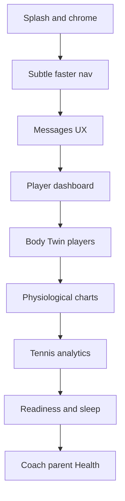

# UX velocity, charts, tennis, messaging, and health data

Work lives in [PeakPerformanceData/peak_performance_data](PeakPerformanceData/peak_performance_data), with physiological backends in [ppd_backend](PeakPerformanceData/ppd_backend) and [ppd_extraction_backend](PeakPerformanceData/ppd_extraction_backend). Grounded in 40 focused codebase explorations plus a live query against **PeakPerformanceDataV2**.

---

## Production database finding (sleep 1.7h, readiness 50%)

Live Postgres on PeakPerformanceDataV2:

- `garmin_connect_sleep`, `garmin_connect_training_readiness`, `garmin_connect_stress`, `garmin_connect_body_battery` **do not exist**.
- Remaining Garmin tables: `garmin_connect_accounts`, `garmin_sync_jobs`.
- Live `calculate_athlete_readiness` still `ORDER BY calendar_date` on those missing tables. Lookups fail; components **default to 50**. Composite with defaults is **~55**, which the UI can show as **50** (moderate) after rounding/source switch.
- Wearable truth is **ClickHouse** (`openwearables_data.ow_sleep_summaries`, timeseries, health scores) via PPC graphs. Dashboard sleep hours come from `fetchReadinessSnapshot` → empty Garmin → **PPC `sleep_duration` fallback**. That fallback can read the **first Plotly trace (`Deep`)** instead of total hours. Typical deep sleep ~90–120 min → **1.7h**. Also possible: `limit 1` by calendar date picking today’s nap/partial row (~102 min = 6120s).

ClickHouse MCP timed out from this environment; treat the Deep-trace + missing-Supabase path as the primary bug, then verify one athlete’s `ow_sleep_summaries.duration_minutes` after deploy.

---

## P0 — Visible UX bugs (do first)

### 1. Splash / logo plate vs page background

**Cause:** PNG assets have baked plates (`Logo-512.png` ~`#ebebeb`, `BCNPTA_Logo` ~`#1d0f21`) composited onto brand bg (`#0d1726` / BCN `#121726`). `theme-css.ts` can re-derive `--background` to a nearby hex (`#101523`). Light-mode CSS in [layout.tsx](PeakPerformanceData/peak_performance_data/src/app/[locale]/layout.tsx) can flash white after a dark splash. Default brand still links static [apple-touch-icon.png](PeakPerformanceData/peak_performance_data/public/apple-touch-icon.png) (light plate) instead of [apple-icon.tsx](PeakPerformanceData/peak_performance_data/src/app/apple-icon.tsx).

**Steps:**
1. Export transparent logos (or plate = exact `hslToHex(brand.colors.background)`).
2. Shared helper used by splash, pwa-icon, apple-icon, manifest, offline.html, cold-start CSS.
3. Align `theme-css.ts` `--background` with explicit brand background.
4. Gate light-mode override until theme hydrates.
5. Link `/apple-icon` for default brand; academy icons via `/api/pwa-icon?bg=`.

### 2. Page changes feel slow and loud

**Cause:** No view transitions; [NavigationProgress.tsx](PeakPerformanceData/peak_performance_data/src/components/navigation/NavigationProgress.tsx) is `h-1.5` + glow, jumps to 30% with no delay, ignores `router.push`; cold-start bar is an infinite sweep; [loading.tsx](PeakPerformanceData/peak_performance_data/src/app/%5Blocale%5D/loading.tsx) duplicates real chrome; duplicate Suspense + `loading.tsx`; [PrefetchLinks.tsx](PeakPerformanceData/peak_performance_data/src/components/navigation/PrefetchLinks.tsx) hardcodes role `'player'`; pages re-`getSession` after middleware already resolved auth.

**Steps:**
1. Thin bar (`h-0.5`, no glow), 150–200ms show delay, hide if nav finishes first; load progress **synchronously**; listen for `ppd:navigation-start` from `router.push`.
2. Cold-start: one sweep, then hide.
3. Root `loading.tsx` content-only; drop duplicate page Suspense (start with parent/training wrong skeleton).
4. Role `template.tsx` using existing `animate-content-reveal`; optional `experimental.viewTransition`.
5. Fix PrefetchLinks role; BottomNav `PrefetchLink`; cut idle prefetch 4.5s → ~1s.
6. `getAuthFromMiddlewareOrFallback()` so pages skip duplicate session/profile.

### 3. Messages: AI FAB cut off

**Cause:** [MessagesPageClient.tsx](PeakPerformanceData/peak_performance_data/src/components/messaging/MessagesPageClient.tsx) is always `z-50` + `bottom-16`. [BottomNav](PeakPerformanceData/peak_performance_data/src/components/navigation/BottomNav.tsx) is `z-40`; FAB is `-translate-y-1/2` so the top half sits inside the messaging overlay.

**Fix:** `z-30` on list, `z-50` on thread (`useMessagingThreadOpen()`). Align `bottom-16` with `.has-bottom-nav` (row + `pb-safe`). Keep nav hidden when a thread is open.

### 4. Mic misaligned in composer

**File:** [MessageInput.tsx](PeakPerformanceData/peak_performance_data/src/components/messaging/MessageInput.tsx)

Row is `items-center` + `self-center`; desktop buttons `sm:size-9` (36px) vs textarea `sm:min-h-[40px]` + JS `scrollHeight`. Mic uses `VoiceInputButton` wrapper + `outline` border while transcribing.

**Fix:** `items-end`; drop `self-center`; `size-11 sm:size-10` and `min-h-11 sm:min-h-10`; floor auto-resize to 44/40; uniform `size-4` icons; keep mic `ghost` (no outline jump).

### 5. Send spinner after optimistic send

**Cause:** [MessagingView.tsx](PeakPerformanceData/peak_performance_data/src/components/messaging/MessagingView.tsx) holds `isSending` until POST returns; [useMessages.ts](PeakPerformanceData/peak_performance_data/src/hooks/data/useMessages.ts) appends the bubble **before** `await fetch`.

**Fix:** Spinner only during attachment upload; clear `isSending` immediately after calling `sendMessage()`. Optional clock on `temp-*` ids. Toast on failure (optimistic revert already exists).

### 6. Unread tooltip after sending

**Cause:** BottomNav uses `/api/messages/unread-count`. `sendMessage` never updates that cache. [useConversationRealtime.ts](PeakPerformanceData/peak_performance_data/src/hooks/data/useConversationRealtime.ts) can `+1` when `sender_id` is missing. Unread API uses `max-age=5` so stale `1` can return.

**Fix:** `mutate('/api/messages/unread-count')` after send; skip own INSERTs; `cache: 'no-store'` on unread fetch + API; set `last_read_at` to `message.created_at` on POST.

### 7. Login / logout slow and abrupt

**Cause:** Both use `window.location.replace`. Login always goes to `/overview` then middleware redirects. Logout goes to `/login` (no locale) then intl redirect. Signout is fire-and-forget. Login prefetch hardcodes `'player'`.

**Fix:** Post-login role endpoint → `/{locale}/{role}`. Logout: `/{locale}/login`, await signout ~300ms or beacon. Shared branded overlay via `sessionStorage` across the hard nav. Unify Settings/session-expiry through `useLogout`.

### 8. Player dashboard empty ring then data

**Cause:** [player-init.ts](PeakPerformanceData/peak_performance_data/src/lib/dashboard/player-init.ts) 1000ms readiness budget → `__partial` → skeleton then client `/api/athletes/{id}/readiness`. SSR seed **omits providers** so `hasConnectedWearable` flashes empty. `MetricRing` 700ms fill looks empty. `force-dynamic` + no login prefetch (`loginPrefetch.ts` unwired).

**Fix:** Seed providers on SSR; keep skeleton until score **or** confirmed empty; skip ring animation if score was in fallback; wire login prefetch with real role; consider 1.5–2s budget **or** always use dedicated readiness without blocking overview.

### 9. Body Twin “not available in this environment” (players only)

User choice: **fix for players; skip parents/coaches.**

Two gates:

1. `NEXT_PUBLIC_BODYVIZ=true` at **build** + optional `BODYVIZ_ALLOWED_EMAILS` ([gating.ts](PeakPerformanceData/peak_performance_data/src/lib/bodyviz/gating.ts)).
2. Stub mode: `demoSnapshots.length === 0` in [body-twin-scene.tsx](PeakPerformanceData/peak_performance_data/src/app/%5Blocale%5D/player/body/body-twin-scene.tsx) when vendor stubs win over [vendor-prebuilt/bodyviz](PeakPerformanceData/peak_performance_data/vendor-prebuilt/bodyviz).

**Fix:** Confirm Vercel flag + redeploy; empty allowlist or include the player; verify install copies prebuilt dist (`ensure-vendor-stubs.sh`). Show `BodyTwinEntryCard` in org mode too (today personal-only). Phase 2 live `/api/player/body-snapshot` is optional after fixture 3D works.

---

## P1 — Physiological performance (in-depth)

Frontend: [ChartsContent.tsx](PeakPerformanceData/peak_performance_data/src/components/charts/ChartsContent.tsx), [useGraphData.ts](PeakPerformanceData/peak_performance_data/src/hooks/useGraphData.ts), [useGraphBatchPrefetch.ts](PeakPerformanceData/peak_performance_data/src/hooks/useGraphBatchPrefetch.ts), [charts/page.tsx](PeakPerformanceData/peak_performance_data/src/app/%5Blocale%5D/charts/page.tsx).

Backend: [ppd_backend/api/routes/graphs.py](PeakPerformanceData/ppd_backend/api/routes/graphs.py), [graph_data_processor.py](PeakPerformanceData/ppd_backend/data_processing/base/graph_data_processor.py), [ppc-proxy](PeakPerformanceData/peak_performance_data/src/app/api/ppc-proxy/%5B...path%5D/route.ts).

**Why slow:**
- SSR seeds 5 graphs with 1s cap; charts are `ssr: false` so first paint is skeletons.
- Wave 1 is **14** types, sequential waves 2–3.
- `syncPhase === 'syncing'` **disables** batch waves (only 8-type `GraphSyncMonitor`).
- Batch treats any SWR hit (including `success: false`) as seeded.
- Hover/athlete prefetch **30-day** keys vs page **90-day**.
- 25s poll then lock empty; empty GET cached 30s.
- `load_timeseries` uncached; coach matrix PPC fan-out.

**Steps (frontend):**
1. Wave 1 = heart-only (~5, match SSR seed); sleep/workouts wave 2.
2. Keep batch waves during sync; extend poll while `syncPhase !== idle`.
3. Skip batch only if `success === true`.
4. Import `DEFAULT_CHART_DAYS_BACK` (90) in [useChartsHoverPrefetch.ts](PeakPerformanceData/peak_performance_data/src/hooks/useChartsHoverPrefetch.ts) and [useAthleteGraphPrefetch.ts](PeakPerformanceData/peak_performance_data/src/hooks/useAthleteGraphPrefetch.ts).
5. Honor `?athleteId=` in charts page + ChartsContent (copy [performance-tests/page.tsx](PeakPerformanceData/peak_performance_data/src/app/%5Blocale%5D/performance-tests/page.tsx)).
6. Seed `recovery_score` only for Whoop.
7. Chart summary: use total sleep (`customdata[1]`), not Deep series ([GraphContainerRecharts.tsx](PeakPerformanceData/peak_performance_data/src/components/charts/GarminConnectGraphs/GraphContainerRecharts.tsx)).

**Steps (backend):**
1. Cache `load_timeseries` with `_QueryCache` like other loaders.
2. Cap coach-matrix PPC fallback (`skipPpcFallback` or p-limit 3).
3. Fix `load_lactate_test_points` N+1.
4. Dashboard readiness: **prefer PPC/ClickHouse**, stop depending on missing `garmin_connect_*` tables (see P1 data).

---

## P1 — Tennis analytics

Supabase-only (not ClickHouse). [match-detail.ts](PeakPerformanceData/peak_performance_data/src/lib/tennis/match-detail.ts) = 1 + 5 parallel queries; shots dominate payload. Detail UI is `dynamic(..., { ssr: false })`. SWR `cache: 'no-store'` bypasses API `max-age=60`. Prefetch omits `?hasVideo=1`. Evolution loads **all** matches.

**Steps:**
1. Pass `hasVideo=1` when `video_upload_status === 'ready'`.
2. `loading` fallback on `MatchDetailView` dynamic import.
3. Honor browser cache for completed matches; `no-store` only after mutations.
4. Split MatchStatsTab to its own chunk; preload CourtHeatmap with detail.
5. Longer term: `?fields=summary|shots`.
6. Rebuild `vendor/courtviz` if PointReplay is still a Noop (empty card).
7. Paginate `/api/tennis/matches/evolution`.

---

## P1 — Readiness and sleep correctness

**Readiness 67 → 50:** Matrix/UI can show raw Garmin `training_readiness` (67) then RPC composite (~50) after async fetch. In production RPC cannot read Garmin tables → defaults. Unify on **one source**: PPC recovery / ClickHouse health scores + sleep hours from `ow_sleep_summaries.duration_minutes / 60`. Never display raw `training_readiness` as the dashboard score unless labeled.

**Sleep 1.7h:**
1. `latestSleepTotalHours` must use `customdata[1]` / `duration_minutes`, never first trace `y`.
2. Prefer last **completed night** (yesterday if today’s row is nap/partial), not `data_date = today` / `limit 1`.
3. Do not treat nap as last-night total unless that is the only session.
4. Rewrite `calculate_athlete_readiness` (and batch) to ClickHouse-backed data or stop calling dead Garmin tables.

---

## P2 — Health for coaches and parents (not Body Twin)

`/health` exists ([HealthHub.tsx](PeakPerformanceData/peak_performance_data/src/components/health/HealthHub.tsx)) but is **self-scoped** (`athlete_id = user.id`). Nav: `roles: ['athlete', 'player']` only. Bottom nav omits Health for all roles. Injuries API already supports coach/parent; page does not.

**Steps:**
1. Extend `/health` like performance-tests: `getAssignedAthletes` / `parent_child_relationships`, `ChildSelector` / athlete dropdown, `?athleteId=`.
2. Add `'coach'` and `'parent'` to health nav; optional BottomNav or quick actions.
3. Fetch injuries via `GET /api/injuries?athleteId=` (parent-aware) rather than direct RLS if policies omit parents.
4. Do **not** add Body Twin to parent/coach.

---

## Verification

- iPhone PWA: splash bg matches first paint; no logo plate.
- Nav: thin bar only if slow; no double skeletons.
- Messages list: full AI FAB; composer mic aligned; send spinner stops with bubble; unread stays 0 after send.
- Login/logout: locale-correct, overlay, no `/overview` hop.
- Player home: no empty ring when data exists; Body Twin 3D (not stub copy) for flagged players.
- Charts: wave 1 heart charts &lt;2s warm; no false empty after sync; `?athleteId=` selects the right person.
- Tennis: detail opens without extra pipeline hop; cached rematch is instant.
- Readiness/sleep: score stable; sleep hours match ClickHouse night total (~7h not 1.7h) for a known athlete.
- Coach/parent: Health hub for each player/child; Body Twin still player-only.

---

## Suggested implementation order

1. P0 messages (FAB, mic, spinner, unread) + splash — highest visual payoff.
2. P0 dashboard ring + Body Twin env/vendor.
3. P0 nav subtlety + login/logout.
4. P1 charts frontend cache/waves + athleteId.
5. P1 readiness/sleep source unification (Supabase tables gone).
6. P1 tennis payload/cache.
7. P2 health for coach/parent.
8. ppd_backend `load_timeseries` cache and matrix fan-out.
