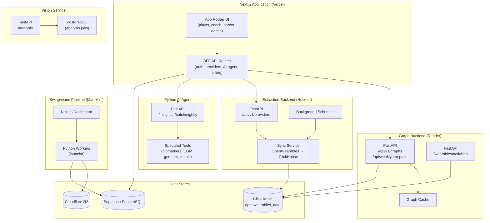

# Container architecture (C4 L2)

This diagram shows the major deployable containers within the PeakPerformanceData platform and their relationships.

## Diagram

## Container inventory

| Container | Repository | Runtime | Deployment | Evidence |
|---|---|---|---|---|
| Next.js BFF + UI | app | Node.js 22, Next.js 15.5 | Vercel (iad1) | `package.json`, `vercel.json` |
| Graph backend | backend | Python, FastAPI | Render (Docker) | `render.yaml`, `api/main.py` |
| Extraction backend | extraction | Python, FastAPI | Hetzner (Docker/Traefik) | `docker/docker-compose.yml` |
| Python AI agent | agent | Python, FastAPI | Unconfirmed | `api/main.py` |
| Vision service | vision | Python, FastAPI | Unconfirmed | `api/routes/analysis.py` |
| SwingVision dashboard | swingvision | Node.js, Next.js | Unconfirmed | `package.json` |
| SwingVision workers | swingvision | Python (launchd) | Mac Mini | `infra/launchd/` |

## Data stores

| Store | Engine | Owner | Content |
|---|---|---|---|
| Supabase PostgreSQL | Postgres | app (migrations) | Auth, profiles, orgs, billing, tennis, invitations |
| ClickHouse | ClickHouse | extraction (migrations) | Wearable timeseries, activity, sleep, summaries |
| Vision PostgreSQL | Postgres | vision (migrations) | Analysis jobs, ball positions, bounce events, shots |
| Cloudflare R2 | Object storage | swingvision | Raw, enhanced, canonical, archived video |

## What this diagram does not claim

- Production deployment health (unverified).
- Network topology and firewall rules (needs infrastructure evidence).
- Whether the Python AI agent and Vision service are deployed separately or together (unconfirmed).
- Complete internal component breakdown (see per-repository architecture docs).
