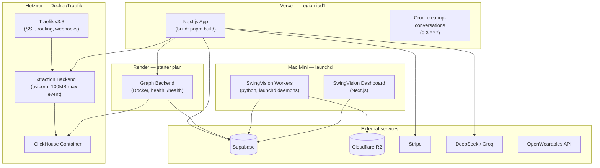

# Deployment topology

This document records the deployment surfaces observed in checked-in configuration. It distinguishes **configured** (present in source) from **verified deployed** (confirmed live). Only the configured state is evidenced here.

## Diagram

## Configured deployment evidence

### Vercel (app)

| Config | Value | Source |
|---|---|---|
| Region | `iad1` | `vercel.json` |
| Build command | `HUSKY=0 pnpm run build` | `vercel.json` |
| Install command | `ensure-vendor-stubs.sh && build:courtviz && build:bodyviz && pnpm install --frozen-lockfile` | `vercel.json` |
| Cron | `cleanup-conversations` at `0 3 * * *` | `vercel.json` |
| Redirects | `/strava-auth-callback`, `/presentation/*` | `vercel.json` |

### Render (graph backend)

| Config | Value | Source |
|---|---|---|
| Type | `web` (Docker) | `render.yaml` |
| Plan | `starter` | `render.yaml` |
| Health check | `/health` | `render.yaml` |
| Env vars | `DATABASE_URL`, `STRAVA_*`, `AWS_*` | `render.yaml` |

Note: `render.yaml` references `STRAVA_*` env vars, which may be stale. See gap DG-05.

### Hetzner (extraction)

| Config | Value | Source |
|---|---|---|
| Proxy | Traefik v3.3 (SSL, routing) | `docker/docker-compose.yml` |
| App server | uvicorn with `--h11-max-incomplete-event-size 104857600` | `src/api/main.py` comment, Dockerfile |
| Database | ClickHouse container | `docker/docker-compose.yml` |
| Network | `ppd-network` + `ppd-shared` (external) | `docker/docker-compose.yml` |

### Mac Mini (SwingVision)

| Config | Value | Source |
|---|---|---|
| Worker daemon | launchd | `infra/launchd/` |
| R2 lifecycle | Configured | `infra/r2-lifecycle.json` |
| Devices | 5 iPhone SE | Pipeline docs (not config file) |

## What this document does not claim

- Whether any deployment is currently live and healthy (unverified).
- Actual environment variable values (secrets are not inspected).
- Network firewall rules or security group configuration.
- Whether the `STRAVA_*` env vars in `render.yaml` are still used or stale (DG-05).
- Whether the Python AI agent and Vision service have their own deployment configs (unconfirmed).
