# Repository and dependency graph

This diagram shows the logical repository identities and their dependency relationships. Each repository identity may have multiple checkout occurrences at different pinned revisions.

## Diagram

```mermaid
flowchart TB
    Portfolio["Portfolio Superproject\n(.gitmodules)"]

    subgraph PeakPerformanceData["PeakPerformanceData/"]
        app["app\npeak_performance_data"]
        backend["backend\nppd_backend"]
        extraction["extraction\nppd_extraction_backend"]
        legacy["legacy-extraction\nppd_legacy_extraction_backend"]
        vision["vision\nppd_vision"]
        agent["agent\nppp_ai_agent"]
        swingvision["swingvision\nswingvision-pipeline"]
        research["research\nppd_research_papers"]
    end

    subgraph Marketing["PeakPerformanceDataMarketing/"]
        academies["academies\nAcademiesPresentation"]
        aivideos["ai-videos\nAI Videos"]
        manim["manim\nManim"]
        remotion["remotion\nRemotion"]
        bodyviz["bodyviz\nThreeJS"]
        courtviz["courtviz\ncourtviz"]
    end

    Portfolio --> app
    Portfolio --> backend
    Portfolio --> extraction
    Portfolio --> legacy
    Portfolio --> vision
    Portfolio --> agent
    Portfolio --> swingvision
    Portfolio --> research
    Portfolio --> academies
    Portfolio --> aivideos
    Portfolio --> manim
    Portfolio --> remotion
    Portfolio --> bodyviz
    Portfolio --> courtviz

    subgraph AppDeps["app vendor/ (nested)"]
        AppBodyViz["bodyviz\nvendor/bodyviz"]
        AppCourtviz["courtviz\nvendor/courtviz"]
    end

    app --> AppBodyViz
    app --> AppCourtviz
```

## Pinned revision summary

| repo_id | Direct checkout | app nested (vendor/) | Same revision? |
|---|---|---|---|
| bodyviz | `e3d2849719` (marketing) | `00caeda7b8` (app vendor) | No |
| courtviz | `583692443f` (marketing) | `7bad49b63d` (app vendor) | No |

The nested vendor checkouts are pinned at different revisions from the marketing checkouts. This is intentional and must not be normalized away. The app uses its own pinned versions for build stability.

## Repository families

| Family | Repositories | Profile |
|---|---|---|
| Main app | app | application |
| Backend services | backend, extraction, legacy-extraction, vision, agent | service |
| Video pipeline | swingvision | service |
| Visualization libraries | courtviz, bodyviz | library |
| Marketing media | academies, ai-videos, manim, remotion | media |
| Research | research | research |

## Lifecycle status

| repo_id | Lifecycle | Notes |
|---|---|---|
| app | active | Main product |
| backend | active | Graph API |
| extraction | active | Wearable ingestion |
| legacy-extraction | unconfirmed | Needs owner confirmation |
| vision | active | Video analysis |
| agent | active | Python AI specialist |
| swingvision | active | Video pipeline |
| research | active | Research corpus |
| academies | active | Sales deck generator |
| ai-videos | unconfirmed | Minimal content, needs owner confirmation |
| manim | active | Data-driven tennis visualization |
| remotion | active | Marketing video compositions |
| bodyviz | active | ThreeJS body visualization packages |
| courtviz | active | Tennis court visualization packages |

## What this diagram does not claim

- Runtime service dependencies (see containers diagram).
- Build-time package dependencies (see per-repository `package.json` / `requirements.txt`).
- Whether `legacy-extraction` and `ai-videos` are still in use (unconfirmed lifecycle).
