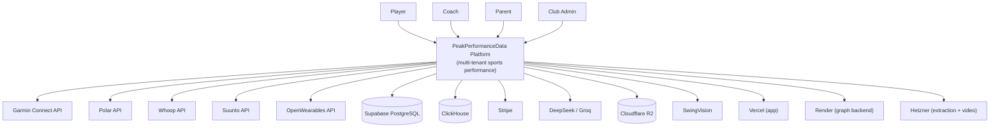

# System context (C4 L1)

This diagram shows the PeakPerformanceData platform boundary, its users, and external systems. Source-linked to revisions observed on 2026-09-13.

## Diagram

## Actors

| Actor | Description |
|---|---|
| Player | Athlete viewing own performance data, tennis scoring, body twin |
| Coach | Managing assigned players, viewing analytics, tennis coaching |
| Parent | Viewing linked child's data and tennis matches |
| Club Admin | Managing organization, members, and academy settings |

## External systems

| System | Purpose | Evidence |
|---|---|---|
| Garmin Connect API | Wearable data source | `src/api/routes/garmin_data.py` in extraction |
| Polar / Whoop / Suunto | Wearable data sources | `src/api/routes/provider_data.py` in extraction |
| OpenWearables API | Unified wearable data abstraction | `src/openwearables/client.py` in extraction |
| Supabase PostgreSQL | Primary relational database (auth, profiles, orgs, billing) | App migrations, `config/database.py` in backend |
| ClickHouse | Wearable timeseries and analytics data store | Extraction migrations, `openwearables_data` database |
| Stripe | Billing and subscriptions | `src/lib/stripe/` in app, `package.json` dependency |
| DeepSeek / Groq | LLM providers for AI agent | `src/app/api/ai-agent/route.ts` in app |
| Cloudflare R2 | Video storage (raw, enhanced, canonical, archived) | SwingVision `workers/shared/` |
| SwingVision | iPhone-based tennis video analysis | SwingVision pipeline |

## Deployment surfaces

| Surface | Config evidence | Status |
|---|---|---|
| Vercel (app) | `vercel.json` — region `iad1`, crons, redirects | Configured |
| Render (graph backend) | `render.yaml` — Docker, starter plan | Configured |
| Hetzner (extraction) | `docker/docker-compose.yml` — Traefik, ClickHouse | Configured |
| Mac Mini (SwingVision) | `infra/launchd/` — worker daemon | Configured |

## What this diagram does not show

- Internal service-to-service communication paths (see containers diagram).
- Data flow details (see `data-flows.md`).
- Trust boundaries (see security DFD).
- Whether configured deployments are currently live and healthy (unverified).
