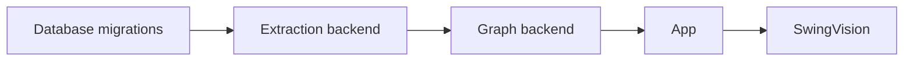

# Release process

This document describes the release process for the PeakPerformanceData platform. It distinguishes **configured** (present in source) from **verified** (confirmed in production).

## Deployment surfaces

| Surface | Mechanism | Configured | Verified |
|---|---|---|---|
| App | Vercel (auto-deploy on push to main) | Yes | Unconfirmed |
| Graph backend | Render (Docker, manual or auto) | Yes | Unconfirmed |
| Extraction | Hetzner (Docker Compose, manual) | Yes | Unconfirmed |
| SwingVision | Mac Mini (launchd, manual) | Yes | Unconfirmed |
| Vision | Unconfirmed | Unconfirmed | Unconfirmed |
| Python agent | Unconfirmed | Unconfirmed | Unconfirmed |

## Release coordination

### Single-service release (Low/Medium risk)

1. Create PR with change description
2. Run tests (per-repo)
3. Merge to main
4. Verify deployment (Vercel auto-deploys; others may need manual trigger)
5. Run post-deployment health checks
6. Document in release record (Medium risk only)

### Multi-service release (High risk)

1. Create PRs in each affected repository
2. Run tests in each repository
3. Coordinate deployment order (see below)
4. Deploy in order, verifying health at each step
5. Run post-deployment verification
6. Document in release record
7. Notify stakeholders

## Deployment order

For changes that span services, deploy in dependency order:

| Step | Service | Verification |
|---|---|---|
| 1 | Database migrations | Schema applied, rollback tested |
| 2 | Extraction backend | Health endpoint, sync test |
| 3 | Graph backend | Health endpoint, graph generation test |
| 4 | App | Build success, smoke test |
| 5 | SwingVision | Worker heartbeat, job processing |

## Rollback procedures

| Service | Mechanism | Status |
|---|---|---|
| App | Vercel instant rollback | Configured |
| Graph backend | Render redeploy previous | Configured |
| Extraction | Docker Compose redeploy | Manual |
| SwingVision | launchd restart with previous code | Manual |
| Database | Migration down script | Per-migration |

## What this document does not claim

- That any deployment is currently healthy (unverified).
- That rollback procedures have been tested (unconfirmed).
- That deployment order is enforced (it is a guideline).
- That database migrations have down scripts for all migrations (needs audit).
- That release coordination is currently practiced (this is a proposed process).
