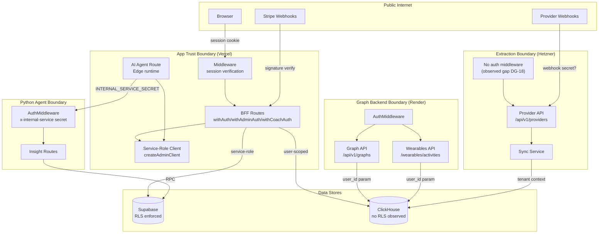

# Security data flow diagram

This diagram shows trust boundaries and data classification across the platform. It is distinct from the C4 container diagram — it focuses on where data crosses trust boundaries and what controls are observed.

## Diagram

## Trust boundaries

| Boundary | Observed control | Required control | Gap |
|---|---|---|---|
| Public → App (BFF) | Supabase session cookie + `withAuth` | Verified session | OK |
| Public → App (webhook) | Stripe signature verification | Signature verification | OK |
| App → Graph backend | `AuthMiddleware` (details unverified) | Authenticated session | Needs verification |
| App → Extraction backend | `X-User-Id` header only (no auth middleware) | Verified identity | DG-18 |
| App → Python agent | `INTERNAL_SERVICE_SECRET` header | Shared secret | OK (if secret is rotated) |
| App → Supabase | RLS + service-role client | RLS enforcement | Needs migration audit |
| App → ClickHouse | No RLS observed | Application-level tenant check | Needs verification |
| Graph backend → ClickHouse | `user_id` parameter | Tenant isolation | Needs verification |
| Extraction → ClickHouse | `TenantContext` in sync | Tenant context | OK for writes |

## Data classification

| Data category | Store | Sensitivity | Observed protection |
|---|---|---|---|
| Auth credentials | Supabase Auth | Critical | Supabase managed |
| User profiles | Supabase `profiles` | High | RLS (needs audit) |
| Organization data | Supabase `organizations` | High | RLS (needs audit) |
| Wearable physiology | ClickHouse `openwearables_data` | High | Application-level only |
| Tennis matches | Supabase `tennis_matches` | Medium | RLS + `match-access.ts` |
| Billing records | Supabase `billing_*` | High | RLS (needs audit) |
| AI conversations | Supabase (conversation memory) | Medium | Needs audit |
| Video files | Cloudflare R2 | Medium | Access controlled |
| Genetic data | Supabase (via agent tools) | Critical | Needs audit |

## What this document does not claim

- Complete threat model (needs per-boundary threat analysis).
- RLS policy correctness (needs Supabase migration audit).
- ClickHouse tenant isolation (no RLS observed, needs application-level verification).
- Whether `AuthMiddleware` in graph backend verifies the same identity as the app session.
- Production network security (firewall, VPC, etc. — needs infrastructure evidence).
